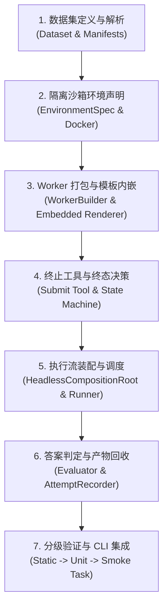

# LazyGoal Benchmark 接入指南

本指南为在 LazyGoal 仓库中标准化接入新评测基准（Benchmark）提供权威的架构约束、7 步生命周期实现指引、踩坑排错矩阵与三级验收标准。

---

## 核心架构红线与设计原则

在接入任何 Benchmark 前，必须严格遵守以下架构红线：

1. **水平物理隔离（Zero Cross-Benchmark Dependencies）**：
   - 所有 Benchmark 必须独立建构在 `benchmarks/<name>/` 目录下。
   - **禁止**任何跨 Benchmark 的水平代码引用（例如 `benchmarks/gaia` 严禁直接引用 `benchmarks/swebench`）。
   - 跨 Benchmark 共享的基础设施必须抽象并下沉至 `benchmarks/src/` 共享层（受 `pnpm run check:dependencies` 静态防护）。
2. **容器沙箱首选（Sandbox First for Execution Safety）**：
   - 凡涉及不受信任的代码运行、Shell 命令执行或特定环境依赖的评测，**必须**使用基于 Docker 的容器化 ACP 模式。
   - 仅纯文本交互或宿主只读分析任务允许采用 [本地 Sidecar 模式](./references/local-sidecar-pattern.md)。
3. **严格类型完备性（Strict Optional Compliance）**：
   - 仓库开启了 `exactOptionalPropertyTypes: true`。在构建环境规约与 Runner 选项时，**严禁**为可选字段直接赋值 `undefined`，必须统一使用条件解构展开。
4. **编译期资产内嵌（No Host Filesystem Leakage in Sandbox）**：
   - 容器沙箱内不挂载宿主源码树。Worker 内部**严禁**通过 `fs.readFile` 动态加载 `.njk` 模板，必须在编译期注入并采用内存提示词渲染器。

---

## 标准化 7 步接入生命周期



### 步骤 1：数据集契约与解析 (`src/types.ts` & `src/dataset.ts`)

- **职责**：定义单任务强类型接口 `BenchmarkTask`，并从 HuggingFace、本地 JSONL 或压缩包中加载解析。
- **规范**：
  - 在 `manifests/` 下必须内置至少 1 个极简的本地烟雾用例（Smoke Task，例如 `*-smoke-001.json`），以便离线测试与快速端到端冒烟。
  - 数据集加载器必须支持通过 `--task <id>` 或过滤器精准提取子集，且在解析异常时提供明确诊断。

### 步骤 2：沙箱环境声明与 Docker 策略 (`src/environment.ts`)

- **职责**：实现 `createBenchmarkEnvironmentSpec`，配置容器工作目录、镜像拉取机制与产物回收。
- **关键规约**：
  - **Docker 本地缓存优先**：拉取镜像前必须先执行 `docker image inspect` 探针，若本地命中则不触发远端 `docker pull`，避免本地预装镜像报 `pull access denied`。
  - **预装镜像策略**：当外部显式传入自定义 `--base-image` 时，默认将 `installCommands` 置空，避免重复执行冗长的 apt/pip 安装。
  - 完整代码参见 [容器化沙箱 ACP 样板库: 环境与产物收集契约](./references/containerized-acp-template.md#3-环境与产物收集契约-srcenvironmentts)。

### 步骤 3：Worker 打包与模板资产内嵌 (`src/worker.ts`)

- **职责**：作为容器内部的执行大脑，接收 ACP 命令并驱动 Goal 循环。
- **关键规约**：
  - **打包内嵌**：使用 `buildBenchmarkWorker` 静态注入 `__lazygoalPromptAssets`，在 Worker 内部调用 `createEmbeddedPromptRenderer` 内存渲染。
  - **自启动判断**：必须包含多入口兼容判断 `process.argv[1].endsWith("worker.mjs")`，防止容器内直接执行无动作退出。
  - 详细陷阱与代码参见 [踩坑排错矩阵: 陷阱 1 与陷阱 2](./references/troubleshooting-matrix.md#陷阱-1worker-进程瞬间退出宿主报告-acp-提前断开)。

### 步骤 4：终止工具与终态流转 (`src/worker.ts`)

- **职责**：向模型提供任务完成工具（如 `submit_answer`），并驱动系统流转至终态。
- **关键规约**：
  - 工具触发后必须变更终止状态机 `isSubmitted = true`。
  - 下一轮 Agent Step 决策中，Worker 必须将决策流转为 `{ type: "complete", completionEvidence: [] }`，使 Runner 能够正常终结 ACP 连接。
  - 详细陷阱与代码参见 [踩坑排错矩阵: 陷阱 5](./references/troubleshooting-matrix.md#陷阱-5agent-提交答案后无限等待或重复提交)。

### 步骤 5：评测执行流编排 (`src/runner.ts`)

- **职责**：协调容器启动、Worker 注入、ACP 通道建立、模型 RPC 桥接与执行控制。
- **关键规约**：
  - 基于 `benchmarks/src/headless-composition-root.ts` 进行无头调度。
  - 必须提供单步超时与总体最大步数（`maxSteps`）护栏保护。
  - 完整编排代码参见 [容器化沙箱 ACP 样板库: 评测执行流编排](./references/containerized-acp-template.md#4-评测执行流编排-srcrunnerts)。

### 步骤 6：判定器、持久化与产物回收 (`src/evaluator.ts`)

- **职责**：比较模型产物与标准答案，记录结构化 Attempt 日志，并从容器安全回收状态。
- **关键规约**：
  - **Base64url 路径转换**：持久化目录使用了 base64url，`collectArtifacts` 回收路径必须使用 `Buffer.from(id, 'utf8').toString('base64url')` 计算对应目录，否则快照丢失。
  - 判定结果统一输出为包含 `score`、`isCorrect`、`details` 的结构化对象，并由 `AttemptRecorder` 归档。
  - 详细陷阱与代码参见 [踩坑排错矩阵: 陷阱 3](./references/troubleshooting-matrix.md#陷阱-3持久化快照与执行轨迹无法回收artifacts-丢失)。

### 步骤 7：CLI 集成与文档规范 (`src/cli.ts` & `README.md`)

- **职责**：提供符合仓库风格的一致命令行交互入口，并沉淀使用文档。
- **CLI 常用选项标准**：
  - `--task <id>`：运行指定任务（默认运行内置烟雾任务）。
  - `--output-dir <path>`：评测结果与 Attempt 日志输出路径。
  - `--base-image <image>`：使用预置 Docker 镜像（跳过容器内依赖安装）。
  - `--model <name>` / `--max-steps <num>`：指定模型与步数上限。
- **文档要求**：每个 Benchmark 必须包含 `README.md`，写明前置条件（Docker / API Key / 依赖镜像）、典型执行命令及结果指标解读。

---

## 强制三级验证验收标准

接入新 Benchmark 时，必须严格依次通过以下三级验证方可合入主线：

```text
┌─────────────────────────────────────────────────────────────┐
│ 级别 1：静态规范检查                                          │
│ - pnpm run check:dependencies （确保无跨 benchmark 依赖越界）│
│ - pnpm run typecheck （确保满足 exactOptionalPropertyTypes） │
├─────────────────────────────────────────────────────────────┤
│ 级别 2：离线单元测试                                          │
│ - 任务数据集 Manifest 解析测试                                │
│ - Evaluator 评分判定测试（正例、反例、格式容差边界）         │
│ - Mock ACP 状态机流转测试                                    │
├─────────────────────────────────────────────────────────────┤
│ 级别 3：容器化端到端冒烟测试（Smoke Task）                   │
│ - 运行内置烟雾任务（如 pnpm tsx src/cli.ts --task smoke-001） │
│ - 验证容器构建 -> Worker 启动 -> 工具调用 -> 终态正常退出     │
│ - 验证宿主 output-dir 成功回收 Snapshot 与 Trajectory 产物   │
└─────────────────────────────────────────────────────────────┘
```

---

## 接入自检清单 (Checklist)

在完成代码编写后，请逐项对照本清单进行审查：

- [ ] **依赖边界**：`benchmarks/<name>` 仅依赖了 `benchmarks/src/`，未引用其他 benchmark 目录。
- [ ] **Prompt 内嵌**：Worker 使用 `createEmbeddedPromptRenderer` 且通过 `buildBenchmarkWorker` 嵌入模板，无沙箱内磁盘读取。
- [ ] **入口自启动**：Worker 模块具备 `isDirectExecution(process.argv[1])` 匹配 `worker.mjs`。
- [ ] **终态流转**：提交答案后能够在后续 Step 自主决策流转为 `complete` 终态并关闭连接。
- [ ] **产物回收**：`collectArtifacts` 路径使用了 `Buffer.from(id).toString("base64url")`，持久化快照与轨迹完整回收到宿主。
- [ ] **Docker 预检**：本地已有镜像不会因执行 `docker pull` 产生网络鉴权失败；自定义 `--base-image` 时不重复执行环境安装。
- [ ] **严格类型**：对象字面量可选属性均采用 `...(val !== undefined ? { val } : {})` 条件展开。
- [ ] **三级验证**：通过静态检查、离线单元测试，并在本地至少跑通一次内置烟雾任务。

---

## 参考资源与深入分册

- [容器化沙箱 ACP 样板代码库](./references/containerized-acp-template.md)：提供 Worker、EnvironmentSpec、Runner、Evaluator 完整可复用源码片段。
- [踩坑诊断与排错矩阵](./references/troubleshooting-matrix.md)：包含 7 大高频深水区陷阱分析与现场修复手法。
- [本地/Sidecar 进程模式适配指南](./references/local-sidecar-pattern.md)：针对非 Docker 轻量级基准（如 ALFWorld）的架构裁剪指南。

