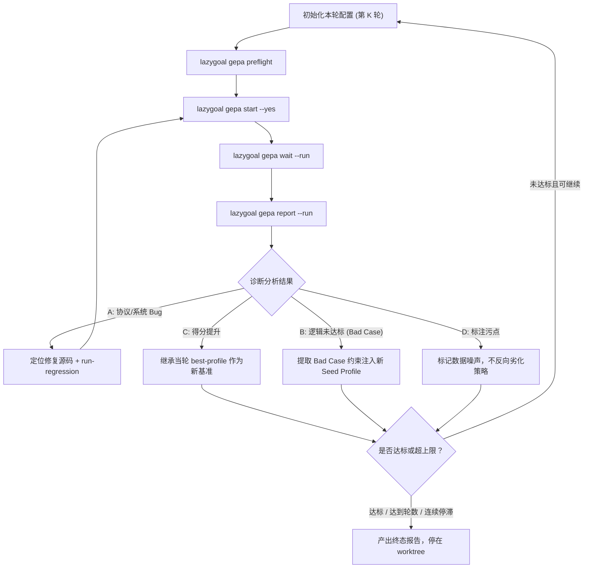

# LazyGoal GEPA 多轮变异与自纠错循环 (GEPA Loop)

指导 Agent 在隔离的 `git worktree` 环境中自主推进完整的 GEPA 多轮变异闭环。本 Skill 组合调用 [`lg-gepa-optimization`](../lg-gepa-optimization/SKILL.md) 的标准 CLI 契约（`preflight`, `start`, `wait`, `report`），在上层负责多轮状态继承、Bad Case 深入归因、分级自纠错与终止收敛控制。

---

## 一、 设计原则与纪律

1. **隔离运行**：整个 GEPA Loop 必须在独立的 `git worktree` 分支中执行。自动源码修复与单测回归不得污染主工作区。
2. **标准 CLI 控制**：所有底层的变异 Run 调度必须通过 `lazygoal gepa` 官方 CLI 执行，禁止手工操控 Worker 进程或私自篡改 `.lazygoal/gepa/runs/` 内部状态。
3. **分级自纠错**：
   - **协议与系统 Bug**：优先就地修复源码并全量回归，不消耗外层变异轮数；
   - **策略未达标 Bad Case**：提取根因，注入到下一轮 Seed Profile 或 Reflection 模板；
   - **数据集标注污点**：显式隔离标记，避免盲目劣化全局 Prompt。
4. **闭环收官**：达到目标分数或轮数上限后停止在 worktree 内，产出包含多轮矩阵、最终 Profile 与修复提交的完整总结，交由用户验证合并。

---

## 二、 输入契约与环境初始化

### 1. 稳定输入契约

执行前确认以下参数已明确具备：

| 参数 | 说明 | 示例 |
|---|---|---|
| `benchmark` | 目标评测基准 | `gaia`, `alfworld` |
| `trainset` / `valset` | 训练集与验证集 Manifest 路径 | `~/.lazygoal/gepa/requests/gaia-level2/train.json` |
| `baseProfilePath` | 变异目标 Profile 路径 | `~/.lazygoal/agent-profiles/gaia-worker-profile.json` |
| `targetScore` | 目标分数（达到即收官） | `1.0` 或指定阈值 |
| `maxRounds` | 最大外层变异轮数 | 默认 `3` ~ `5` |
| `metricBudgetPerRound` | 单轮变异 Metric 调用上限 | 默认 `3` ~ `5` |
| `patience` | 连续无提升早停轮数 | 默认 `2` |

### 2. 建立隔离 Worktree

1. 基于当前开发分支（如 `dev`）创建隔离分支与 worktree：
   ```bash
   git worktree add -b gepa-loop/<benchmark>-<timestamp> .worktrees/gepa-loop-<benchmark> dev
   ```
2. 进入该 worktree 目录，确认 Python 环境指向 prompt-evaluation 的 uv 虚拟环境：
   ```bash
   export LAZYGOAL_GEPA_PYTHON=$(pwd)/prompt-evaluation/gepa/.venv/bin/python
   ```
3. 确认 `.env` 配置存在（必要时复制自宿主开发环境）以支持 LLM 调用。

---

## 三、 GEPA Loop 状态机执行流



### Step 1: 准备本轮 Request 与 Candidate

* **Round 1**：基于用户指定的 `baseProfilePath` 读取初始 Profile，构造本轮 `request.json`（设定 `maxMetricCalls = metricBudgetPerRound`）。
* **Round K+1**：
  * **若上一轮得分提升**：直接继承上一轮生成的 `best-profile.json`，将其更新为本轮的 base profile；
  * **若上一轮得分未提升**：
    - 读取上一轮详细 trajectories 与诊断 trace；
    - 针对 Bad Case 提取“正向准则”与“边界防错约束”；
    - 将新约束融合注入到当前最佳 Candidate 中，生成新的 Seed Profile。

### Step 2: 预检与启动

1. 执行预检：
   ```bash
   LAZYGOAL_GEPA_PYTHON=... node bin/lazygoal.cjs gepa preflight \
     --request <request_path> \
     --profile-path <current_profile_path>
   ```
2. 校验通过后拉起后台变异：
   ```bash
   LAZYGOAL_GEPA_PYTHON=... node bin/lazygoal.cjs gepa start \
     --request <request_path> \
     --profile-path <current_profile_path> \
     --yes
   ```
   记录返回的 `runId`。

### Step 3: 等待并获取权威报告

1. 阻塞等待本轮到达终态：
   ```bash
   LAZYGOAL_GEPA_PYTHON=... node bin/lazygoal.cjs gepa wait --run <runId>
   ```
2. 运行结束时拉取权威 report：
   ```bash
   LAZYGOAL_GEPA_PYTHON=... node bin/lazygoal.cjs gepa report --run <runId>
   ```

### Step 4: 结果深入诊断与分级自纠错

读取本轮运行产物（`report.json`、各任务 `attempt.json`、`trajectories` 和 `traces`），按以下三级策略自纠错：

#### 级别 A：系统与协议错误（Crash / Protocol Error）
* **特征**：`stepCount=0`，`errors` 包含 `INVALID_LLM_RESPONSE`、`INVALID_AGENT_DECISION` 或运行时未捕获异常。
* **自纠错动作**：
  1. 查阅 trace 中的原始模型返回内容，定位校验失败的字段或协议不兼容处；
  2. 在 worktree 内编辑对应包源码（如 `packages/llm/` 或 `packages/contracts/`）；
  3. 补充回归单测；
  4. 运行 `node scripts/run-regression.mjs` 确认回归套件 100% 通过；
  5. 提交中文 commit，例如 `fix(llm): ...`；
  6. **不计入外层轮数计数**，在 worktree 内重新执行当前轮次变异。

#### 级别 B：算法与业务逻辑未达标（Algorithmic / Reasoning Bad Case）
* **特征**：系统无报错（`errors: []`），但判题未命中（例如计算未用代码、循环计数差 1、未按要求格式提交）。
* **自纠错动作**：
  1. 提取 Bad Case 的关键输入、模型推理链与执行动作；
  2. 明确具体失效模式（如“牛顿法求根中 while 循环在条件满足后多自增了一次”）；
  3. 将经验转化为防御性提示词约束（例如：“进行循环或收敛迭代时，严格校验使条件首次成立的最小下标”）；
  4. 注入到下一轮 Seed Candidate 或 Reflection 提示词模板中。

#### 级别 C：官方评测集标注污点（Dataset Ground Truth Defect）
* **特征**：Agent 的推理与拼写 100% 正确，而官方 Ground Truth 存在拼写笔误（如波利比乌斯广场写成 `Ploybius`）。
* **自纠错动作**：
  1. 确认该任务属于标注固有噪声；
  2. 记录在案并标记为“已知标注污点”，在循环评估中对该案例做旁路归因；
  3. 禁止为了迎合错别字而特化甚至破坏全局 Prompt。

### Step 5: 终止与流转条件判定

在每轮自纠错与结果整理后，判断循环状态：

1. **达标收工**：若 `bestScore >= targetScore`，达成最终优化目标，退出 Loop；
2. **轮数耗尽**：若 `currentRound >= maxRounds`，退出 Loop；
3. **停滞早停**：若连续 `patience` 轮最佳分数未增长且未能发现新的有效突变点，退出 Loop；
4. **继续下一轮**：否则递增轮次计数，携带新生成的 Seed Profile 进入下一轮 Step 1。

---

## 四、 终态产物与总结规范

当 GEPA Loop 结束时，必须按以下结构生成权威总结：

1. **多轮演进全景矩阵**：
   | 轮次 | Run ID | 耗时 | 最佳得分 | 核心变异 / 策略调整点 | 自纠错与修复记录 |
   |---|---|---|---|---|---|
   | Round 1 | `run_...` | ...s | 0.0 | 基线评测 | 修复 Gemini evidenceSequences 投影残留 |
   | Round 2 | `run_...` | ...s | 0.5 | 强化 Python 代码验算与循环下标防御 | 注入边界防错约束 |
   | ... | ... | ... | ... | ... | ... |

2. **最终 Profile 产物**：
   - 给出最终胜出的 `best-profile.json` 路径；
   - 对比基线 Profile，列出关键新增或调整的 System Prompt 与 Instructions。
3. **源码与测试沉淀（若有）**：
   - 列出在自纠错阶段提交的所有 Git commit 记录；
   - 附带可点击的代码修改文件与行号超链接。
4. **停在 Worktree**：
   - 明确指出当前分支名与 worktree 路径；
   - 提示用户审查并决定是否将该分支合入目标分支（如 `dev`）。
