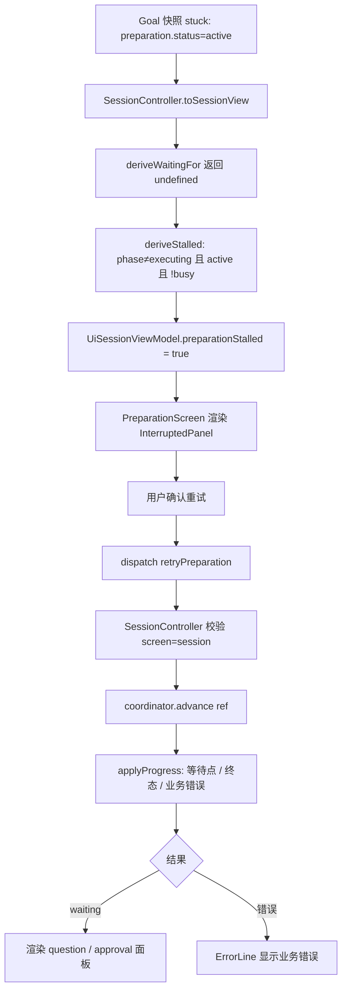

## 产品概述
修复 LazyGoal TUI 中 Preparation 阶段被中断后 Goal 永久卡死、用户无从恢复的问题。

## 核心特性
- **中断识别**：Goal 停在 `gathering_context` / `planning` 且 `preparation.status === "active"`（非等待用户输入）且当前无异步推进时，TUI 将其识别为「Preparation 已中断」，而不是显示无意义的等待文案。
- **自助重试**：中断状态下提供重试入口，走 `coordinator.advance()` 重新推进，用户无需重启 CLI 或删除快照。
- **状态正确性**：中断态不属于「等待用户输入」，不污染 `UiWaitingFor` 与 `SessionScreen` 的既有语义。
- **孤儿数据清理**：删除已卡死的 Goal `9b8111dd-4880-49bc-b018-c20abda7df1c` 及其 trajectory / trace。

## 明确不做
- 不修改 `packages/runtime`（含 `GOAL_NOT_WAITING` 文案）。
- 不从源头改 `active` 的持久化语义。
- 不登记 spec。


## 技术栈
沿用项目现有栈，不引入新依赖：TypeScript（strict）、React + Ink 终端 UI、`node:test` + `ink-testing-library`、tsx 运行器。

## 实现方案

### 策略
在 TUI 层新增一个**派生显示状态** `preparationStalled` 和一条**新命令** `retryPreparation`，把「卡死的瞬时态」转化为「可识别 + 可恢复」的用户可见状态。Runtime 语义零改动。

### 关键技术决策

**决策 1：新增独立字段 `preparationStalled`，不扩展 `UiWaitingFor`**
`UiWaitingFor` 的语义是「Session 等待用户输入的细分类型」（[types.ts:72-78](packages/tui/src/types.ts#L72-L78)），而 stalled 恰恰是**不**等待用户输入。塞进该联合体会污染 `SessionScreen` 的 spinner label switch（[session-screen.tsx:137-143](packages/tui/src/session-screen.tsx#L137-L143)）并让「waitingFor 存在即应渲染输入框」的隐含契约失效。

**决策 2：状态由 Controller 派生，屏幕组件不自行推断**
`UiSessionViewModel` 的契约明确要求「UI 不应自行推断 Runtime 状态机」（[types.ts:129-131](packages/tui/src/types.ts#L129-L131)）。因此沿用同文件既有派生函数 `deriveWaitingFor` / `deriveQuestion` / `deriveProposal` 的风格，在 `toSessionView` 内新增 `deriveStalled`。

**决策 3：必须叠加 `!busy` 判断（关键正确性约束）**
`preparation.status === "active"` 在一次正常的 `advance()` 进行中也是合法的瞬时态。若只看 status 不看 busy，会在每次正常推进时闪出「已中断」面板。stalled 仅在「非等待态 + active + 当前无异步推进」时为真。

**决策 4：重试复用 `coordinator.advance()`，不新增 Runtime 能力**
`advance()` 本身就会重跑 preparation executor 并推进到下一个等待点或终态（[goal-coordinator.ts:284-324](packages/runtime/src/goal-coordinator.ts#L284-L324)），已有完整恢复能力，只是 UI 未暴露入口。重试语义等价于「恢复后再推进一次」，因此 `retryPreparation` 直接用内存中的 `this.snapshot.goal`（screen 已为 session），无需再 `store.restore`。

### 复杂度与性能
全部为 O(1) 派生计算与单次 `advance()` 调用，无新增遍历、无后台轮询、无额外 I/O。重试受既有 `dispatch` 串行闸门保护（`busy` 时以 `UI_BUSY` 拒绝），不会并发触发多次 LLM 调用。

### 可靠性
- `retryPreparation` 在非 session 页面返回 `NO_ACTIVE_SESSION`，与 `resumeSession` 的错误码保持一致。
- 重试成功 → 自然渲染 question / approval / executing 页面；重试失败 → 走既有 `setError(toUiError(error))` 显示业务错误，不吞异常。
- fail-closed：不改变任何 Runtime 状态转换，UI 层不写快照。

## 实现要点

- **新增公开接口的中文契约级 TSDoc**（AGENTS.md 强制）：`UiCommand` 新成员、`UiSessionViewModel` 新字段、`PreparationScreenProps` 新 prop、新增派生函数，均需职责 / 状态语义 / 参数返回 / 副作用 / 局限 + 至少一个 `@example`。
- **UI 文案保持英文**（AGENTS.md：Agent 输出与 UI 文案用英文）。
- **`resetKey` 需纳入新状态**（[preparation-screen.tsx:51-54](packages/tui/src/preparation-screen.tsx#L51-L54)），否则重试后闸门不复位、后续提交被锁死。
- **重试控件用 `submitGate.attempt` 包装**，与 `handleApprove`（[preparation-screen.tsx:82-86](packages/tui/src/preparation-screen.tsx#L82-L86)）一致，避免重复提交。
- **不要按错误方向改**：曾误判「屏幕把 Agent 提问误渲成输入框」。实际 `deriveWaitingFor` 在 active 态返回 `undefined`（[session-controller.ts:592-621](packages/tui/src/session-controller.ts#L592-L621)），本就不会渲染输入框；死局在 [preparation-screen.tsx:124-126](packages/tui/src/preparation-screen.tsx#L124-L126) 那一行黄字。
- **架构文档同次更新**：[docs/architecture/tui.md:19](docs/architecture/tui.md#L19) 现有表述「可恢复入口统一为 `resume`」在新增命令后不再准确，需改；[:21](docs/architecture/tui.md#L21) PreparationScreen 职责需带上中断恢复入口。只描述已实现行为，保持简短。

## 架构设计

数据流（纯 TUI 层闭环，Runtime 无改动）：



## 目录结构

```
packages/tui/src/
├── types.ts                  # [MODIFY] 新增 UiCommand 成员 retryPreparation；UiSessionViewModel 新增可选字段 preparationStalled。两处均需补中文契约级 TSDoc 与 @example。
├── session-controller.ts     # [MODIFY] 新增 deriveStalled 派生函数并在 toSessionView 注入；execute switch 新增 case retryPreparation（复用 advance + applyProgress，校验 screen==="session"）。
├── preparation-screen.tsx    # [MODIFY] 新增 StalledPanel（复用 ConfirmInput）、onRetry prop；替换 124-126 行的死局黄字分支；resetKey 纳入 preparationStalled。
├── app.tsx                   # [MODIFY] case "session" 非 executing 分支（99-107 行）给 PreparationScreen 传入 onRetry。
└── index.ts                  # [CHECK] 确认 UiCommand / UiSessionViewModel 已导出；如未导出则补充（无需新增导出类型，除非测试需要）。

packages/tui/test/
├── session-controller.test.ts # [MODIFY] 新增：retryPreparation 触发 coordinator.advance 并 applyProgress；非 session 页面返回 NO_ACTIVE_SESSION；stalled 派生在 active+非 busy 时为真、在 busy 或 waiting_input 时为假。沿用 FakeCoordinator / dependencies / sessionView 既有构造模式。
└── screens.test.tsx          # [MODIFY] 新增：StalledPanel 渲染重试入口并回调 onRetry；busy 或正常等待态不渲染该面板。沿用 createGoalSnapshot / questionSession 等既有 helper（39-132 行）的构造风格。

docs/architecture/
└── tui.md                    # [MODIFY] 同步第 19 行「可恢复入口统一为 resume」与第 21 行 PreparationScreen 职责描述。

.lazygoal/                    # [CLEANUP] 删除卡死 Goal 9b8111dd 的快照、trajectories 与 traces 目录。
```

## 关键代码结构

```ts
/**
 * Session 的 Preparation 是否已停滞在无法自行推进的中间态。
 *
 * @remarks
 * 只在「非 executing 阶段 + preparation.status 为 active + 当前无等待点 +
 * 无进行中的异步推进」时为真。active 在一次正常 advance() 期间同样是合法
 * 瞬时态，因此必须叠加 busy 判断，否则正常推进中会误报中断。
 *
 * @example
 * ```ts
 * if (view.preparationStalled === true) render(<StalledPanel onRetry={retry} />);
 * ```
 */
readonly preparationStalled?: boolean;
```

```ts
/**
 * 重新推进一个停滞的 Preparation 阶段。
 *
 * @remarks
 * 仅在当前存在活动 Goal Session 时可用；等价于对最新快照再执行一次
 * advance()，由 Runtime 重跑 preparation executor。不写入快照、不改
 * Runtime 状态机。
 *
 * @example
 * ```ts
 * await controller.dispatch({ kind: "retryPreparation" });
 * ```
 */
| { readonly kind: "retryPreparation" };
```
