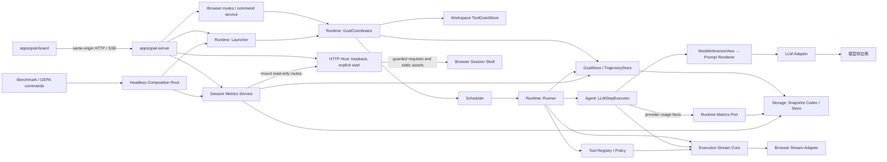

# Goal Server

本机 Web 服务 Composition Root，连接 Runtime、Browser、HTTP 与前端。本文描述当前实现、使用边界与限制；[公开入口](../src/index.ts)。

## 职责与使用

通过本模块的公开入口使用上述能力；[公开入口](../src/index.ts)。状态或副作用由调用方在所属边界控制。

## 边界与限制

本模块不替代其依赖模块的协议或持久化职责；具体输入、失败语义与类型以链接的源码契约为准。

## 服务装配与主流程

## 主流程

1. Launcher 校验 intent、Profile、协议组合和持久化依赖，默认创建普通 Run；GoalPlan 可缺省，也可保留已有计划。
2. `/plan` 为尚未提交 `run_started` 的当前 Run 选择 Plan 模式；当前 Run 已完成或失败时，将一次性选择保存为 `nextRunMode`，由下一 Run 消费。
3. Coordinator 调用统一 Runner。普通 Run 直接处理用户请求；Plan Run 的 Prompt 要求先提出任务提案，但 Runtime 仍按现有 Profile、Tool Policy 和 Action 审批授权已暴露的业务 Tool。Decide 可请求目标明确的 Think；Runner 提交 Think 输出后再调用 Decide，完成候选通过协议与证据校验后，还须独立审查交付与事实支持；接受后才提交回复和完成。只有最终业务决策推进 Step。
4. `ask_user` 与 Plan Run 的 `task_proposal` 都保存为可恢复的 `pendingInteraction`。提案等待期间不继续模型或 Tool 调用；用户回答、批准或反馈持久化后，Coordinator 恢复同一 Run。completed 或 failed 输入先归档历史及终态，再提交新 Run。
5. 获批 Plan Run 可通过受模式能力授权的计划 Tool 更新 GoalPlan。一个 Run 可依次更新多个 Todo；标记 Todo 完成必须引用当前 Run 已提交 Observation。Run 终态独立于未完成 Todo，后者保留原状态且不会自动创建下一 Run。
6. 每个事实、Memory Patch、消息、Action/Observation 和 Snapshot 都遵守“提交成功后才继续”的边界。非 YOLO 工具审批可按单次、当前 Goal 或 workspace 授权；持续授权在 Goal 批准快照提交后才激活。Web 看板从已提交的 Goal、Run 与计划状态投影会话和交互面板。

实时事件通过独立的 `execution-stream` Core 旁路发送：它只分配 Goal/Run 内 cursor、执行可见性过滤、增量合并和慢订阅者关闭，不拥有 Goal 状态转换、Trajectory 写入、Provider/Tool 调用或 UI 渲染。Runtime 负责把生命周期和提交边界映射成领域事件；Agent/LLM 负责把模型流归一化后发布；Tool 可选地发布输出分片；Web 服务把事件适配为同源 SSE，前端维护瞬时活动视图，恢复仍以 Snapshot/Trajectory 为准。
