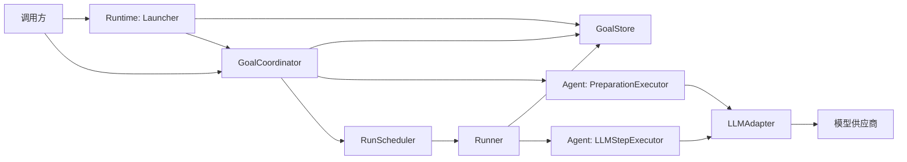

# LazyGoal 架构总览

> 当前架构的极简入口。以源码为事实来源；功能演进过程见 `specs/`，接口细节见源码 TSDoc。

LazyGoal 是一个 Goal 驱动的同步 Agent。`runtime` 拥有状态、生命周期和持久化，`agent` 把完整 Goal 转成一次模型调用，`llm` 隔离具体模型供应商。每个 Step 完成后，Runner 先保存最新完整 Goal，再决定继续、等待或结束。

| 概念 | 含义 |
| --- | --- |
| Goal | 由冻结 definition 与可变 state 组成的可恢复 Session 聚合 |
| Run | Goal 内当前执行实例，拥有独立 `runId` |
| Step | Executor 的一次原子执行 |
| Profile | 创建 Goal 时复制的 Agent 配置 |
| Snapshot | GoalStore 中某个 `goalId` 的最新完整状态 |

## 模块关系

## 主流程

1. Launcher 校验原始 intent，创建并保存 `gathering_context/active` Goal，再调用 Coordinator。
2. Coordinator 推进 Preparation，并在每次继续前保存阶段或交互等待点。
3. 进入 executing 后，Scheduler 使用 `{ goalId, runId }` 调用 Runner。
4. Runner 恢复 Goal、校验 `runId`，进入 `running`。
5. Agent Executor 接收已注册的授权 ToolDefinition 并生成 AgentDecision；Runner 做严格协议、Profile、Registry、输入和 Policy 校验。
6. 自动允许的 Action 按 `stage_action → Tool → observe_action` 顺序保存；需要批准的 Action 保存为等待点，领域 failure 继续下一轮，基础设施异常保存 `execution_error`。
7. Coordinator 对 Action 执行 `approve_action`/`reject_action`：批准先保存再以瞬时授权调度，拒绝写入 rejected Observation；终止决策或正数 `maxSteps` 使 Run 停止。

## 跨模块不变量

- `goalId` 定位 Session，`runId` 标识执行实例，二者不能互换。
- Preparation workflow 不消费 Step；executing workflow 必须拥有已确定 task。
- Coordinator 独占 Preparation 转换，Runner 独占 Run 转换；Executor 不保存 Goal。
- 下一 Step 只能在上一份完整快照保存成功后开始。
- Runtime 不依赖 Agent 或具体 LLM；依赖通过接口注入。
- 当前只保存最新快照，不提供历史版本或并发冲突检测；Runtime 与 Runner 已支持自动允许、审批等待、拒绝、瞬时授权以及 safe/manual 中断恢复。

## 模块速查

- [Runtime](./runtime.md)：状态、生命周期、调度与持久化。
- [TUI Controller](./tui.md)：单 Goal UI 命令串行化与不可变会话快照。
- [Agent](./agent.md)：Prompt、响应协议与 Step 执行。
- [LLM](./llm.md)：供应商无关接口与模型适配器。
