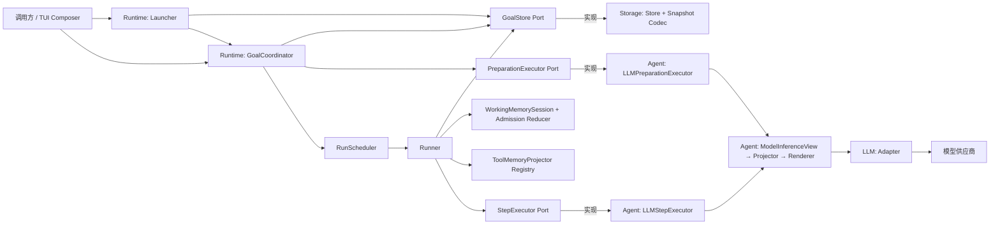

# LazyGoal 架构总览

> 当前架构的极简入口。以源码为事实来源；功能演进过程见 `specs/`，接口细节见源码 TSDoc。

LazyGoal 是一个 Goal 驱动的同步 Agent。`runtime` 拥有状态、生命周期、结构化 Working Memory 和持久化 Port，`storage` 提供当前 Snapshot v1 与 Profile 持久化，`agent` 通过 Projector 与 Renderer 把完整 Goal 转为一次模型调用，`llm` 隔离模型供应商。新 Goal 统一冻结 Prompt Bundle v1、`structured@1`、`trajectory-layered@1` 与 `bm25-lite@1`；历史 Snapshot 或协议版本在 Storage/Runtime 边界直接拒绝，不执行迁移。每个业务边界先提交事实与 canonical Memory Patch，再保存最新完整 Goal。

| 概念 | 含义 |
| --- | --- |
| Goal | 由冻结 definition 与可变 state 组成的可恢复 Session 聚合 |
| Run | Goal 内当前执行实例，拥有独立 `runId` |
| Step | Executor 的一次原子执行 |
| Profile | 创建 Goal 时复制的 Agent 配置 |
| Prompt Bundle | 由 Goal 冻结版本、由 Agent 解析的版本化 Prompt 组合（Global Overview + Phase Protocol） |
| Snapshot | GoalStore 中某个 `goalId` 的最新完整状态 |
| Working Memory | 从已提交 Patch 临时归约的 `facts/hypotheses/plan/blockers` 投影，不进入 Snapshot |
| Memory revision | Snapshot 指向的 accepted Patch 链头，用于中断后确定性重建 |

## 模块关系

## 主流程

1. Launcher 校验原始 intent 与 Prompt/Memory 协议，创建并保存 `gathering_context/active` Goal，再调用 Coordinator。
2. Coordinator 推进 Preparation，并在每次继续前保存阶段或交互等待点。
3. 进入 executing 后，Scheduler 使用 `{ goalId, runId }` 调用 Runner。
4. Runner 恢复 Goal、校验 `runId`，进入 `running`。
5. Agent Executor 按 Goal 冻结的 Prompt Bundle 版本渲染唯一 system 消息（Global Overview → Profile → Phase Protocol → 授权 ToolDefinition），结构化 Goal 同时接收从 Trajectory 重建的 Working Memory；Runner 做严格协议、Profile、Registry、输入、Policy 和 Evidence 校验。
6. Coordinator/Runner 通过共享 Committer 追加事实与 canonical Patch，保存 Snapshot v1 的提交边界、Context Epoch 和 revision；Tool 返回后可由同步纯函数 Projector 提议 Fact，Runtime 统一做 evidence、去重、失效与容量准入。Snapshot 成功后才更新临时 Memory。
7. Coordinator 对 Action 执行 `approve_action`/`reject_action`：批准先保存再以瞬时授权调度，拒绝写入 rejected Observation；终止决策或正数 `maxSteps` 使 Run 停止。缺失或损坏的结构化 Trajectory 在模型调用前 fail-closed。

## 跨模块不变量

- `goalId` 定位 Session，`runId` 标识执行实例，二者不能互换。
- Preparation workflow 不消费 Step；executing workflow 必须拥有已确定 task。
- Coordinator 独占 Preparation 转换，Runner 独占 Run 转换；Executor 不保存 Goal。
- 下一 Step 只能在上一份完整快照保存成功后开始。
- Runtime 不依赖 Agent 或具体 LLM；依赖通过接口注入。
- 新 Goal 的 Prompt Bundle v1 与 `structured@1`、`trajectory-layered@1`、`bm25-lite@1` 由 Composition Root 一起冻结；不支持的历史 Snapshot 或协议组合直接失败，不提供兼容迁移路径。
- Working Memory 只在 Coordinator/Runner 调用链内存在；`WorkingMemorySession` 从 Snapshot 的 `memoryRevision` 与 `committedThroughSequence` 重建，原始 Trajectory 永不被 Compact 或归约覆盖。
- accepted Patch、Runtime 生命周期 Patch、Action/Observation 和终态事实共享同一提交顺序；模型 Patch 在关联 Action 前提交，Projector Patch 与 Observation 处于同一 Snapshot 边界，终态清理 phase intent。
- Prompt Bundle（Global Overview 与 Phase Protocol）是 Agent 拥有的上层模型契约，Profile 只补充不冲突的角色与领域细节；Tool 权限和状态合法性仍由 Runtime 强制执行。
- 分层依赖方向由 `npm run check:dependencies` 自动校验：View DTO、Prompt Renderer 与 Storage DTO/Schema 不得反向引用 Runtime，只有 Codec 与 Projector 允许同时看到两侧；脚本同时拒绝任何 package 反向加载 Storage 或 Agent。
- 当前只保存最新快照，不提供历史版本或并发冲突检测；Runtime 与 Runner 已支持自动允许、审批等待、拒绝、瞬时授权以及 safe/manual 中断恢复。

## 模块速查

- [Runtime](./runtime.md)：状态、生命周期、调度与持久化 Port。
- [Storage](./storage.md)：Goal Snapshot 与 Profile 的 DTO、Schema、Codec 及内存/JSON Store。
- [TUI Controller](./tui.md)：单 Goal UI 命令串行化与不可变会话快照。
- [Benchmark Evaluation](./benchmarks.md)：显式 ALFWorld TextWorld 评测入口与 Episode 报告。
- [Agent](./agent.md)：ModelInferenceView、Projector、Renderer、响应协议与 Step 执行。
- [LLM](./llm.md)：供应商无关接口与模型适配器。
