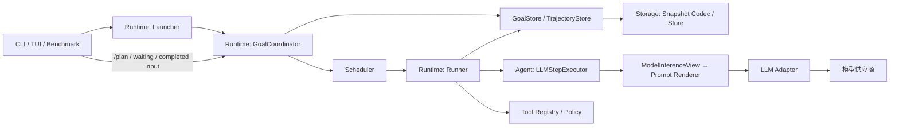

# LazyGoal 架构总览

> 本目录只描述当前实现；功能设计、历史决策和迁移说明保留在 `specs/`。

LazyGoal 是一个 Goal 驱动的可恢复 Agent Runtime。`runtime` 拥有 Goal、Run、Trajectory、Working Memory 和持久化边界；`agent` 将当前 Goal 投影为单轮模型请求；`contracts` 生成模型输出契约；`llm` 隔离供应商；`storage` 保存当前 Snapshot；`tui` 渲染同一个 Session 时间线。当前协议固定为 Prompt Bundle v1、`structured@1`、`trajectory-layered@1` 和 `bm25-lite@1`，不为旧开发数据提供迁移路径。

| 概念 | 含义 |
| --- | --- |
| Goal | 由冻结 definition 与可变 state 组成的可恢复 Session 聚合；持有会话消息、Plan Mode/GoalPlan 和 Run 历史 |
| Run | Goal 内一次执行边界，拥有独立 `runId`；completed 后由显式输入创建后继 Run |
| Task | 模型提出、用户批准后固定到 Goal workflow 的目标与完成条件 |
| Step | 一次 Run 内已提交的 Agent 决策或 Tool Action/Observation 周期；序号只在 Run 内递增 |
| Snapshot | GoalStore 中某个 `goalId` 的最新完整状态 |
| Working Memory | 从已提交 Trajectory 的 accepted Patch 临时归约出的上下文 |
| Timeline | TUI Controller 按提交顺序维护的不可变消息、Markdown Block 与步骤列表 |

## 模块关系

```mermaid
flowchart LR
    C[CLI / TUI / Benchmark] --> L[Runtime: Launcher]
    L --> G[Runtime: GoalCoordinator]
    C -->|/plan / waiting / completed input| G
    G --> S[GoalStore / TrajectoryStore]
    G --> Q[Scheduler]
    Q --> R[Runtime: Runner]
    R --> S
    R --> E[Agent: LLMStepExecutor]
    E --> V[ModelInferenceView → Prompt Renderer]
    V --> A[LLM Adapter]
    A --> M[模型供应商]
    S --> ST[Storage: Snapshot Codec / Store]
    R --> T[Tool Registry / Policy]
```

## 主流程

1. Launcher 校验 intent、Profile、协议组合和持久化依赖，创建 `phase: "executing"` 的 Goal；任务尚未批准时 `workflow.task` 缺省，默认不 materialize GoalPlan。
2. `/plan` 作为控制 Effect 在安全边界进入 Plan Mode；GoalCoordinator 持有 GoalPlan，模型只在该模式获得计划更新分支，TUI 只读投影同一 Snapshot。
3. Coordinator 调用统一 Runner。模型在同一决策协议中可以提问、提交普通只读 Tool Action、提出任务提案或请求历史 Context Lookup。
4. `ask_user` 与 `task_proposal` 都保存为可恢复的 `pendingInteraction`。用户回答、批准或反馈后，Coordinator 先保存再继续；waiting 输入恢复同一 Run，completed 输入先归档历史并提交新 Run。
5. 任务批准后，Runner 继续处理普通 Tool、Lookup、完成、等待和失败决策；Tool 权限、输入、Policy 与 Evidence 由 Runtime 再次校验。Plan Mode 下一个执行 Run 只承接一个 Todo，完成证据与 Todo completed 在同一提交边界写入。
6. 每个事实、Memory Patch、消息、Action/Observation 和 Snapshot 都遵守“提交成功后才继续”的边界。TUI 通过 Store 提交通知和流式转录构造统一时间线。

## 跨模块不变量

- Goal workflow 只有 `executing`；`workflow.task` 缺省表示任务尚未批准，存在时表示已批准任务。
- 未批准任务时，模型只能看到 `ask_user`、任务提案、Lookup 和显式只读 Tool；副作用 Tool 必须等任务批准。只读 Tool 仍走普通 `stage_action`、执行和 `observe_action`，并计入 Step。
- Runtime 独占状态转换、持久化、Tool 授权和 Evidence 校验；Agent 不保存 Goal，也不决定 Runtime ID、Step、Epoch 或审批状态。
- `goalId` 定位 Session，`runId` 标识执行实例；恢复时二者必须同时匹配。
- `Goal.mode` 与 `GoalPlan` 由 Runtime/Storage 持有；normal Goal 不包含 GoalPlan，Plan Mode 的一个执行 Run 只能绑定一个 Todo。
- 跨 Run 历史必须携带完整 `(goalId, runId)` 来源；旧 Run 的 Lookup 结果不能成为当前 Run 的完成 Evidence。
- `pendingInteraction` 与 `pendingAction` 的等待点可持久化恢复；请求 ID、Goal/Run 身份和提交边界必须匹配。
- Working Memory 只从已提交 Trajectory 重建；原始事实账本不被 Compact 覆盖。
- Prompt Bundle 与三个当前协议由 Composition Root 一起冻结；未知版本、旧 Snapshot 和交叉协议组合 fail-closed。
- `contracts` 保持零出站依赖；依赖方向由 `npm run check:dependencies` 校验。

## 模块速查

- [Runtime](./runtime.md)：Goal 状态、推进、恢复、Trajectory 与持久化 Port。
- [Storage](./storage.md)：Snapshot/Profile DTO、Schema、Codec 与 Store。
- [Agent](./agent.md)：模型视图、Prompt Bundle、请求组装与决策解析。
- [Contracts](./contracts.md)：Canonical/Wire 模型输出契约和 Tool 输入契约。
- [LLM](./llm.md)：供应商无关 Adapter、配置与取消语义。
- [TUI](./tui.md)：Session Controller、统一时间线和交互抽屉。
- [Benchmark Evaluation](./benchmarks.md)：Headless Root、ALFWorld 与 SWE-bench 评测入口。
