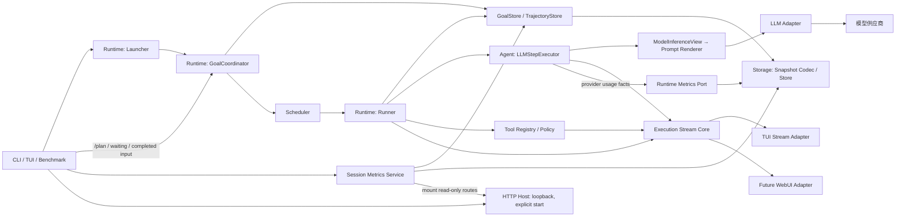

# LazyGoal 架构总览

> 本目录只描述当前实现；功能设计、历史决策和迁移说明保留在 `specs/`。

LazyGoal 是一个 Goal 驱动的可恢复 Agent Runtime。`runtime` 拥有 Goal、Run、Trajectory、Working Memory 和持久化边界；`agent` 将当前 Goal 投影为单轮模型请求；`contracts` 生成模型输出契约；`llm` 隔离供应商；`execution-stream` 只提供进程内 JSON-safe 实时事件与有界订阅；`storage` 保存当前 Snapshot 与独立模型调用指标事实；`session-metrics` 从 Goal 和调用事实投影会话统计；`http` 提供显式启动的本机路由宿主；`tui` 负责装配但不会自动监听端口。当前协议固定为 Prompt Bundle v1、`structured@1`、`trajectory-layered@1` 和 `bm25-lite@1`，不为旧开发数据提供迁移路径。

| 概念 | 含义 |
| --- | --- |
| Goal | 由冻结 definition 与可变 state 组成的可恢复 Session 聚合；持有会话消息、独立 GoalPlan、下一 Run 的一次性模式选择和 Run 历史 |
| Run | Goal 内一次执行边界，拥有独立 `runId`、模式和可选获批任务；completed 后由显式输入创建后继 Run |
| Task | Plan Run 的提案经用户批准后保存在该 Run 的目标与完成条件；普通 Run 直接以用户请求为目标 |
| Step | 一次 Run 内最终已提交的 Agent 决策或 Tool Action/Observation 周期；中间 Decide/Think 阶段和 Think 检查点不增加 Step 序号 |
| Snapshot | GoalStore 中某个 `goalId` 的最新完整状态 |
| Working Memory | 从已提交 Trajectory 的 accepted Patch 临时归约出的上下文 |
| Timeline | TUI Controller 按提交顺序维护的不可变消息、Markdown Block 与步骤列表 |
| Execution Stream | 按 Goal/Run 隔离的实时事件旁路；不写 Snapshot 或 Trajectory |
| Session Metrics | 基于 Goal 快照和模型调用事实重新归约的查询投影；不参与 Goal 恢复 |

## 模块关系

```mermaid
flowchart LR
    C[CLI / TUI / Benchmark] --> L[Runtime: Launcher]
    L --> G[Runtime: GoalCoordinator]
    C -->|/plan / waiting / completed input| G
    G --> S[GoalStore / TrajectoryStore]
    G --> Q[Scheduler]
    Q --> R[Runtime: Runner]
    R --> S
    R --> E[Agent: LLMStepExecutor]
    E --> V[ModelInferenceView → Prompt Renderer]
    V --> A[LLM Adapter]
    A --> M[模型供应商]
    S --> ST[Storage: Snapshot Codec / Store]
    R --> T[Tool Registry / Policy]
    R --> X[Execution Stream Core]
    E --> X
    T --> X
    X --> U[TUI Stream Adapter]
    X --> W[Future WebUI Adapter]
    E -->|provider usage facts| MS[Runtime Metrics Port]
    MS --> ST
    C --> MC[Session Metrics Service]
    MC --> S
    MC --> ST
    C --> H[HTTP Host: loopback, explicit start]
    MC -->|mount read-only routes| H
```

## 主流程

1. Launcher 校验 intent、Profile、协议组合和持久化依赖，默认创建普通 Run；GoalPlan 可缺省，也可保留已有计划。
2. `/plan` 为尚未提交 `run_started` 的当前 Run 选择 Plan 模式；当前 Run 已完成时，将一次性选择保存为 `nextRunMode`，由下一 Run 消费。
3. Coordinator 调用统一 Runner。普通 Run 直接处理用户请求；Plan Run 的 Prompt 要求先提出任务提案，但 Runtime 仍按现有 Profile、Tool Policy 和 Action 审批授权已暴露的业务 Tool。Decide 可请求目标明确的 Think；Runner 提交 Think 输出后再调用 Decide，只有最终业务决策推进 Step。
4. `ask_user` 与 Plan Run 的 `task_proposal` 都保存为可恢复的 `pendingInteraction`。提案等待期间不继续模型或 Tool 调用；用户回答、批准或反馈持久化后，Coordinator 恢复同一 Run。completed 输入先归档历史并提交新 Run。
5. 获批 Plan Run 可通过受模式能力授权的计划 Tool 更新 GoalPlan。一个 Run 可依次更新多个 Todo；标记 Todo 完成必须引用当前 Run 已提交 Observation。Run 终态独立于未完成 Todo，后者保留原状态且不会自动创建下一 Run。
6. 每个事实、Memory Patch、消息、Action/Observation 和 Snapshot 都遵守“提交成功后才继续”的边界。TUI 从已提交的 Goal、Run 与计划状态投影交互面板和统一时间线。

实时事件通过独立的 `execution-stream` Core 旁路发送：它只分配 Goal/Run 内 cursor、执行可见性过滤、增量合并和慢订阅者关闭，不拥有 Goal 状态转换、Trajectory 写入、Provider/Tool 调用或 UI 渲染。Runtime 负责把生命周期和提交边界映射成领域事件；Agent/LLM 负责把模型流归一化后发布；Tool 可选地发布输出分片；TUI 订阅这些通用事件并维护瞬时活动视图，恢复仍以 Snapshot/Trajectory 为准。

## 跨模块不变量

- Goal workflow 只有 `executing`；Run 持有 `mode` 和可选 `approvedTask`，GoalPlan 独立于当前模式。
- 普通 Run 不产生任务审批等待；Plan Prompt 的提案顺序不是 Tool 硬门控，未批准前的业务 Tool 仍由既有 Profile、Tool Policy 和 Action 审批控制。
- Runtime 独占状态转换、持久化、Tool 授权和 Evidence 校验；Agent 不保存 Goal，也不决定 Runtime ID、Step、Epoch 或审批状态。
- `goalId` 定位 Session，`runId` 标识执行实例；恢复时二者必须同时匹配。
- 模型调用指标是独立的投影事实；查询时从 Goal 快照、JSONL 调用记录和覆盖标记重新计算，不成为 Runtime 恢复输入。
- 通用 HTTP 宿主只负责 Hono 子路由挂载和回环监听生命周期；Session Metrics 自己定义只读 JSON/SSE 路由，TUI 组合根仅装配路由而不自动启动服务。
- `/plan` 选择当前或下一 Run 的模式且只消费一次；后续 Run 只由用户新输入创建。
- GoalPlan Todo 不绑定 Run；同一 Run 可以顺序推进多个 Todo，旧 Run 或未提交 Observation 不能完成 Todo。
- 跨 Run 历史必须携带完整 `(goalId, runId)` 来源；旧 Run 的 Lookup 结果不能成为当前 Run 的完成 Evidence。
- `pendingInteraction` 与 `pendingAction` 的等待点可持久化恢复；请求 ID、Goal/Run 身份和提交边界必须匹配。
- Working Memory 只从已提交 Trajectory 重建；原始事实账本不被 Compact 覆盖。
- Prompt Bundle 与三个当前协议由 Composition Root 一起冻结；未知版本、旧 Snapshot 和交叉协议组合 fail-closed。
- `contracts` 保持零出站依赖；依赖方向由 `npm run check:dependencies` 校验。

## 模块速查

- [Runtime](./runtime.md)：Goal 状态、推进、恢复、Trajectory 与持久化 Port。
- [Storage](./storage.md)：Snapshot/Profile DTO、Schema、Codec 与 Store。
- [Agent](./agent.md)：模型视图、Prompt Bundle、请求组装与决策解析。
- [Contracts](./contracts.md)：Canonical/Wire 模型输出契约和 Tool 输入契约。
- [LLM](./llm.md)：供应商无关 Adapter、配置与取消语义。
- [Execution Stream](./execution-stream.md)：Goal/Run 实时事件 Envelope、可见性策略和进程内订阅。
- [Session Metrics](./session-metrics.md)：用量事实、会话投影、覆盖状态与只读订阅路由。
- [HTTP Host](./http.md)：可复用本机 HTTP 服务、路由挂载与显式生命周期。
- [TUI](./tui.md)：Session Controller、统一时间线和交互抽屉。
- [Benchmark Evaluation](./benchmarks.md)：Headless Root、隔离 benchmark 与 Prompt Evaluation 入口。
