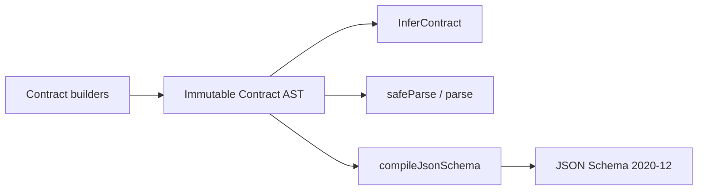

# Contracts 模块

## 摘要

`@lazygoal/contracts` 是独立的结构契约基础包。调用方通过公开 builder 创建带品牌且不可变的
Contract AST；同一份 AST 可用于 TypeScript 类型推导、严格 JSON 输入校验和 JSON Schema
2020-12 编译。当前 Tool 输入契约与 Agent 模型输出响应契约（Preparation 与 Step Wire 响应）
已全面基于不可变 Contract AST，其余 Snapshot、Trajectory、Profile 等业务协议仍使用各自既有校验入口。

## 数据流

## 职责速查

| 组件 | 负责 | 不负责 |
| --- | --- | --- |
| [Contract builders 与 AST](../../packages/contracts/src/contract.ts) | 构造并冻结受支持节点、保存递归引用身份 | 执行回调规则、转换、默认值或协议 I/O |
| [公共类型](../../packages/contracts/src/types.ts) | `Contract`、`InferContract` 与各节点的只读输出推导 | 运行时输入校验 |
| [Definition checker](../../packages/contracts/src/definition.ts) | 在消费 AST 前检查节点、optional 位置和递归图完整性 | 把普通输入错误转换为 validation issue |
| [Parser](../../packages/contracts/src/parser.ts) | 严格解析 JSON 值，生成隔离副本、稳定 issue，并限制循环/深度/issue 数量 | 修改输入、隐式转换或持久化 |
| [Schema compiler](../../packages/contracts/src/json-schema.ts) | 从 AST 确定性生成独立的 JSON Schema 2020-12 数据 | 持有 validator 实例、缓存或第二份可编辑定义 |
| [Model output contracts](../../packages/contracts/src/model-output/index.ts) | 构造阶段 Wire Contract AST、生成 Shape Guide 并编译模型原生 JSON Schema Bundle | 发起网络请求或解析具体响应 |

## 边界与当前限制

- `packages/contracts/src/` 不依赖 LazyGoal 其它 package，也不依赖外部结构校验器；Ajv 仅存在于
  [package devDependencies](../../packages/contracts/package.json) 和 [oracle 测试](../../packages/contracts/test/json-schema-oracle.test.ts) 中。
- [依赖检查器](../../scripts/check-dependencies.mjs) 将 `contracts` 声明为零出站基础包，并允许其它
  package 单向依赖它；当前 `runtime`、`tools`、`agent` 与 `benchmarks` 已单向依赖它处理 Tool
  输入契约与模型输出契约，其余 Snapshot、Trajectory、Profile 和 Diagnostic Trace 协议保持原校验入口。
- AST 是进程内定义，不是 wire protocol；Schema 是按次编译的派生产物。Parser 只接受有限 JSON 值，
  optional 只能直接用于 object 字段，递归输入受固定深度和诊断数量上限约束。

