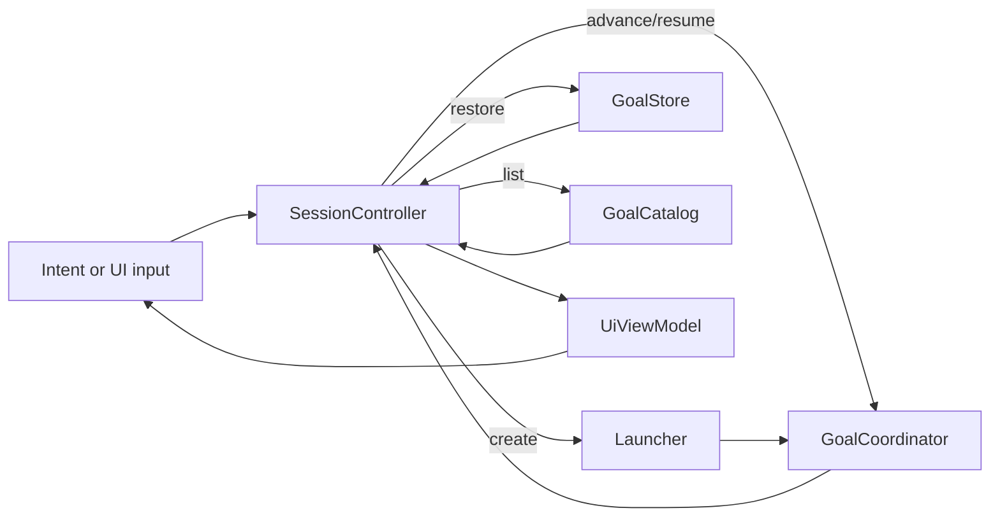

# TUI Controller

## 摘要

`packages/tui` 当前提供 SessionController 与 React Ink 的意图/Preparation 界面。
Controller 把一次进程内的用户交互限制为单 Goal 会话，组合 Launcher、
GoalCoordinator、GoalStore 和 GoalCatalog；`TuiApp` 通过
`useSyncExternalStore` 订阅不可变 `UiViewModel`，屏幕只提交语义化命令。

## 职责速查

| 组件 | 负责 | 不负责 |
| --- | --- | --- |
| [SessionController](../../packages/tui/src/session-controller.ts) | 串行 dispatch、单 Goal 约束、Runtime 命令映射、错误和快照通知 | React/Ink 渲染、CLI 参数、领域状态转换 |
| [UiCommand/UiViewModel](../../packages/tui/src/types.ts) | 描述用户意图和可渲染状态 | 自行推断 Runtime 可用操作 |
| [TuiApp](../../packages/tui/src/app.tsx) | 订阅 Controller 并按 screen 路由页面 | Runtime 编排和快照写入 |
| [IntentScreen / PreparationScreen](../../packages/tui/src/intent-screen.tsx) | 英文 intent、question、proposal 批准与反馈输入、空白校验、busy 禁用 | 生成 Goal ID、直接调用 Runtime |
| Runtime adapters | 启动、恢复、推进与 Catalog 查询 | UI 状态持有 |

## 当前数据流

`create` 校验非空 intent 后只生成一个 goalId，并委托 Launcher；恢复命令先读取
完整快照，再以 `{goalId, runId}` 调用 Coordinator。消息、任务批准、Action 批准
和拒绝分别映射为 Coordinator 的 `resume` action。每次成功推进都用最新 Goal
替换 session ViewModel；业务错误保留最近已知 Goal 或当前页面，并在 `error`
中暴露稳定 code/message。

`dispatch` 在操作开始同步置 `busy`；已有操作或关闭页面会拒绝新命令。Controller
不启动后台 Worker、不创建第二个 Goal，也不在 UI 层写入快照。`TuiApp` 使用
`useSyncExternalStore` 读取快照；`IntentScreen` 与 `PreparationScreen` 只在提交
非空文本或批准时发出一次语义化命令，busy 时停用输入控件。

## 当前限制

- 本阶段尚未接入 CLI、`resume` 选择页面、executing/Action/终态 SessionScreen
  或 Ctrl+C 关闭编排；这些由 React Ink TUI Spec 的后续 TODO 实现。
- `SessionController` 只保证单进程内串行化；跨进程租约和历史快照仍由 Runtime
  当前限制决定。
