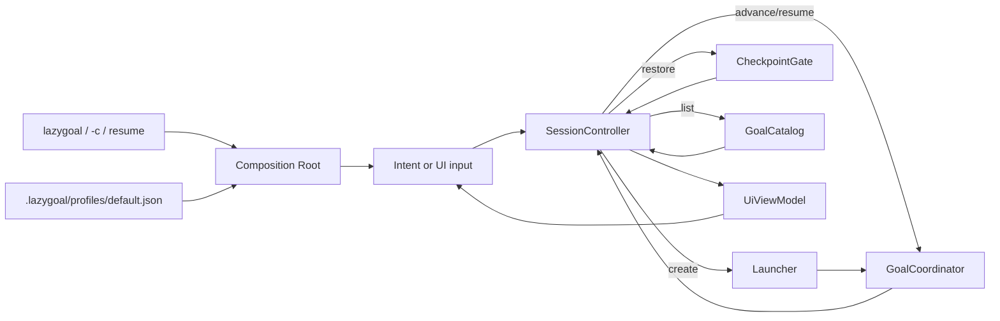

# TUI Controller

## 摘要

`packages/tui` 当前提供项目级 `lazygoal` CLI、Composition Root、SessionController
与 React Ink 的 intent、Goal 选择、Preparation 和 executing Session 界面，并把
Ctrl+C/SIGINT 接入受管关闭流程。
Controller 把一次进程内的用户交互限制为单 Goal 会话，组合
Launcher、GoalCoordinator、GoalStore 和 GoalCatalog；CLI 只在环境变量校验通过后
创建这一整组共享依赖，`TuiApp` 通过
`useSyncExternalStore` 订阅不可变 `UiViewModel`，屏幕只提交语义化命令。

## 职责速查

| 组件 | 负责 | 不负责 |
| --- | --- | --- |
| [cli.tsx](../../packages/tui/src/cli.tsx) | `parseArgs` 路由空参数、`-c`、`resume`，校验 LLM/Profile 环境，加载当前 Profile，创建单一 Composition Root 并协调 SIGINT、Ink 卸载和退出码 130 | 领域状态转换、跨进程并发租约 |
| [SessionController](../../packages/tui/src/session-controller.ts) | 串行 dispatch、单 Goal 约束、Runtime 命令映射、错误和快照通知 | React/Ink 渲染、CLI 参数、领域状态转换 |
| [UiCommand/UiViewModel](../../packages/tui/src/types.ts) | 描述用户意图和可渲染状态 | 自行推断 Runtime 可用操作 |
| [TuiApp](../../packages/tui/src/app.tsx) | 订阅 Controller 并按 screen 路由页面 | Runtime 编排和快照写入 |
| [IntentScreen](../../packages/tui/src/intent-screen.tsx) / [GoalSelectScreen](../../packages/tui/src/goal-select-screen.tsx) / [PreparationScreen](../../packages/tui/src/preparation-screen.tsx) / [SessionScreen](../../packages/tui/src/session-screen.tsx) | 英文 intent、Catalog 选择、Preparation、消息 scrollback、executing 状态、blocked 输入、Action 审批/拒绝、终态和 Ctrl+C 回调 | 生成 Goal ID、直接调用 Runtime |
| Runtime adapters | 启动、恢复、推进与 Catalog 查询 | UI 状态持有 |

## 当前数据流



Composition Root 以 `realpath(process.cwd())` 为 workspaceRoot，将 Goal 快照放在
`.lazygoal/goals`，只读取当前生效的 `.lazygoal/profiles/default.json`，共享一个
`OpenAICompatible`、Profile Registry、`ReadFileTool`、`WriteFileTool`、`EditFileTool`、
`GrepTool`、`BashTool`、`JsonFileGoalStore`、`CheckpointGateGoalStore`、Coordinator、
Scheduler、Runner、根 `AbortController` 和 SessionController。Runner 注入
`createDefaultToolPolicy` 生成的 fail-closed 授权策略：只读 `read_file` 与 `grep`
自动放行，`write_file`、`edit_file`、`bash` 与任何未识别 Tool 都需要用户逐次批准。缺失或非法 Profile、未注册 Tool，以及缺失
`LLM_API_KEY`、`LLM_BASE_URL` 或 `LLM_MODEL` 时，在创建 Goal 前返回稳定非零错误；
Profile 文件不会由程序自动生成，构造根本身也不会创建 `.lazygoal` 或 Goal。用户需要手工创建
`.lazygoal/profiles/default.json`，其当前结构为：

```json
{
  "schemaVersion": 1,
  "id": "default",
  "name": "Default",
  "description": "通用 LazyGoal Agent",
  "systemPrompt": "You are a focused coding agent...",
  "instructions": ["Use only authorized tools."],
  "toolIds": ["read_file", "write_file", "edit_file", "grep", "bash"]
}
```

当前 Composition Root 只读取这个文件，不扫描或验证其它 Profile。Profile 只补充
Global Overview 与 Phase Protocol 未规定的角色和工作细节；Tool 权限仍由 Runtime
强制执行。`create` 校验非空 intent 后只生成一个 goalId，并委托 Launcher；Launcher
创建的新 Goal 自动冻结当前 Global System Prompt v1。`resume` 先查询
按 Catalog 顺序返回的可恢复条目并显示 Goal 选择页，`continueLatest`（CLI 的 `-c`）
直接恢复首项；确认后读取完整快照，再以 `{goalId, runId}` 调用 Coordinator。消息、任务批准、Action 批准
和拒绝分别映射为 Coordinator 的 `resume` action。每次成功推进都用最新 Goal
替换 session ViewModel；业务错误保留最近已知 Goal 或当前页面，并在 `error`
中暴露稳定 code/message。

`dispatch` 在操作开始同步置 `busy`；已有操作或关闭页面会拒绝新命令。第一次
Ctrl+C 会将 Controller 切换到 `shutting_down`，保留当前 Goal 的最近内存副本并
拒绝后续命令，不写入 `cancelled`。Controller
不启动后台 Worker、不创建第二个 Goal，也不在 UI 层写入快照。`TuiApp` 使用
`useSyncExternalStore` 读取快照，并以 `exitOnCtrlC: false` 通过 raw-mode 回调
通知 CLI；CLI 同时监听进程级 `SIGINT`。`IntentScreen`、`GoalSelectScreen` 与
`PreparationScreen` 与 `SessionScreen` 只在提交非空文本、确认选择、批准或拒绝
时发出一次语义化命令，busy 时停用输入控件。`GoalSelectScreen` 只展示 Catalog
摘要，不在选择前恢复完整 Goal；`SessionScreen` 用 `Static` 保存真实消息，并在
动态区域展示状态栏、checkpoint、Spinner、Action 输入和终态摘要。

## 关闭流程

- CLI bin shim 通过绝对解析的 `tsx/esm` loader 启动 TSX 源码，因此从其他
  workspace 调用时仍保留当前项目根的依赖解析，而快照路径仍按调用方 cwd 隔离。
- 第一次 raw-mode Ctrl+C 或 SIGINT 进入同一个幂等流程：Controller 先切换
  `shutting_down`，随后冻结 Checkpoint Gate、abort 根 signal、卸载 Ink 并等待
  `waitUntilExit()`，最后由 `ShutdownCoordinator` 等待已进入的原子保存和受管
  资源；超过 2 秒则强制关闭剩余资源，调用 `ExitPort(130)`。
- `OpenAICompatible`、Executor 和 Tool 共享根 signal；模型调用中断只传播
  `ExecutionAbortedError`，不会生成 fail Step、`execution_error` 或新快照。
- `SessionController` 只保证单进程内串行化；跨进程租约和历史快照仍由 Runtime
  当前限制决定。
