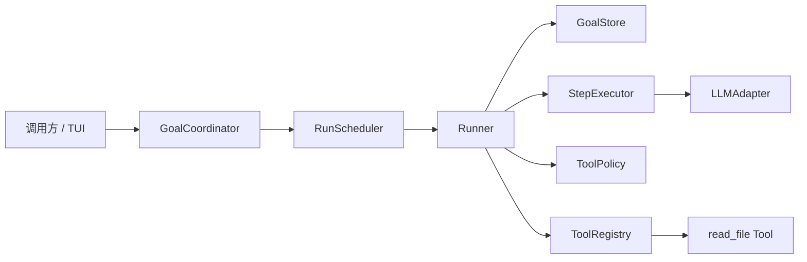

# Action/Observation Loop 设计

## Overview

本功能把 executing 阶段从“LLM 直接返回 StepResult”改为“AgentDecision → 可选 ToolCallAction → Observation”的可恢复循环。Runner 继续独占 Run 状态推进和持久化顺序；GoalCoordinator 继续独占外部用户操作；Agent 只生成严格结构化决策；Tool 实现不接触 GoalStore。

Goal 快照升级为 v3，并通过只读迁移兼容 v1/v2。执行记忆保持有界，只保存 checkpoint、最近 Step 和当前 pending Action。首个 `read_file` Tool 位于独立 `packages/tools`，验证真实文件 Observation，但不引入写入或 Shell 能力（`req-1-*`～`req-8-*`）。

## Architecture



一次自动 Action 周期的顺序固定为：

```text
恢复 Goal → 检查 maxSteps → 生成 AgentDecision
→ 校验 Tool/参数/授权与 Policy
→ 保存 checkpoint + pendingAction
→ 执行 Tool → 得到 Observation
→ 保存 lastStep、清除 pendingAction、stepCount + 1
→ 下一轮
```

任何箭头后的保存失败都会停止后续调用。Action 在执行前已有 durable intent；Observation 只有成功保存后才完成 Step（`req-3-*`、`req-7-*`）。

## Key Design Decisions

### 1. Action 是 AgentDecision 分支，不是所有文字输出

`StepExecutor` 仍表示一次模型决策边界，但返回 `AgentDecision`。`tool_call` 才产生 Action；纯知识回答使用 `complete`，用户阻塞使用 `wait`，主动失败使用 `fail`。新协议不再产生 `continue`；每个分支都携带非空 checkpoint。文本 LLMAdapter 不变，Agent Prompt 以 JSON 描述 Tool 定义和决策协议（`req-1-*`、`req-6-2`）。

### 2. Runner 是唯一 A/O 持久化编排者

Runner 从 Registry 解析 Tool、校验 Profile 白名单和输入，再调用 Policy。它通过纯 `transition` 应用 `stage_action`、`observe_action`、终止决策和执行失败，不让 StepExecutor、Policy 或 Tool 修改 Goal。GoalCoordinator 只把用户批准或拒绝转换为显式 RunInput，并先保存再调度（`req-2-*`～`req-5-*`）。

### 3. 审批与实际执行授权分离

Tool 声明 `replayPolicy`，Policy 根据 Goal、Action 和 Tool 定义返回 `allow` 或 `require_approval`。需要批准时，Run 进入 waiting，pendingAction 标记 `awaiting_approval`。批准后 Coordinator 保存 `approved` 状态，并以仅本次调用有效的 `authorizedActionId` 调度 Runner；该授权不持久化，进程中断后不能被误当作“尚未执行”（`req-4-*`、`req-8-1`）。

拒绝会生成 `rejected` Observation、完成当前 Step 并继续循环，不执行 Tool。对于恢复出的 `approved` Action，`safe` Tool 可用相同 actionId 自动重放；`manual` Tool 转为 `outcome_unknown` waiting，用户可再次批准重试或拒绝重放（`req-4-4`、`req-8-*`）。

### 4. Observation 区分领域结果与系统失败

Tool 正常返回 `success` 或 `failure` Observation；二者都会完成 Action Step 并进入下一轮。Tool 抛出异常、Tool/参数协议错误、Profile 越权和 AgentDecision 协议错误使用扩展的 RunStopReason 终止 Run，不伪造成 Observation，也不追加 assistant 消息。Tool 抛出发生在 pendingAction 保存后时保留该 Action，明确结果可能未知（`req-2-*`、`req-5-*`）。

### 5. Working Context 只投影有界执行记忆

executing Working Context 从 Run 投影 `checkpoint`、`lastStep` 和 `pendingAction`；这些控制数据仍是最后一条非持久化 user 消息。模型返回的新 checkpoint 已吸收上一轮 Observation，并在下一个 Action 执行前持久化。Goal messages 只保存真实 user/assistant 交互；Action、Observation 和 checkpoint 不伪装成消息（`req-6-*`）。

### 6. Step 只在完整决策周期后计数

`observe_action`、`reject_action` 或 `complete/wait/fail` 决策成功转换时 `stepCount + 1`。`stage_action`、批准、恢复和同 actionId 重放均不计数。Runner 仍在生成新 AgentDecision 前检查正数 maxSteps；0 保持无限（`req-7-*`）。

### 7. v3 严格协议与只读迁移

新 Goal 使用 `schemaVersion: 3`。解码路径为 v1 → v2 → v3；恢复本身不写回。v2 的 lastStep 包装为只允许迁移产生的 `legacy` StepRecord，并从已有文本确定性派生可选 checkpoint；下一次正常保存才写 v3。新产生的 Step 禁止使用 legacy 分支（`req-8-3`、`req-8-4`）。

## Components and Interfaces

```ts
interface StepExecutor {
    execute(goal: Goal, tools: readonly ToolDefinition[]): Promise<AgentDecision>;
}

interface ToolDefinition {
    readonly id: string;
    readonly description: string;
    readonly inputSchema: JsonObject;
}

interface Tool {
    readonly definition: ToolDefinition;
    readonly replayPolicy: "safe" | "manual";
    validate(input: JsonValue): ToolValidationResult;
    execute(request: ToolExecutionRequest): Promise<ToolObservation>;
}

interface ToolRegistry {
    get(toolId: string): Tool | undefined;
}

interface ToolPolicy {
    evaluate(context: ToolPolicyContext): "allow" | "require_approval";
}
```

Runtime 定义以上契约及内存 Registry；`packages/tools` 提供 `ReadFileTool`。RunnerDependencies 增加 Registry 与 Policy。Runner 向 StepExecutor 只传 Profile 授权且已注册的 ToolDefinition；执行时仍重新校验 action.toolId，防止模型越权（`req-2-1`、`req-2-2`）。

GoalUserAction 增加携带 actionId 的 `approve_action` 与 `reject_action`。executing 等待结果细分为 `blocked`、`action_approval` 和 `action_recovery`；原 message 仅恢复 Agent `wait`，结构化批准不追加真实消息。RunScheduler 接受可选的瞬时 `authorizedActionId`，只允许匹配当前 pendingAction（`req-4-*`、`req-8-1`）。

LLMStepExecutor 移除 ToolsNotSupportedError 前置拦截，改为解析 AgentDecision；LLMPreparationExecutor 同样不再因 Profile 含 toolIds 失败，因为 Preparation 不执行 Tool。供应商 Adapter 及统一文本消息协议无需变化。

`ReadFileTool` 注入 workspaceRoot，输入严格为 `{ path: string }`。它拒绝绝对路径与 `..`，并使用解析后的真实路径再次确认目标位于 workspaceRoot 内，避免符号链接越界；合法读取返回内容，ENOENT 等正常文件错误返回 failure Observation（`req-2-3`、`req-2-4`、`req-5-2`）。

## Data Models

```ts
type JsonValue = null | boolean | number | string | readonly JsonValue[] | JsonObject;
interface JsonObject { readonly [key: string]: JsonValue }

interface ToolCallAction {
    readonly actionId: string;
    readonly toolId: string;
    readonly input: JsonValue;
}

type Observation =
    | { readonly kind: "success"; readonly output: JsonValue; readonly summary: string }
    | { readonly kind: "failure"; readonly code: string; readonly message: string; readonly retryable: boolean }
    | { readonly kind: "rejected"; readonly reason: string };

type AgentDecision =
    | { readonly kind: "tool_call"; readonly checkpoint: string; readonly action: ToolCallAction }
    | { readonly kind: "complete"; readonly checkpoint: string; readonly summary: string }
    | { readonly kind: "wait"; readonly checkpoint: string; readonly reason: string }
    | { readonly kind: "fail"; readonly checkpoint: string; readonly error: string };

type StepRecord =
    | { readonly kind: "action"; readonly action: ToolCallAction; readonly observation: Observation }
    | { readonly kind: "decision"; readonly result: Exclude<AgentDecision, { kind: "tool_call" }> }
    | { readonly kind: "legacy"; readonly result: StepResult };

interface PendingAction {
    readonly action: ToolCallAction;
    readonly status: "approved" | "awaiting_approval" | "outcome_unknown";
}
```

RunState 保留 id/status/stepCount/stopReason，新增 `checkpoint?: string` 与 `pendingAction?: PendingAction`，lastStep 改为上述联合类型。跨字段 Schema 保证：Preparation 不含执行记忆；pendingAction 只存在于 executing；waiting 的 Agent wait、审批等待和恢复等待互斥；终态不能持有待审批 Action。`observe_action` transition 在清除 pendingAction 前校验 actionId 一致。

## Error Handling

- `TOOL_NOT_AUTHORIZED`、`TOOL_NOT_FOUND`、`INVALID_TOOL_INPUT`、`INVALID_AGENT_DECISION` 和 `TOOL_EXECUTION_ERROR` 写入 `stopReason: { kind: "execution_error", code, message }`，不消费 Step；持久化错误仍原样抛出。
- Agent 主动 `fail` 是正常决策，消费一个 Step、写 decision lastStep 并进入 failed；它不使用 execution_error。
- Observation 保存失败后，Store 中仍是 pendingAction；恢复时按 replayPolicy 处理。系统不承诺跨文件系统或外部服务的 exactly-once。
- actionId 与当前 pendingAction 或最近 Action 冲突且不是合法恢复时按 INVALID_AGENT_DECISION 失败；有界快照不提供全局历史去重。

## Testing Strategy

- Domain/Transition：穷举 stage、approve、reject、observe、terminal、cancel、maxSteps 与非法状态组合，验证每个 Step 只计数一次（`req-3-*`、`req-4-*`、`req-7-*`）。
- Runner：用记录顺序的 Fake Store/Executor/Tool/Policy 验证先保存后执行、普通 failure Observation 继续、基础设施错误终止、审批不执行、safe 重放和保存失败停止（`req-2-*`～`req-5-*`、`req-8-*`）。
- Coordinator/Scheduler：覆盖 actionId 匹配、批准、拒绝、瞬时授权、message 与 Action 等待类型隔离，以及每条恢复路径先保存再调度（`req-4-*`、`req-7-3`）。
- Agent：覆盖 ToolDefinition Prompt、四分支严格 AgentDecision Schema、checkpoint/lastStep/pendingAction 投影、无 Tool 纯文本 complete，以及 Preparation 允许非空 toolIds（`req-1-*`、`req-6-*`）。
- Tool：在临时工作区验证真实 read_file、缺失文件、绝对路径、`..` 与符号链接逃逸（`req-2-3`、`req-2-4`、`req-5-2`）。
- Store：覆盖 v3 克隆与不变量、v1/v2 只读迁移、legacy Step、下一次保存升级和损坏快照拒绝（`req-6-3`、`req-8-*`）。
- 最终运行 TypeScript 编译、Runtime/Agent/Tools 全量测试与 `git diff --check`。
