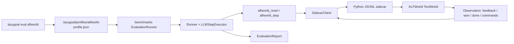

# ALFWorld TextWorld 评测接入设计

## Overview

本设计把 ALFWorld TextWorld 作为独立评测 package 接入 LazyGoal。`benchmarks` 负责评测编排、Conda 环境和 ALFWorld 连接；用户通过显式的 `lazygoal eval alfworld` 入口选择工作区中的 ALFWorld Profile，评测任务再通过专用 Tool 进入现有 `Runner` 的 Action/Observation 循环。普通 `lazygoal` 启动路径保持不变。需求覆盖 [req-1](./requirements.md#需求-1-独立评测环境可准备) 至 [req-7](./requirements.md#需求-7-现有-lazygoal-行为保持兼容)。

## Key Design Decisions

### 1. 以 `benchmarks` 作为独立 package

- 新增私有 package `@lazygoal/benchmarks`，位于 `benchmarks/`，拥有自己的 `package.json`、`tsconfig.json` 和测试脚本。
- `benchmarks/alfworld/` 保存环境配置、Python sidecar、任务清单、TypeScript 代码、测试和安装说明；benchmarks 包根目录只保留包级配置文件。
- 初版不把 `benchmarks` 接入生产 package 依赖图；根脚本通过 `npm --prefix benchmarks ...` 显式委托，避免普通安装和测试触发 Conda。
- 评测代码只依赖现有 Runtime/Agent/LLM 的公开边界，不修改 `packages/runtime`、`packages/tools`、`packages/tui` 的生产注册表。
- ALFWorld 的运行时测试 Profile 固定放在工作区 `.lazygoal/profiles/alfworld-profile.json`，复用现有 Profile 文件 Schema，`id` 固定为 `alfworld-profile`，`toolIds` 固定包含现有只读 `read_file`、`grep` 与专用 `alfworld_reset`、`alfworld_step`，不包含 `write_file`、`edit_file` 或 `bash`。该文件是工作区配置而不是 Goal Snapshot；由于 `.lazygoal/` 继续被忽略，Profile 不进入源码提交。
- Profile 的 `systemPrompt` 和 `instructions` 必须要求模型先调用 `alfworld_reset`、每次 `alfworld_step` 只提交一条环境命令、禁止使用 Bash，并且只有观察中的 `won=true` 才能报告完成；任务路径、数据根和模型凭据不写入 Profile，而由 manifest 与进程环境提供。
- `lazygoal eval alfworld --profile alfworld-profile --manifest <path>` 是唯一的 ALFWorld 入口；`--profile` 默认值为 `alfworld-profile`，但仍显式加载 `.lazygoal/profiles/<profileId>.json` 并校验文件内 `id`。普通 `lazygoal` 和 `lazygoal resume` 仍只加载既有 `.lazygoal/profiles/default.json`，不会扫描或自动启用 ALFWorld Profile。

### 2. 通过任务级 JSONL sidecar 管理环境

- 每个 Episode 启动一个长期存活的 Python sidecar，任务终态后关闭并等待进程退出；下一个任务使用新的 sidecar，避免跨任务共享隐藏状态。TypeScript 使用显式的 `ALFWORLD_PYTHON` 路径，以 `spawn` 且 `shell: false` 启动 Python，不通过 Bash 拼接环境命令。
- sidecar 的 stdout 只输出 JSONL 协议，诊断日志写入 stderr。每个请求包含单调递增的 `requestId`，客户端同一时间只允许一个未完成请求。
- 协议操作为 `health`、`reset`、`step`、`close`。`reset` 绑定一个任务清单项，`step` 只推进一条文本命令，`close` 由评测生命周期调用。
- 客户端对响应行、等待时间和进程退出建立有限边界；超限、乱码、错配 `requestId` 或中途退出都结束当前会话，不自动重放未知结果。

### 3. 专用 Tool 连接现有 Agent/Runtime

- Profile 可以同时授权现有只读基础 Tool 与 ALFWorld 专用 Tool；但环境初始化和推进只能由 `alfworld_reset`、`alfworld_step` 完成。关闭由评测器在任务终态、中止和异常路径统一调用，不开放给模型主动破坏会话。评测入口先从 `.lazygoal/profiles/<profileId>.json` 加载并校验 Profile，再把该 Profile 冻结到 executing Goal。
- `alfworld_reset` 只允许在空闲会话初始化一次；`alfworld_step` 只允许在活动会话中调用一次一条命令；任务结束后两者都拒绝继续推进。
- 两个 Tool 均声明 `manual` replay。sidecar 超时或进程异常时 Tool 抛出基础设施异常，由 Runner 保留 `outcome_unknown`，不伪造成功 Observation；环境拒绝命令则返回可继续决策的领域 failure。
- 评测 Policy 自动放行 `read_file`、`grep` 和两个专用 Tool，不进入 TUI 的人工审批流程；`write_file`、`edit_file`、`bash` 不加入该 Profile。对 req-3-1/req-3-3 的解释是：基础 Tool 可以辅助读取仓库，任何 ALFWorld 环境操作仍必须走专用 Tool，且不允许用 Bash 替代。
- 评测器使用现有 `CURRENT_PROMPT_BUNDLE_VERSION`、`LLMStepExecutor` 和 `Runner`，直接构造已完成 Preparation 的 executing Goal，避免把本 Spec 扩展为 Preparation 或 Prompt 变更。Profile 选择属于评测 CLI 的 Composition Root 装配，不改变默认 TUI Composition Root 的 Registry。

### 4. 固定任务清单并隔离环境配置

- 任务清单使用数据根目录下的相对 `gameFile`、稳定 `taskId`、数据切分、顺序、随机种子和单任务 Step 上限；禁止保存机器绝对路径。
- 默认 Smoke 清单使用 TextWorld `valid_seen`，关闭 domain randomization；Regression 只消费提交到仓库的固定清单，任务顺序由清单顺序决定。
- sidecar 启动期验证 Python、ALFWorld 版本、`ALFWORLD_DATA`、任务文件和可用 TextWorld 环境；任何一项失败都在模型调用前终止评测。
- Conda 只安装 TextWorld 依赖。Apple Silicon 的 `osx-64` 选择、数据下载和 `ALFWORLD_DATA` 设置写入 `benchmarks/alfworld/README.md`；显式入口自动解析 `benchmarks/alfworld/.env.alfworld`，命令行环境变量优先；THOR 不进入本 Spec。

### 5. 以环境事实生成独立评测报告

- 每次尝试产生一个 `EpisodeAttempt`，记录 `taskId`、gamefile 标识、`won`、结束状态、步数、目标完成率、耗时、错误类别和重试序号。
- 评测结束生成一个 JSON `EvaluationReport`，包含 manifest/config/model/prompt 的非敏感标识、尝试列表和成功率、平均步数、失败分类汇总。
- `won` 是成功的唯一事实来源；模型的 `complete` 仅作为 Goal 状态记录，不能覆盖环境失败。
- 基础设施重试创建新的 attempt 并保留原始记录；同一个未知 Action 不在 Tool 层自动重放。
- 报告默认输出到调用方指定的位置或 stdout，日志走 stderr；报告不写入 `.lazygoal`，也不把完整 Observation 轨迹写入 Goal Snapshot。

### 6. 保持现有生产行为和数据协议

- 不新增 Runtime 的 Observation、Snapshot、Trajectory 或 replay 字段；评测结果是 `benchmarks` 自己的 DTO。
- 不修改普通 TUI Composition Root 的 Tool Registry、默认 Policy、默认 Profile 和 `lazygoal`/`lazygoal resume` 启动路径；新增的 `eval alfworld` 仅在显式参数分支中装配评测 Profile、专用 ToolRegistry 和 sidecar。
- 评测使用内存 GoalStore 或隔离临时目录；不依赖生产 Goal 文件，也不把 ALFWorld 过程状态声称为可跨进程恢复。

## Architecture

`lazygoal eval alfworld` 先解析 Profile 和任务清单，再由 `EvaluationRunner` 顺序运行任务；每个任务拥有独立 sidecar 和一个活动环境会话。任务开始前通过 `reset` 绑定清单项，任务终态或错误后先关闭 sidecar，再写入 attempt 报告。AbortSignal 从 Runner 传到 Tool、SidecarClient 和子进程清理边界。

## Components and Interfaces

### `benchmarks` package

- `package.json`：声明私有 package、`typecheck`、协议单测和显式 ALFWorld Smoke/Regression 脚本。
- `tsconfig.json`：覆盖 `benchmarks/alfworld/src` 与 `benchmarks/alfworld/test`，不改变根 `tsconfig.json` 对生产源码的范围。
- `.lazygoal/profiles/alfworld-profile.json`：工作区中的唯一 ALFWorld 测试 Profile；评测入口只从该通用 Profile 目录加载，不从 benchmarks 源码目录隐式读取。
- `alfworld/src/cli.ts`：实现 `eval alfworld` 的参数解析、Profile 加载和运行器调用；Profile 缺失、ID 不匹配或 Tool 白名单不满足时，在创建模型请求前失败。
- 根 `bin/lazygoal.cjs` 只对显式的 `eval alfworld` 参数转发到 benchmarks 入口；其它参数继续转发到现有 TUI CLI。该转发不把 `@lazygoal/benchmarks` 加入生产 package 依赖，也不改变默认 `test`。

### Python sidecar

- `benchmarks/alfworld/python/sidecar.py`：读取 Conda 环境配置，构造单 batch TextWorld 环境，禁止向 stdout 写非协议文本。
- `health` 返回 sidecar 协议版本、ALFWorld 版本、数据根和能力；`reset` 返回初始观察、任务标识和可用命令；`step` 返回新观察、`done`、`won`、目标完成率和可用命令；`close` 释放环境并退出。
- sidecar 只接受经过清单解析的任务文件，拒绝越出 `ALFWORLD_DATA` 的路径；固定任务通过显式 gamefile 加载，不依赖环境随机抽样顺序。

### TypeScript bridge and Tools

- `benchmarks/alfworld/src/sidecar-client.ts`：拥有子进程、JSONL 请求队列、超时、AbortSignal、协议校验和关闭流程。
- `benchmarks/alfworld/src/alfworld-tools.ts`：实现 `AlfworldResetTool`、`AlfworldStepTool`；只负责 sidecar 会话状态和环境协议转换，Tool 输出仅使用现有 `ToolObservation` 的 `success`/`failure` 形状，不复制文件读取、搜索或路径沙箱逻辑。
- `benchmarks/alfworld/src/profile.ts`：从 `.lazygoal/profiles` 加载 Profile，校验现有 Profile Schema、只读基础 Tool 与 `alfworld_reset`/`alfworld_step` 的允许集合，并把 Profile ID、文件路径和版本标识传给评测报告。
- `benchmarks/alfworld/src/evaluation-runner.ts`：接收已校验的 Profile，复用现有 `ReadFileTool`、`GrepTool` 实例并注册专用环境 Tool，装配自动放行 Policy、隔离 GoalStore、`LLMStepExecutor`、`Runner` 和报告聚合器；不回写 Profile 文件。
- `benchmarks/alfworld/src/manifest.ts` 与 `report.ts`：校验固定任务清单和报告 DTO，不向 Runtime 导出新领域类型。

## Data Models

协议和报告保持 JSON 可序列化：

- `SidecarRequest`：`requestId`、`op` 与操作参数；`step` 参数只有一条非空命令。
- `SidecarResponse`：匹配的 `requestId` 加 `ok` 分支；成功结果与稳定错误对象互斥。
- `ResetResult`：`taskId`、`gamefile` 标识、初始 `observation` 和 `admissibleCommands`。
- `StepResult`：`observation`、`done`、`won`、`goalConditionSuccessRate` 和 `admissibleCommands`。
- `EpisodeAttempt` / `EvaluationReport`：记录配置标识、尝试结果、重试序号和汇总统计；不得包含 API Key 或完整秘密环境变量。

## Error Handling

- 配置错误：Python、数据根、任务清单或版本预检失败，评测在创建 Goal 前退出。
- Profile 错误：`.lazygoal/profiles/<profileId>.json` 缺失、结构无效、文件内 ID 不匹配或包含未知、写入、编辑、Bash 等不允许的 Tool 时，评测在启动 sidecar 和模型请求前退出；普通 CLI 的 default Profile 错误语义不变。
- 领域错误：ALFWorld 拒绝命令时返回 `failure` Observation，`retryable` 由适配器根据环境结果设置，Runner 可继续下一轮。
- 基础设施错误：超时、进程退出、协议错配、响应超限或 JSON 非法时关闭当前会话并抛出专用错误；Runner 保存 execution error 和 `outcome_unknown`，不生成虚假的 Observation。
- 中止：转换为现有 `ExecutionAbortedError`，停止后续请求，等待子进程退出或强制清理，不写入失败 Step。
- 任务终态：`won=true` 才能生成成功 attempt；`done=true` 且 `won=false` 或模型提前 `complete` 都记录为未成功。

## Research Findings

- ALFWorld 官方环境入口通过 `get_environment("AlfredTWEnv")` 解析 TextWorld 环境；环境实现从 `valid_seen`/`valid_unseen` 等数据路径收集 gamefile，并可请求 `won`、`admissible_commands` 和 `extra.gamefile` 信息。[环境入口](https://raw.githubusercontent.com/alfworld/alfworld/master/alfworld/agents/environment/__init__.py)、[TextWorld 实现](https://github.com/alfworld/alfworld/blob/master/alfworld/agents/environment/alfred_tw_env.py)、[评测配置](https://github.com/alfworld/alfworld/blob/master/configs/eval_config.yaml)
- 官方 Quickstart 要求 Python 3.9+；Apple Silicon 推荐使用 `CONDA_SUBDIR=osx-64`，数据通过 `alfworld-download` 准备。[官方 Quickstart](https://github.com/alfworld/alfworld#quickstart)
- ALFWorld 当前仓库的环境实现和 PyPI 安装版本可能存在差异，因此 sidecar 必须锁定已验证的 ALFWorld 版本或 commit，并在 `health` 阶段报告版本；不得把未验证的上游 API 当作 Runtime 契约。

## Testing Strategy

### 无外部环境的测试

- 用假的 JSONL child process 覆盖请求顺序、`requestId`、错配响应、非法 JSON、超时、退出和 AbortSignal，覆盖 req-2、req-6。
- 用假的 `AlfworldSession` 覆盖 reset/step 状态机、重复/并发调用、manual replay 和 close 幂等，覆盖 req-2、req-3。
- 用假的 LLM Adapter 和 GoalStore 运行 `Runner`，验证 `won` 才能形成成功报告、模型提前 complete 仍失败、领域 failure 可继续，覆盖 req-3、req-5、req-7。
- 用临时 workspace 覆盖 `.lazygoal/profiles/alfworld-profile.json` 的加载、ID 校验、Tool 白名单校验和缺失错误，验证普通 `lazygoal` 不自动启用该 Profile，覆盖 req-3、req-7。
- 验证评测 Profile 中的 `read_file`/`grep` 解析到现有 Tool 实例，并与普通 Tool 的输入校验、沙箱和 Observation 语义一致；验证 ALFWorld 专用 Tool 不包含重复的文件或搜索实现，覆盖 req-3、req-7。

### 显式启用的真实评测

- Conda 预检测试验证 Python、ALFWorld 数据、版本和单个固定 `valid_seen` 任务；缺失 Profile 或环境配置必须在模型请求前失败，覆盖 req-1、req-6、req-7。
- Smoke 测试运行一个固定任务并生成机器可读报告；Regression 测试运行仓库清单中的固定任务集，验证 attempt 保留、汇总指标和阈值退出码，覆盖 req-4、req-5。
- 中止、环境拒绝命令、sidecar 退出和任务结束路径验证关闭动作和报告状态，覆盖 req-2、req-6。

### 回归检查

执行 `npm --prefix benchmarks run typecheck`、`npm --prefix benchmarks test`、真实评测的显式命令，以及现有 `npx tsc --noEmit`、`npm run check:dependencies`、仓库测试和 `git diff --check`。未显式开启 ALFWorld 时不得创建 Conda 进程，覆盖 req-1.4、req-7。
