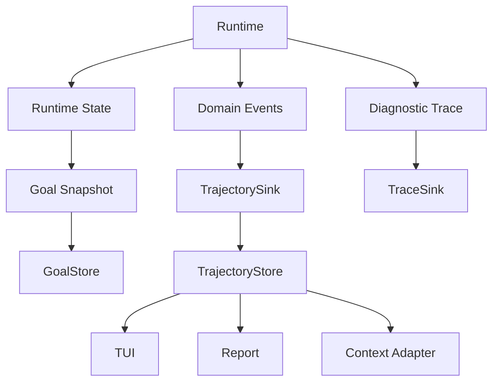

# Execution Trajectory 设计

## Overview

本设计在不改变现有恢复协议的前提下，为 Runtime 增加三条并行输出：`Runtime State` 继续生成 `Goal Snapshot`，事实型 `Domain Events` 追加到 `TrajectoryStore`，运行诊断写入独立的 `Diagnostic Trace`。`Goal Snapshot` 是恢复权威；`Trajectory` 是可查询的审计历史，最后一个快照记录的 `committedThroughSequence` 是提交边界；`state_committed` 只标记快照持久化事实，不参与边界判定。

## Research Findings

- `packages/runtime` 当前只拥有 Goal、Run、Action/Observation 和状态转换，不依赖其它 package；`GoalStore` 只保存最新快照，不提供历史查询。
- `packages/storage` 当前严格读写 Snapshot v5，Codec 是 Runtime 与磁盘 DTO 的唯一转换边界；新增提交边界需要新的 Snapshot DTO 版本，同时保留旧快照读取能力。
- `packages/tui/src/cli.tsx` 是 Composition Root，当前在同一进程装配 `GoalStore`、`Runner`、`GoalCoordinator`、Agent Executor 和 Tool Registry，适合注入共享 Trajectory/Trace 依赖。
- `packages/agent` 的 `ContextCompactor` 已与 Runtime、Storage 和 Trajectory 解耦；Trajectory 只能通过新的 Adapter 映射为 `ContextUnit`。

## Architecture

Runtime 是唯一的事件生产者。`TrajectoryStore` 只负责追加和查询，TUI、Report 与
Context Adapter 只读它；`TraceSink` 不进入事件 reduce，也不参与 Goal 恢复。

## Components and Interfaces

### Runtime

- 在 `packages/runtime/src/trajectory.ts` 定义 `TrajectoryEvent`、事件 payload、
  `TrajectorySink`、`TrajectoryStore`、`DiagnosticTraceSink` 和事件分类/投影函数。
- `TrajectorySink.append` 接收不含服务端序号的 event draft，返回已分配
  `eventId`、`sequence`、时间戳的不可变事件；同一 `(goalId, runId)` 的追加由共享
  recorder 串行化。
- `TrajectoryStore` 在 `TrajectorySink` 之上提供按 Goal/Run 和序列范围读取；缺少
  对应文件时返回空轨迹。
- `Runner` 负责 executing 阶段的执行单元、Action、Tool、Observation、状态提交和终态
  事件；`GoalCoordinator` 负责 Preparation、用户输入、批准/拒绝和恢复事件。
- `RunnerDependencies` 与 `GoalCoordinatorDependencies` 的轨迹依赖保持可选，缺省使用
  no-op recorder 以兼容直接使用 Runtime 的旧调用方；正式 Composition Root 始终注入真实
  recorder。

### Agent and Tools

- `LLMStepExecutor` 和 `LLMPreparationExecutor` 的模型原始请求、响应、耗时和 Provider
  元数据只进入可选 `DiagnosticTraceSink`。
- 解析成功的 `AgentDecision` 在 Runtime Executor 边界记录为 Domain Event，保证它和后续
  Action 共享同一个 `executionUnitId`，不修改严格 AgentDecision 协议。
- Tool 不直接依赖 Trajectory；Runner 在调用 Tool 前后记录 `tool_started` 和
  `tool_finished`，因此既覆盖内置 Tool，也覆盖外部注入 Tool。
- `packages/agent` 新增的 `TrajectoryContextUnitAdapter` 只接收不可变事件列表并生成
  `ContextUnit`；本轮不把该投影自动加入 Prompt。

### Storage and Composition Root

- `packages/storage` 实现 `JsonFileTrajectoryStore`，在
  `.lazygoal/trajectories/<goal>/<run>.jsonl` 追加一行一个事件；Goal/Run 标识使用与
  GoalStore 相同的安全编码，读取按 `sequence` 排序并做严格事件校验。
- `GoalSnapshotCodec` 增加 Snapshot v6 DTO，在 `state.run` 保存非负整数
  `committedThroughSequence`；v5 快照读取时映射为 `0`，不修改原文件，v1 至 v4 继续按
  现有协议拒绝。
- `packages/tui/src/cli.tsx` 创建一个共享 `JsonFileTrajectoryStore`、recorder 和
  `TraceSink`，同时注入 Runner、Coordinator、Agent Executor 与报告/TUI 查询入口。
- TrajectoryStore 的追加只保证当前单进程内按 Run 串行；不引入并发租约或 exactly-once，
  原子双写留给未来 `Durable Outbox`。

## Data Models

### Domain Event Envelope

每个事件包含以下稳定元数据：`eventSchemaVersion: 1`、`eventId`、按 Run 单调递增的
`sequence`、`goalId`、`runId`、`eventType`、ISO UTC `occurredAt`、`phase`，以及可选
的 `executionUnitId`、`stepIndex`、`actionId`、`parentEventId` 和事实 `payload`。
属于模型决策或 Step 的事件必须带 `executionUnitId`；Goal/Run 生命周期和
`state_committed` 等非执行单元事件可以省略它。序号负责排序，时间只用于诊断展示，
消费者不得用时间替代序号。

payload 使用严格 discriminated union，至少包括：`goal_created`、`run_started`、
`run_resumed`、`decision_received`、`action_staged`、`action_approved`、
`action_rejected`、`action_recovered`、`tool_started`、`tool_finished`、
`observation_recorded`、`run_waiting`、`run_completed`、`run_failed`、
`run_cancelled`、`execution_error` 和 `state_committed`。payload 只保存事件发生时的
事实；当前状态、当前计划和当前 pending Action 由 Runtime State 维护。

`state_committed` payload 保存本次 Snapshot 的 `committedThroughSequence`。该事件自身
拥有更大的 `sequence`，但不被纳入它所标记的提交边界。

### Snapshot Boundary

Runtime `RunState.committedThroughSequence` 和 Storage v6 的同名字段表示最新有效
Snapshot 已纳入的最大 Domain Event 序号。保存顺序固定为：

1. 追加本次状态所需的事实事件，取得最大序号 `N`。
2. 将 `committedThroughSequence` 设为 `N` 并保存 Goal Snapshot。
3. Snapshot 保存成功后追加 `state_committed(committedThroughSequence=N)`。

因此，即使第 3 步失败，消费者仍以 Snapshot 中的 `N` 判断提交边界；第 3 步事件只是
审计 marker，不能覆盖或推导边界。

### Diagnostic Trace

Diagnostic Trace 使用独立的 `TraceRecord`，可包含耗时、Provider request ID、调试文本、
脱敏后的原始请求/响应和异常堆栈。它不保证稳定事件 Schema，不进入 `TrajectoryStore`，
也不作为恢复或 Context Adapter 的事实来源。

## Error Handling

- 在外部效果或状态保存前追加 Domain Event 失败时，recorder 返回稳定的
  `TRAJECTORY_APPEND_FAILED`；Runtime 停止后续 Action/转换，不产生新的 Snapshot 提交。
- `tool_started` 已成功追加后，Tool 抛错或中止只追加能够证明的失败事件；没有返回结果时
  不追加 `tool_finished` 成功事件，也不伪造 Observation。既有 pending Action 恢复语义继续
  生效。
- Snapshot 保存失败时不追加 `state_committed`，旧 Snapshot 仍是恢复边界。
- Snapshot 已保存而 `state_committed` 追加失败时不得回滚 Snapshot；暴露
  `TRAJECTORY_COMMIT_MARKER_FAILED` Diagnostic Trace，并继续以 Snapshot 的边界恢复。
- Trajectory 查询遇到非法事件行时返回稳定的 `TRAJECTORY_PROTOCOL_ERROR`；该错误不阻止
  GoalStore 单独恢复 Goal Snapshot。Diagnostic Trace 写入失败只记录本地错误，不改变
  Domain Event 或 Snapshot 语义。

## Key Design Decisions

1. **事实事件与派生状态分离。** Runtime State 仍由现有纯状态转换维护；Trajectory 只记
   发生过的事实。当前状态不会被复制进事件，也不会由事件隐式 replay 回 Runtime。
2. **Snapshot 边界优先于 marker。** `committedThroughSequence` 进入 Snapshot v6，
   `state_committed` 只用于审计，解决 marker 丢失时误判已提交事件的问题。
3. **Domain Events 与 Diagnostic Trace 分流。** 稳定、可查询的事件和可选、可脱敏的诊断
   信息使用不同类型和 Sink，避免 Provider 细节污染领域协议。
4. **执行单元由 Runtime 生成。** Runner/Coordinator 在一次模型决策开始时生成
   `executionUnitId`，所有后续 Action/Tool/Observation/commit 事件复用它；模型原始请求
   不进入 Domain Event，因此不需要修改 AgentDecision 或 StepExecutor 公共协议。
5. **先保证当前单进程语义。** TrajectoryStore 只提供每个 Run 的串行追加；跨存储原子性、
   Outbox、重试和 exactly-once 明确标注为未来方向。

## Testing Strategy

- Runtime 单元测试覆盖事件顺序、执行单元关联、Preparation/Executing、Action 审批/拒绝/
  恢复、Tool 成功/失败/中止、终态和 no-op recorder 兼容性（req-1、req-2、req-5）。
- Snapshot/Codec 测试覆盖 v6 编解码、v5 映射为边界 `0`、`committedThroughSequence`
  跨字段校验、marker 丢失和未提交 tail 不 replay（req-3、req-7）。
- 失败注入测试覆盖事件追加失败的 fail-closed、Snapshot 保存失败、Snapshot 成功但
  `state_committed` 失败，以及既有 pending Action 的恢复边界（req-4）。
- TrajectoryStore 测试覆盖 JSONL 追加、单调序列、范围查询、空文件、非法事件和安全路径；
  消费者测试验证 committed/uncommitted 分类及 TUI、Report、Context Adapter 的只读投影
  （req-6）。
- Trace 测试验证脱敏、大小限制、TraceSink 故障隔离；Agent 测试确认原始模型请求/响应
  不进入 Domain Event，现有完整 Runtime、Storage、Agent、TUI 测试继续通过（req-5、req-7）。
