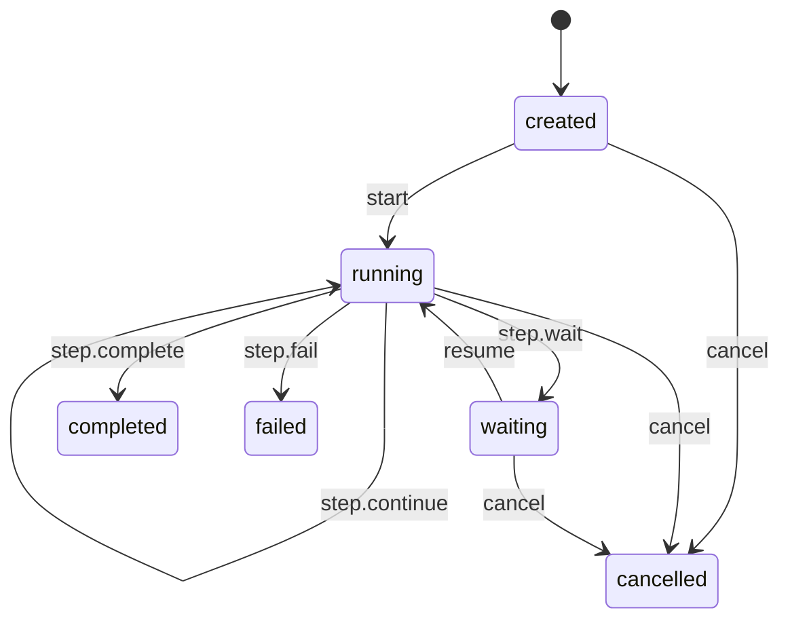

# 最小 Goal-driven Loop 基础设施设计文档

## Overview（概览）

第一版 Runtime 只解决三个问题：

1. 用普通 TypeScript 数据表达 Goal 与 Run。
2. 根据一个输入完成一次确定的状态转换。
3. 通过简单 `RunStore` 保存和加载当前 Run。

它不是完整 Agent loop。调用方需要主动调用状态转换并决定是否再次调用；Runtime 不会调用 LLM、Tool，也不会自动循环。

### 设计依据

- [OpenAI 对 Codex agent loop 的说明](https://openai.com/index/unrolling-the-codex-agent-loop/)表明，完整 loop 会在模型推理、Tool 调用和结果回填之间反复执行，直到得到终止输出。第一版只保留这个循环所依赖的单步状态边界。
- [Stately 的状态转换文档](https://stately.ai/docs/transitions)将转换表达为当前状态与事件到下一状态的确定映射。项目采用这个思想，但不依赖 XState。
- [LangGraph Persistence 文档](https://docs.langchain.com/oss/javascript/langgraph/persistence)说明暂停、恢复和故障恢复依赖可识别、可保存的运行状态。第一版只提供可序列化状态和 `RunStore` 边界，不实现 checkpoint 历史。
- [tsx Test Runner 文档](https://tsx.is/node-enhancement)确认现有 `tsx` 可以直接运行 TypeScript 的 Node.js 内置测试，因此不增加测试框架依赖。

### 方案选择

采用“纯状态转换函数 + `RunStore`”方案：

- `transition(run, input)` 只计算下一状态，不执行 I/O。
- `RunStore` 只保存和加载当前状态。
- 调用方负责把两者按需组合。

不采用可变 `Run` class，以避免状态修改和 I/O 混合；不采用 Event Sourcing，因为事件日志、重放和幂等不属于第一版。

## Architecture（架构）

Runtime 作为现有 `@kai/llm` 的 sibling package，暂时不依赖 LLM package：

```text
packages/runtime/
├── package.json
├── src/
│   ├── domain.ts
│   ├── transition.ts
│   ├── run-store.ts
│   └── index.ts
└── test/
    ├── transition.test.ts
    └── store.test.ts
```

一次调用的数据流为：

1. 调用方持有或从 `RunStore` 加载 `RunState`。
2. 调用方把 `RunState` 和一个 `RunInput` 交给 `transition`。
3. 转换成功时，调用方得到新的 `RunState`，并可将其保存到 `RunStore`。
4. 即使结果仍为 `running`，本次调用也立即结束，不自动执行下一 step。

状态关系如下：



`completed`、`failed` 和 `cancelled` 为终态，不接受后续输入。

## Components and Interfaces（组件与接口）

### 1. Domain Model

`domain.ts` 只包含普通数据类型和一个 `createRun` 工厂：

- `Goal`：描述目标与完成条件。
- `RunState`：保存 Goal、当前状态、step 计数和最近结果。
- `RunInput`：描述本次状态推进的输入。
- `StepResult`：描述一次 step 的结果。
- `createRun(goal, runId)`：创建初始状态为 `created`、step 计数为 `0` 的 Run。

Goal 直接嵌入 `RunState`，第一版不增加单独的 `GoalStore`。Goal ID 和 Run ID 由调用方提供，Runtime 不负责生成随机 ID。

### 2. Transition Core

`transition.ts` 暴露一个同步纯函数：

`transition(currentState, input) → TransitionResult`

它必须：

- 不修改传入的 `RunState`。
- 成功时返回一个新的 `RunState`。
- 非法转换时返回失败结果和原状态。
- 不调用 `RunStore`、LLM、Tool、Clock 或其他 I/O。

第一版使用普通 TypeScript 分支完成状态匹配，不引入状态机框架或可配置 transition graph。

### 3. RunStore

`run-store.ts` 定义两个最小操作：

- `save(run) → Promise<void>`：按 Run ID 保存或替换当前快照。
- `load(runId) → Promise<RunState | undefined>`：加载当前快照；不存在时返回 `undefined`。

第一版提供 `InMemoryRunStore`，内部只保存每个 Run 的最新状态。不提供历史记录、删除、查询、事务或持久化到磁盘的能力。

### 4. Public Exports

`index.ts` 只导出上述公共类型、`createRun`、`transition`、`RunStore` 和 `InMemoryRunStore`，不包含额外 facade 或自动调度器。

## Data Models（数据模型）

### Goal

| 字段 | 类型 | 说明 |
|---|---|---|
| `id` | `string` | Goal 标识 |
| `objective` | `string` | 目标描述 |
| `completionCriteria` | `string[]` | 完成条件；第一版只保存，不自动验证 |

### RunState

| 字段 | 类型 | 说明 |
|---|---|---|
| `id` | `string` | Run 标识 |
| `goal` | `Goal` | 当前 Run 的完整 Goal |
| `status` | `RunStatus` | 当前生命周期状态 |
| `stepCount` | `number` | 已接收的有效 step 结果数量 |
| `lastResult` | `StepResult` 或缺省 | 最近一次有效 step 结果 |

`RunStatus` 为 `created | running | waiting | completed | failed | cancelled`。

### StepResult

`StepResult` 使用可辨识联合类型：

- `continue`：`kind` 为 `continue`，`summary` 保存本次结果摘要。
- `wait`：`kind` 为 `wait`，`reason` 保存等待原因。
- `complete`：`kind` 为 `complete`，`summary` 保存最终结果摘要。
- `fail`：`kind` 为 `fail`，`error` 保存失败原因。

### RunInput

`RunInput` 同样使用可辨识联合类型，只包含：

- `start`
- `step`，并携带一个 `StepResult`
- `resume`
- `cancel`

所有模型都只使用 JSON 可表达的数据，不保存函数、class 实例、连接或其他进程内资源。

### TransitionResult

`TransitionResult` 包含两个分支：

- 成功：`ok` 为 `true`，并携带新的 `RunState`。
- 失败：`ok` 为 `false`，携带未改变的原 `RunState`，以及包含 `code` 和 `message` 的错误。

### 状态转换规则

| 当前状态 | 输入 | 下一状态 | step 计数 |
|---|---|---|---|
| `created` | `start` | `running` | 不变 |
| `created` | `cancel` | `cancelled` | 不变 |
| `running` | `step.continue` | `running` | 加 1 |
| `running` | `step.wait` | `waiting` | 加 1 |
| `running` | `step.complete` | `completed` | 加 1 |
| `running` | `step.fail` | `failed` | 加 1 |
| `running` | `cancel` | `cancelled` | 不变 |
| `waiting` | `resume` | `running` | 不变 |
| `waiting` | `cancel` | `cancelled` | 不变 |

其余组合均为非法转换。只有 `step` 输入会更新 `lastResult`。

## Error Handling（错误处理）

- 非法状态转换不抛异常，返回 `TransitionResult` 的失败分支；错误码固定为 `INVALID_TRANSITION`，并返回未改变的原状态。
- `RunStore.load` 找不到 Run 时返回 `undefined`，不视为异常。
- `RunStore` 的实际存储故障通过 rejected Promise 交给调用方处理；第一版不实现重试和错误恢复策略。
- 第一版只处理由 TypeScript 代码创建的可信模型，不增加运行时 Schema 校验库。
- 终态收到任何输入都按非法转换处理。

## Testing Strategy（测试策略）

测试使用 Node.js 内置 `node:test`、`node:assert/strict` 和现有 `tsx`，不增加第三方测试框架。建议验证命令为：

- `npx tsx --test`
- `npx tsc --noEmit`

Agent 可以编写和修改测试文件；Runtime 生产实现仍由用户手写。

测试范围：

1. `createRun` 产生正确初始状态。
2. `created → running → waiting → running → completed` 主路径。
3. `continue`、`fail` 和各非终态的 `cancel` 分支。
4. 每个有效 `step` 恰好增加一次 `stepCount`。
5. 非法转换返回错误且不修改原状态。
6. Goal 与 Run 可以完成 JSON round-trip。
7. `InMemoryRunStore` 支持保存、覆盖、加载和不存在的 Run。
8. 测试不请求真实 LLM、Tool、文件系统或网络服务。

## 后续版本边界

第一版不会为未来能力预先增加空接口。后续确认需要时，再逐步加入：

1. 单次 `load → transition → save` 的 application service。
2. 本地持久化 checkpoint 与进程恢复。
3. 事件 ID、幂等处理和执行历史。
4. 完成验证、执行预算与无进展检测。
5. LLM、Tool 和自动调度组成的完整 Goal-driven loop。
