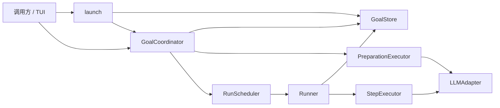

# Goal 准备工作流设计

## Overview

Goal 扩展为从原始意图、准备问答、任务批准到连续执行的唯一可恢复 Session。Goal 保存真实会话、工作流和 Run 最新状态；Preparation 不进入 Run，也不消费 Step。实现覆盖 `req-1-*`～`req-8-*`，并保持 GoalStore 每个 goalId 只保存最新完整快照。

Runtime 新增 `GoalCoordinator` 统一启动后的阶段推进和用户输入；`Runner` 只处理已进入 `executing` 的 Run 循环。Agent 分别实现 PreparationResult 与 StepResult 协议。

## Architecture



`launch` 创建并保存 `gathering_context` Goal 后调用 `advance`。`advance` 推进到下一等待点或执行终态；`resume` 是提交等待输入的唯一公开入口。任何下游模型调用或 Step 都只能发生在前一状态成功保存之后（`req-2-*`～`req-5-*`、`req-7-2`）。

## Key Design Decisions

### 1. Goal 按 definition/state 分组

Goal 仍是唯一持久化 Session。`definition` 保存创建后不可改写的 intent、冻结 Profile 和执行策略；`state` 保存工作流、真实消息和 Run。公开类型不暴露 static/dynamic 概念（`req-1-*`、`req-8-*`）。

### 2. Coordinator 拥有外部输入转换

Coordinator 独占 WorkflowState 转换，并在执行阻塞解除时原子完成“追加用户消息 + `waiting → running` + 保存”；Runner 独占 `created → running`、StepResult 转换和连续执行。PreparationResult 不进入 `transition(RunState)`，原 `Runner.resume` 不再作为公开入口（`req-4-*`、`req-5-*`、`req-7-*`）。

### 3. Working Context 每轮派生

请求顺序固定为 `system(Profile) → Goal.state.messages → current Working Context`。Working Context 作为最后一条非持久化 user 控制消息发送；不写入 Goal。真实消息保持单个有序联合数组，assistant 来源与未来 Track 身份正交（`req-6-*`）。

### 4. 执行结果与消息分离

`StepExecutionResult` 只包含 StepResult，不允许 Executor 返回待持久化消息。Runner 对成功返回的 `wait/complete/fail` 生成规范化 assistant 消息，并从冻结 Profile 填充来源；`continue.summary` 只保存到 `lastStep`，且必须是可独立供下一 Step 使用的累计 checkpoint。模型原始 JSON、Working Context、Runtime/Adapter 异常均不伪装成会话消息。

### 5. maxSteps 是可选策略

`maxSteps` 为非负整数，默认 `0` 表示无限。正数上限达到后，Runner 保留最后一个真实 `lastStep`，将 Run 置为 failed，并写入 `stopReason: { kind: "max_steps_exceeded" }`；该终止不增加 `stepCount`、不产生 Step 或 assistant 消息（`req-7-4`）。

## Components and Interfaces

### GoalCoordinator

```ts
interface GoalCoordinator {
    advance(ref: RunRef): Promise<GoalProgressResult>;
    resume(request: ResumeGoalRequest): Promise<GoalProgressResult>;
}
type GoalUserAction =
    | { readonly kind: "message"; readonly content: string }
    | { readonly kind: "approve" };
interface ResumeGoalRequest { readonly ref: RunRef; readonly action: GoalUserAction }
type GoalProgressResult =
    | { readonly ok: true; readonly kind: "waiting"; readonly phase: "gathering_context"; readonly waitingFor: "question"; readonly goal: Goal }
    | { readonly ok: true; readonly kind: "waiting"; readonly phase: "planning"; readonly waitingFor: "approval"; readonly goal: Goal }
    | { readonly ok: true; readonly kind: "waiting"; readonly phase: "executing"; readonly waitingFor: "blocked"; readonly goal: Goal }
    | { readonly ok: true; readonly kind: "terminal"; readonly phase: "executing"; readonly goal: Goal }
    | { readonly ok: false; readonly error: { readonly code: GoalProgressErrorCode; readonly message: string } };
type GoalProgressErrorCode =
    | "RUN_NOT_FOUND" | "GOAL_NOT_WAITING"
    | "INVALID_GOAL_INPUT" | "INVALID_PHASE_RESULT";
```

`advance` 对 active Preparation 调用 Executor；只允许 `context_ready` 在保存 planning 后继续下一轮。Preparation waiting、Run waiting 和终态直接返回。执行 `created/running` 时调用 Scheduler，等待其结束后恢复并返回最新 Goal。

`resume` 的唯一合法组合是 gathering/question + message、planning/approval + message 或 approve、executing/blocked + message。所有 message action 都追加原文 user 消息；approve 是不写消息的控制动作。planning feedback 回到 active，approve 固定 proposal 并进入 executing；executing message 与 `waiting → running` 同快照保存，然后才调度。文本以 `trim()` 判空，其他组合无副作用地失败。

### Executors、Launcher 与 Runner

```ts
interface PreparationExecutor { execute(goal: Goal): Promise<PreparationResult> }
type PreparationResult =
    | { readonly kind: "question"; readonly question: string }
    | { readonly kind: "context_ready" }
    | { readonly kind: "task_proposal"; readonly task: GoalTask; readonly approvalRequest: string };
interface StepExecutionResult { readonly result: StepResult }
interface StepExecutor { execute(goal: Goal): Promise<StepExecutionResult> }
interface LaunchRequest {
    readonly goalId: string; readonly intent: string; readonly profileId: string; readonly maxSteps?: number;
}
type LaunchResult = GoalProgressResult | { readonly ok: false; readonly error: { readonly code: "PROFILE_NOT_FOUND"; readonly message: string } };
```

PreparationExecutor 只接收 active gathering/planning Goal，并按 phase 使用严格 Schema。Coordinator 把 question 保存为 assistant 消息；task_proposal 保存到 WorkflowState，并把“完整任务提案 + approvalRequest”的规范化文本保存为 assistant 消息，因此 feedback 后即使移除当前 proposal，下一轮仍能从真实历史获得被修改内容。Coordinator 与 Runner 都从冻结 Profile 填充 assistant.profileId，Executor 不能提供身份。

intent 经 `trim()` 后为空，或 maxSteps 不是非负整数时，Launch 返回 `INVALID_GOAL_INPUT`，且发生在生成 runId 或保存之前。Launcher 保存 intent 原文，将其同时写入 definition 和首条 user 消息，保存后才调用 Coordinator。

Runner 拒绝非 executing Goal。成功 StepResult 经 transition 后与规范化消息原子保存；Executor 异常转换为无 assistant 消息的 fail Step。保存成功后才允许下一轮。Coordinator 从 Scheduler 的 RunnerResult 恢复最新 Goal 并转换为 GoalProgressResult。

## Data Models

```ts
interface Goal {
    readonly id: string;
    readonly metadata: { readonly schemaVersion: 2 };
    readonly definition: GoalDefinition;
    readonly state: GoalState;
}
interface GoalDefinition {
    readonly intent: string;
    readonly profile: AgentProfile;
    readonly executionPolicy: { readonly maxSteps: number };
}
interface GoalState {
    readonly workflow: GoalWorkflowState;
    readonly messages: readonly GoalMessage[];
    readonly run: RunState;
}
interface StepRecord { readonly result: StepResult }
type RunStopReason = { readonly kind: "max_steps_exceeded" };
interface RunState {
    readonly id: string;
    readonly status: RunStatus;
    readonly stepCount: number;
    readonly lastStep?: StepRecord;
    readonly stopReason?: RunStopReason;
}
type GoalWorkflowState =
    | { readonly phase: "gathering_context"; readonly preparation: { readonly status: "active" | "waiting_input" } }
    | { readonly phase: "planning"; readonly preparation: { readonly status: "active" } | { readonly status: "waiting_approval"; readonly proposal: GoalTask } }
    | { readonly phase: "executing"; readonly preparation: { readonly status: "completed" }; readonly task: GoalTask };
type GoalMessage = UserMessage | AssistantMessage;
interface UserMessage { readonly role: "user"; readonly content: string }
interface AssistantMessage { readonly role: "assistant"; readonly assistant: { readonly profileId: string }; readonly content: string }
```

新 `GoalDefinition` 专指 Goal 内冻结定义；旧启动输入不再使用该名称。Deprecated `GoalInput`、`LegacyRunState` 和旧 `createRun` 重载保留独立的 v1 结构且不继承 v2 RunState，仅供兼容代码使用，新流程不得依赖。

```ts
type WorkingContext =
    | { readonly phase: "gathering_context"; readonly intent: string }
    | { readonly phase: "planning"; readonly intent: string }
    | {
        readonly phase: "executing";
        readonly intent: string;
        readonly task: GoalTask;
        readonly execution: {
            readonly stepCount: number;
            readonly maxSteps?: number;
            readonly previousStep?: StepRecord;
        };
    };
```

Builder 只接受当前可执行的 active/running 状态；仅在 `maxSteps > 0` 时输出 maxSteps，仅在 lastStep 存在时原样投影 previousStep。P0 只保存最近 Step，不提供完整轨迹；StepRecord 是后续扩展 Action/Observation 的边界，但本功能不预置空字段。

### 快照不变量与迁移

v2 Schema 使用跨字段校验：Preparation 阶段的 Run 必须为 `created/0` 且无 lastStep/stopReason；lastStep 存在当且仅当 `stepCount > 0`。created 不含结果；running 的最近结果只可为 continue，或为刚解除的 wait；waiting/completed 分别要求 wait/complete；failed 是“lastStep 为 fail 且无 stopReason”或“lastStep 为 continue/wait 且 stopReason 为满足正数上限的 max_steps_exceeded”两个互斥分支；cancelled 保留取消前结果且无 stopReason。未批准任务不能进入 executing（`req-1-4`、`req-4-*`）。

解码器按版本选择严格 Schema。合法 v1 转为 v2：原 task 同时成为 intent 和 executing 最终 task，Profile 与 Run id/status/stepCount 原样保留，`maxSteps = 0`，`lastResult` 包装为 `lastStep: { result }`；assistant 消息补 `profileId = v1.profile.id`，消息内容与顺序不变，不推断 stopReason（`req-8-1`～`req-8-2`）。v1 的 Run 交叉字段不一致视为损坏快照。

恢复只返回内存转换结果；下一次正常 save 才以 v2 原子替换（`req-8-3`）。

## Error Handling

- Goal 缺失或 runId 不匹配返回 `RUN_NOT_FOUND`；当前没有等待输入返回 `GOAL_NOT_WAITING`；空消息或 action 与等待类型不匹配返回 `INVALID_GOAL_INPUT`；Executor result 与 phase 不匹配返回 `INVALID_PHASE_RESULT`；Profile 缺失只由 launch 返回。以上业务失败均无副作用。
- Preparation Adapter/协议异常原样传播并保留最后成功快照；执行 Executor 异常消费一个 fail Step，但不追加 assistant 消息。
- Store/I/O 错误原样传播并停止；非法 JSON、未知版本、Schema 或 ID 不匹配抛出 `GoalSnapshotProtocolError`（`req-5-4`、`req-8-4`）。
- P0 不提供 CAS、重复 goalId 保护、协作式 cancel、消息裁剪或上下文压缩；并发写同一 Goal 最后完成者覆盖，`maxSteps = 0` 可能持续执行。新增这些行为前须修订 Requirements。
- Preparation 与 Step Executor 在 Profile 含 toolIds 时都于 Adapter 调用前抛出 `ToolsNotSupportedError`；真实 Action/Observation 不属于本功能。

## Testing Strategy

- Domain/Store：覆盖阶段和 Run 跨字段不变量、非法组合、v2 克隆，以及 v1 只读迁移、消息补全、lastResult 包装、下一次保存升级和损坏协议（`req-1-*`、`req-8-*`）。
- Coordinator：覆盖全部合法/非法 action、proposal 完整消息、反馈后重规划、批准、解除阻塞，以及每个“先保存后继续”和返回 Goal 为最新快照的顺序（`req-2-*`～`req-5-*`）。
- Runner：覆盖 continue 自动循环、累计 checkpoint、blocked、Executor 异常、正数上限保留 lastStep、`maxSteps = 0` 和保存失败停止；无限模式用有限 Fake 最终 complete（`req-7-*`）。
- Agent：覆盖三阶段 Working Context、lastStep → previousStep、消息顺序、严格 phase Schema、规范化 assistant 文本、原始 JSON 不持久化及 Tool 拒绝（`req-4-*`、`req-6-*`）。
- 最终运行 `npx tsc --noEmit`、Runtime/Agent 全量测试和 `git diff --check`。
