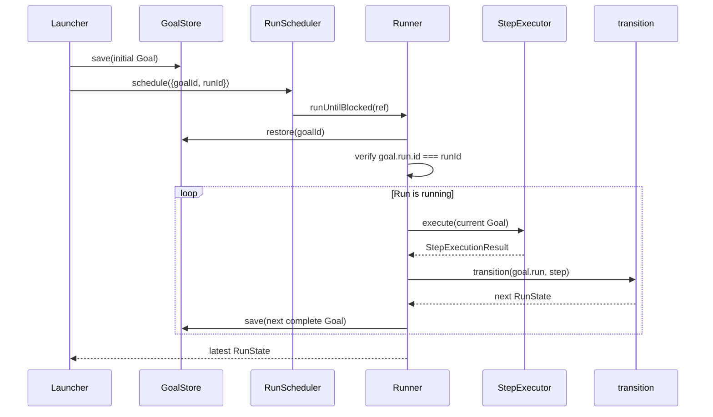

# Goal Session 持久化设计

## Overview

本设计把现有仅描述任务内容的 `Goal` 扩展为持久化聚合根：它以 `goalId` 为唯一存储键，包含任务定义、Goal metadata、冻结 Profile、按顺序保存的 messages，以及一个具有独立 `runId` 的当前 `RunState`。`RunState` 不再反向嵌入 Goal 和 Profile，从而保持整个聚合可 JSON 序列化且不存在循环引用。

Runtime 新增 `GoalStore`，并提供内存实现与本地 JSON 文件实现。文件实现按 Goal 保存一个最新快照，通过同目录临时文件替换完成更新；新进程使用相同存储目录即可按 `goalId` 恢复。现有 Run 状态机与停止条件不变，`Runner` 改为加载、推进并保存整个 Goal 聚合。该设计覆盖 `req-1-*` 至 `req-6-*`。

## Key Design Decisions

### 1. Goal 是聚合根，RunState 只表达执行状态

现有 `Goal` 改为完整聚合；原有 `objective` 与 `completionCriteria` 下沉到 `GoalTask`。冻结 Profile、messages 和当前 Run 均由 Goal 直接拥有。`RunState` 保留 `runId`、状态、步数和最近结果，删除对 Goal 与 Profile 的反向引用。

`transition(run, input)` 继续只接收 `RunState` 并返回新的 `RunState`，其合法转换、Step 计数和错误语义保持不变，满足 `req-4-*`。需要完整上下文的 `StepExecutor` 改为接收 Goal，而不是扩张状态转换核心。

### 2. goalId 与 runId 使用显式 RunRef 组合

`goalId` 负责持久化寻址，`runId` 负责执行身份。`Runner` 与 `RunScheduler` 接收 `{ goalId, runId }`，加载 Goal 后必须校验 `goal.run.id === runId`。这避免额外维护 `runId → goalId` 持久化索引，也不会把两个 ID 合并。

首版一个 Goal 仍只包含一个当前 Run；不增加 Run 列表、重试历史或多 Run 调度。未来需要多个 Run 时，可扩展 Goal 内部结构，而不改变 `goalId` 的聚合身份。

### 3. 每个 Goal 使用一个可替换 JSON 快照

`JsonFileGoalStore` 接收明确的存储目录，每个 `goalId` 对应一个 JSON 文件。文件名使用 `goalId` 的 UTF-8 `base64url` 编码，避免路径分隔符和目录穿越问题；JSON 内容仍保存原始 `goalId` 并在恢复时核对。

保存流程固定为：严格校验 Goal → 写入同目录临时文件 → 刷新文件内容 → 将临时文件替换为目标文件 → Promise 成功。恢复只读取目标文件并校验，不修改 metadata、不推进 Run。相同 `goalId` 的后续保存只替换该文件，因此标准恢复只能看到最新成功快照，满足 `req-2-*` 与 `req-3-*`。

首版保证进程重启后的持久恢复，不处理多个进程同时写入同一 Goal、锁、版本冲突或跨文件事务。

### 4. 恢复边界执行严格运行时校验

`packages/runtime` 增加 Zod 4 直接依赖，以 `GoalSnapshotSchema` 严格校验写入和读取的数据。Schema 固定 `schemaVersion: 1`，覆盖 Goal、Profile、messages、RunState 与 `StepResult` 的所有分支，并拒绝额外字段。

领域类型继续由 `domain.ts` 导出；Schema 的成功结果必须结构兼容 `Goal`。持久化文件只包含 JSON 数据，不保存 Registry、Adapter、Store 或函数，满足 `req-1-4`。

### 5. messages 记录实际模型交互

Goal messages 只保存 `user` 与 `assistant` 内容；Profile 的 `systemPrompt` 单独保存在冻结 Profile 中，避免重复。每次 LLM Step 构造一个包含当前任务和 Run 进度的 user message，模型原始响应作为 assistant message。

`StepExecutor` 返回 `StepExecutionResult`，其中包含既有 `StepResult` 与本次需要追加的 messages。`Runner` 先应用 Run 状态转换，再把 messages 追加到 Goal，最后整体保存；保存成功后才允许进入下一 Step。Executor 抛错时继续沿用现有失败转换语义，本次没有成功返回的 messages 不追加。

## Architecture



## Components and Interfaces

### Domain Model

```ts
export interface Goal {
    readonly id: string;
    readonly metadata: GoalMetadata;
    readonly task: GoalTask;
    readonly profile: AgentProfile;
    readonly messages: readonly GoalMessage[];
    readonly run: RunState;
}

export interface GoalMetadata {
    readonly schemaVersion: 1;
}

export interface GoalTask {
    readonly objective: string;
    readonly completionCriteria: readonly string[];
}

export interface GoalMessage {
    readonly role: "user" | "assistant";
    readonly content: string;
}

export interface RunState {
    readonly id: string;
    readonly status: RunStatus;
    readonly stepCount: number;
    readonly lastResult?: StepResult;
}

export interface RunRef {
    readonly goalId: string;
    readonly runId: string;
}
```

Goal metadata 首版只保存 `schemaVersion`，不引入当前需求未使用的时间字段。Profile 在 Launcher 中复制数组形成冻结快照，恢复时不查询 Registry，覆盖 `req-1-*` 与 `req-2-4`。

### GoalStore

```ts
export interface GoalStore {
    save(goal: Goal): Promise<void>;
    restore(goalId: string): Promise<Goal | undefined>;
}

export class InMemoryGoalStore implements GoalStore { /* ... */ }
export class JsonFileGoalStore implements GoalStore { /* ... */ }
```

`InMemoryGoalStore` 在保存和恢复时使用结构化克隆，避免调用方随后修改内部快照。`JsonFileGoalStore` 放在 Runtime 的基础设施文件中；`GoalStore` 接口不暴露文件路径、JSON 或文件系统概念。

### Execution Contracts

```ts
export interface StepExecutionResult {
    readonly result: StepResult;
    readonly appendedMessages: readonly GoalMessage[];
}

export interface StepExecutor {
    execute(goal: Goal): Promise<StepExecutionResult>;
}

export interface RunScheduler {
    schedule(ref: RunRef): Promise<RunnerResult>;
}
```

Launcher 继续接收明确的任务输入与 `profileId`，并额外接收初始 messages；它生成 `runId`、组装 Goal、先保存再调度。成功结果增加 `goalId`，继续返回 `runId`、Profile 标识与最新 `RunState`。

Runner 改为依赖 `GoalStore`。每次 start、resume、Step、Executor 异常或 `maxSteps` 保护产生新 RunState 后，Runner 都创建新的 Goal 快照并保存。其等待、终态、步数上限和 Store 错误传播顺序保持现有行为，覆盖 `req-5-*`。

## Error Handling

- 目标文件不存在：`GoalStore.restore` 返回 `undefined`，由调用边界转换为 `GOAL_NOT_FOUND`。
- Goal 存在但 `RunRef.runId` 不匹配：Runner 返回 `RUN_NOT_FOUND`，且不执行或保存。
- JSON 语法错误、Schema 不匹配或文件内 `goalId` 不匹配：抛出带 `INVALID_GOAL_SNAPSHOT` code 的 `GoalSnapshotProtocolError`。
- 其他文件系统读写错误：保留原错误对象向上传播；不得改写为未找到结果。
- 临时文件写入或替换失败：保存 Promise reject，并尽力清理本次临时文件；Runner 不进入下一 Step。
- `transition` 理论上的失败继续视为 Runner 不变量错误，不伪装成持久化或 Executor 错误。

以上边界覆盖 `req-3-3`、`req-3-4` 与 `req-6-*`。

## Testing Strategy

- Domain 与 Schema：验证完整 Goal JSON round-trip、`goalId`/`runId` 独立、四种 StepResult、非法字段与循环外进程对象不能进入快照。
- `InMemoryGoalStore`：验证保存、覆盖、恢复、未找到和克隆隔离，只返回最新快照。
- `JsonFileGoalStore`：在独立临时目录中验证首次保存、覆盖、路径安全、损坏 JSON、Schema 错误、ID 不匹配及底层 I/O 错误。
- 跨进程恢复：由一个 `tsx` 子进程保存 Goal，再由新的子进程使用同一目录恢复并比较完整数据，覆盖 `req-3-1` 与 `req-3-2`。
- Transition 回归：现有合法与非法转换测试继续验证相同状态、Step 计数和 `lastResult`。
- Runner 回归：使用 `InMemoryGoalStore` 验证 start、continue、wait/resume、终态、`maxSteps`、Executor 异常、Store 错误，以及每次继续前已保存完整 Goal。
- Agent 集成：验证 Prompt 使用冻结 Profile 和已恢复 messages；合法模型响应返回待追加的 user/assistant messages，并随最新 Goal 快照保存。
- 全量验证：执行 TypeScript 检查、Runtime 测试和 Agent 测试；测试不访问网络、真实 LLM 或真实 Tool。
