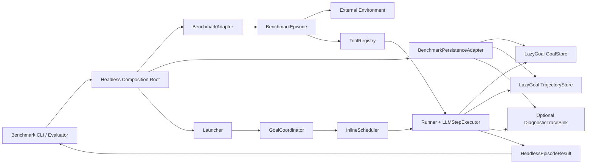

# Headless Benchmark Composition Root 设计

## Overview

本设计在 `benchmarks` package 增加一个可复用的 headless Composition Root，负责
把一个 benchmark task 装配成完整的 LazyGoal Goal/Run。Root 只拥有通用生命周期、
依赖注入和持久化接线；benchmark 自己提供任务描述、环境 Episode、Tool Registry、
评分和任务到存储命名空间的适配。ALFWorld 是首个 adapter，未来 benchmark 可以
复用同一 Root，而不需要修改 LazyGoal 核心源码或复制 Runtime 编排。

## Key Design Decisions

### 1. Root 的边界是单 task、单次执行

- `benchmarks/src/headless-composition-root.ts` 提供通用单 task 执行器，不解析
  Manifest，不聚合多个 task，也不决定 benchmark 成功条件。
- 每次执行创建一个独立 Goal/Run；Root 使用现有 `Launcher`、`GoalCoordinator`、
  `InlineScheduler` 和 `Runner`，不直接改写 Runtime 状态。
- Root 内置固定 Preparation Executor：根据 adapter 的任务描述依次返回
  `context_ready` 和 `task_proposal`；headless 调用自动提交 `approve`，因此仍经过
  LazyGoal 的 Preparation、Planning 和 Approval 转换。
- `Runner` 结束在 waiting 或 terminal 时，Root 恢复最新 Goal、读取环境 outcome，
  再在 `finally` 关闭 Episode。Root 不把 waiting 强行转换成成功或失败。

### 2. Benchmark Adapter 只拥有环境和领域数据

定义 `BenchmarkAdapter<TTask, TOutcome>`，由 benchmark 实现两个能力：

- `describeTask(task)` 将任意任务转换为通用 `BenchmarkTaskDescriptor`：`intent`、
  `objective`、`completionCriteria` 和 `maxSteps`。
- `createEpisode(task, context)` 创建一次环境会话并返回 `BenchmarkEpisode<TOutcome>`。
  Episode 只暴露 `ToolRegistry`、只读 `readOutcome()` 和幂等 `close()`；环境进程、
  连接、领域状态和外部错误均由 adapter 拥有。

Root 不知道 `TTask`、`TOutcome` 的字段，也不要求 outcome 包含 `won`、`reward` 或
  其他固定成功字段。各 benchmark 的 evaluator 根据 Root 返回的 Runtime 结果和
  outcome 自行评分、重试和生成报告。

### 3. 持久化使用 LazyGoal Port，benchmark 只适配命名空间

定义 `BenchmarkPersistenceAdapter<TTask>` 作为很薄的装配边界，而不是新的存储
协议。它根据 task 计算稳定 namespace，并为当前 Goal/Run 返回：

- LazyGoal `GoalStore`，保存最新完整 Goal Snapshot；
- LazyGoal `TrajectoryStore`，同时作为 `TrajectorySink` 追加事实事件；
- 可选的 LazyGoal `DiagnosticTraceSink`；
- Snapshot、Trajectory、Trace 的稳定 locator。

Root 将同一组 bindings 注入 Launcher、Coordinator、Runner 和 LLM Executor。默认
文件实现复用 `JsonFileGoalStore`、`JsonFileTrajectoryStore`、
`JsonFileDiagnosticTraceSink`；测试可以注入内存替身。benchmark 不实现 Snapshot
编解码、事件校验、提交边界、Trace 脱敏或重试语义；若使用数据库等后端，也只能
实现 LazyGoal 既有 Port 或其薄包装。

每个 task 的 namespace、Goal/Run 标识和 locator 均独立。Trajectory 的提交边界
始终来自最新 Goal Snapshot 的 `committedThroughSequence`；`state_committed` 只作
审计 marker，未提交 tail 保留但不自动 replay。Trace 即使落盘也不参与恢复。

### 4. 通用运行层不改变普通 LazyGoal

- `benchmarks/src/` 不导入 `benchmarks/alfworld/`，也不向 `packages/*` 反向添加
  benchmark 依赖。
- 只有显式 benchmark CLI 调用 Root；普通 CLI、TUI、Profile 加载和现有测试不创建
  benchmark adapter 或外部环境。
- headless 默认使用自动放行的 Tool Policy，但仍由冻结 Profile 和 Tool Registry
  强制授权；Root 不添加 Bash 或其他未注册 Tool。
- Root 的 Persistence Adapter 是 `benchmarks` 内部扩展点，不作为 LazyGoal Runtime
  的公共 API；需要 Runtime 新能力时先另立 Spec。

## Architecture



Root 只在一个调用中装配依赖并管理生命周期；Environment、Manifest、评分和报告
分别由 adapter 与 evaluator 拥有。`GoalStore`、`TrajectoryStore` 和 Trace sink
是同一 task 的持久化绑定，但三者仍保持 Runtime 定义的独立语义。

## Components and Interfaces

### 通用 headless contracts

```ts
interface BenchmarkTaskDescriptor {
  readonly intent: string;
  readonly objective: string;
  readonly completionCriteria: readonly string[];
  readonly maxSteps: number;
}

interface BenchmarkEpisode<TOutcome> {
  readonly registry: ToolRegistry;
  readOutcome(): TOutcome;
  close(): Promise<void>;
}

interface BenchmarkAdapter<TTask, TOutcome> {
  describeTask(task: TTask): BenchmarkTaskDescriptor;
  createEpisode(
    task: TTask,
    context: BenchmarkEpisodeContext,
  ): Promise<BenchmarkEpisode<TOutcome>>;
}

interface BenchmarkPersistenceAdapter<TTask> {
  namespaceFor(task: TTask): string;
  open(context: BenchmarkPersistenceContext): Promise<BenchmarkPersistenceBindings>;
}
```

`BenchmarkPersistenceBindings` 至少包含 `GoalStore`、`TrajectoryStore` 和稳定
locator，可选包含 `DiagnosticTraceSink`；`BenchmarkEpisodeContext` 只包含
workspace、冻结 Profile 和 `AbortSignal` 等通用信息。实际新增的 TypeScript 公共
接口必须在源码中补充中文契约 TSDoc 与最小示例。

### Root 装配顺序

1. evaluator 生成或注入 task、Profile、模型依赖和 AbortSignal。
2. Root 调用 `describeTask`，生成 Goal ID/Run ID，并调用 Persistence Adapter 打开
   当前 namespace 的 LazyGoal Store/Sink bindings。
3. Root 调用 `createEpisode`，取得环境 Episode 和 Tool Registry；任何失败都进入
   统一清理路径，不启动模型。
4. Root 创建 `LLMStepExecutor`、固定 Preparation Executor、`Runner`、
   `InlineScheduler`、`GoalCoordinator` 和 `Launcher`，所有组件共享同一 Store/Sink
   实例。
5. Root 调用 `launch`，收到 planning approval waiting 后调用 `resume({ approve })`；
   Coordinator 再通过 InlineScheduler 进入 Runner。
6. Runner 返回后，Root 从 Store 恢复最终 Goal，读取 Episode outcome，组装
   `HeadlessEpisodeResult<TOutcome>`，然后关闭 Episode。

### ALFWorld adapter

`benchmarks/alfworld/` 新增 `alfworld-adapter.ts`，把现有 Manifest 任务、
`SidecarClient` 和 `createAlfworldToolSet` 接到通用 contracts。它继续负责
`won`、`done`、步数和完成率的事实收集；`evaluation-runner.ts` 继续负责 Manifest
顺序、重试和 `EvaluationReport`，只把单 task 执行委托给 Root。

## Data Models

- `BenchmarkTaskDescriptor` 是构造 Goal 的短生命周期输入，不写入 benchmark-specific
  字段。
- `BenchmarkPersistenceContext` 至少包含 benchmark 标识、namespace、Goal ID 和
  Run ID；namespace 由 benchmark 适配，Goal/Run 由 Root 分配。
- `BenchmarkPersistenceLocator` 记录 Snapshot、Trajectory 及启用时 Trace 的稳定
  文件或存储定位，不要求底层 Port 暴露物理路径。
- `HeadlessEpisodeResult<TOutcome>` 包含最新 Goal、Runner 结果、模型完成事实、
  outcome 和 PersistenceLocator；Root 不添加评分字段。
- LazyGoal Snapshot、Trajectory Event/JSONL 和 TraceRecord 的格式完全复用现有
  Runtime/Storage 契约，不新增 benchmark 专用替代格式。

## Error Handling

- Persistence Adapter 打开必要 Store 失败时，Root 不启动模型；运行中 Snapshot 或
  Trajectory 写入失败按 LazyGoal 原有 fail-closed 语义传播，不报告虚假成功。
- Trace 写入失败只记录诊断故障，不覆盖已成功的 Snapshot、Domain Event 或主执行
  结果。
- Adapter 的领域错误由 Tool 转成现有 `failure` Observation；基础设施异常原样
  传播给 Root，由 evaluator 决定失败类别和是否重试。
- Root 在所有退出路径执行一次 Episode `close()`；关闭错误附加到结果或错误上下文，
  不覆盖已经确定的环境事实。
- Abort 在模型调用、Tool 调用或持久化边界停止后续工作并完成清理；Root 不写入
  虚假成功状态，也不凭 Snapshot 自动恢复不可恢复的外部环境。

## Testing Strategy

### 通用 Root

- 使用两个任务类型和两个结果类型不同的 fake adapter，验证同一 Root 可复用、
  Preparation/Planning/Approval/Executing 顺序正确、Tool 授权一致且无 AlfWorld
  字段依赖。
- 使用内存 LazyGoal Store/Sink 替身验证任务隔离、Snapshot 与 Trajectory 共享
  Goal/Run、`committedThroughSequence` 边界、Trace 可选和 close 幂等；再用临时目录
  集成测试读取 `JsonFile*` 生成的真实文件。
- 覆盖初始持久化失败、运行中 Trajectory 失败、Trace 失败、环境异常、close 失败、
  waiting、terminal 和 Abort，确认无模型误启动或虚假成功。

### ALFWorld 与回归

- 现有 sidecar、Tool、Manifest、Profile、报告和 Conda 预检测试保持原有覆盖，新增
  adapter-to-Root 接线测试；`won` 仍由 evaluator 判定，不进入通用 Root。
- 验证普通 LazyGoal CLI/TUI 不加载 benchmark；验证新增 adapter 不需要修改
  `packages/*` 生产接口。
- 执行 `npm --prefix benchmarks run typecheck`、`npm --prefix benchmarks test`、
  `npx tsc --noEmit`、`npm run check:dependencies`、现有测试和 `git diff --check`。
