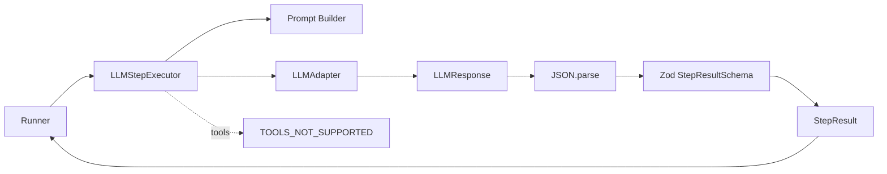

# LLM Step Executor 设计

## Overview

新增 `packages/agent` 作为 Runtime 与 LLM 之间的集成层，提供
`LLMStepExecutor`。它接收一个符合现有 `LLMAdapter` 契约的适配器，针对一次
`RunState` 构造请求、调用一次模型，并把响应解析成一个既有 `StepResult`。

本设计覆盖需求 `req-1-*` 至 `req-5-*`：执行器只负责单步，不拥有 Store、状态
转换或循环；纯文本 JSON 是首版唯一模型协议；Tool、自动重试和完整消息历史留到
后续需求。所有新增代码通过现有 Runtime/LLM 类型协作，不修改 Runtime 的状态机
语义。

## Key Design Decisions

### 1. 集成层独立于 Runtime 与 LLM

在 `packages/agent` 中实现 `LLMStepExecutor`，依赖方向为
`agent -> runtime contracts` 与 `agent -> llm contracts`。Runtime 不反向依赖
LLM，LLM 适配器也不知道 Run 状态。当前仓库没有统一 workspace 解析，因此源码
阶段沿用现有包的相对源码导入方式；对外导出的类型边界保持为 Runtime 与 LLM
现有接口。

### 2. 固定两条消息，避免隐式历史

`buildStepRequest(state)` 是纯函数，返回一个包含两条消息的 `LLMRequest`：

- `system`：Profile 的 `systemPrompt`、按原顺序拼接的全部 `instructions`，以及
  严格 JSON 输出协议。
- `user`：一个确定性序列化的 Run 上下文，包含 `objective`、全部
  `completionCriteria` 和 `stepCount`；存在 `lastResult` 时才加入该字段。

不把先前消息或模型响应历史偷偷追加到请求中。构造过程只读取状态并复制/序列化
值，因此不会修改 `RunState`、Goal 或 Profile。

### 3. 使用 Zod 4 做唯一响应边界

在 `response-schema.ts` 定义四个严格对象分支，并用
`z.discriminatedUnion("kind", ...)` 组成 `StepResultSchema`。每个结果的有效载荷
使用 `z.string().trim().min(1)`，额外字段、错误的 `kind`、缺字段和空白文本均拒绝。
Zod 的 discriminated union 与 `safeParse` 适合把外部不可信 JSON 收敛为可判别的
TypeScript 数据：[Zod API](https://zod.dev/api)。

`parseStepResult(content)` 先执行 `JSON.parse`，再执行
`StepResultSchema.safeParse`；两类失败统一抛出 `LLMResponseProtocolError`，不猜测
模型意图、不修复文本、不重试。解析成功后只返回一个 `StepResult`。

### 4. Tool 请求显式失败，Tool 协议另行演进

`LLMStepExecutor.execute` 在构造请求前检查 `state.profile.toolIds`。非空时抛出
`ToolsNotSupportedError`（`code: "TOOLS_NOT_SUPPORTED"`），且不调用适配器。
当前 `StepResult` 不增加 Tool 分支，也不把 Tool 参数塞进自由文本协议。

未来引入 Tool Calling 时，每个 Tool 自己持有 Zod `inputSchema`；模型展示用的
JSON Schema 可由 Zod 4 的 `z.toJSONSchema` 生成，执行前仍用同一 schema
`safeParse` 校验参数：[Zod JSON Schema](https://zod.dev/json-schema)。ToolCall
将作为独立协议设计，不与本版 `StepResult` 解析器混合。

### 5. 错误保持可识别且不吞掉适配器异常

新增两个错误类型：

- `ToolsNotSupportedError`：`code` 为 `TOOLS_NOT_SUPPORTED`。
- `LLMResponseProtocolError`：`code` 为 `INVALID_LLM_RESPONSE`，可携带解析原因
  或 Zod issues。

错误消息以错误码开头，使现有 Runner 捕获后写入的 `fail.error` 仍可识别。适配器
调用不包裹在会改写异常的 catch 中；`LLMAdapter.generate` 抛出的原错误直接向上
传播。Runner 继续沿用既有异常语义，把一次异常计为一次失败 Step。

## Architecture



执行顺序固定为：Tool 前置检查 → 请求构造 → 一次 `generate` → JSON 解析 → Zod
校验 → 返回结果。执行器不保存状态、不调用 `transition`、不启动下一步。

## Components and Interfaces

建议的源文件边界如下：

- `package.json`：声明 `@kai/agent` 包及其直接 `zod` 依赖；Runtime/LLM 保持现有
  契约，不引入对 Agent 的反向依赖。
- `prompt.ts`：导出 `buildStepRequest(state: RunState): LLMRequest` 与协议文本常量。
- `response-schema.ts`：导出 `StepResultSchema`、`parseStepResult`。
- `errors.ts`：导出两个带稳定 `code` 的错误类。
- `llm-step-executor.ts`：导出 `LLMStepExecutor` 及其依赖配置。
- `index.ts`：集中导出公共类、函数、schema、错误和必要类型。

```ts
export interface LLMStepExecutorDependencies {
  readonly adapter: LLMAdapter;
}

export class LLMStepExecutor implements StepExecutor {
  constructor(dependencies: LLMStepExecutorDependencies);
  execute(state: RunState): Promise<StepResult>;
}
```

`execute` 只捕获并转换 JSON/Zod 协议错误；Adapter 错误原样抛出。所有 helper 都
接受只读输入，禁止通过类型断言绕过响应 schema。

## Data Models

模型响应的唯一允许形状为：

```ts
{
  kind: "continue" | "wait" | "complete" | "fail",
  summary?: string,
  reason?: string,
  error?: string
}
```

实际 Zod 分支会按 `kind` 限定对应字段：`continue/complete` 只用非空 `summary`，
`wait` 只用非空 `reason`，`fail` 只用非空 `error`；不允许把可选字段当成跨分支
的宽松协议。

## Error Handling

1. `toolIds` 非空：在任何模型调用前抛出 `ToolsNotSupportedError`。
2. `content` 不是单个合法 JSON 对象，或 schema 校验失败：抛出
   `LLMResponseProtocolError`，不进行第二次调用。
3. Adapter reject：不转换、不重试，保留原始错误对象。
4. 以上错误进入现有 Runner 后，由 Runner 生成 `fail` 结果并执行一次既有状态
   转换和保存；执行器本身不直接写 Store。

## Testing Strategy

在 `packages/agent/test/llm-step-executor.test.ts` 使用内存 fake adapter，禁止
网络、真实模型、Tool 和文件系统：

- 验证请求只调用一次，包含 Profile/Goal/stepCount/lastResult，且不改变输入状态。
- 分别覆盖四个合法 `StepResult` 分支，以及非法 JSON、未知 kind、缺失字段、错误
  类型、空白文本和额外字段。
- 验证 Tool 配置在 Adapter 调用次数为零时抛出稳定错误码，Adapter 原始异常保持
  同一对象。
- 用 fake 响应序列 `continue` → `complete` 驱动现有 Runner，断言最终状态与步数；
  再覆盖协议错误、Adapter 错误和 Tool 错误进入 Runner 后的失败持久化。
- 执行 `npx tsc --noEmit`、agent 测试及全部现有 Runtime 回归测试；测试不得依赖
  外部环境变量。
