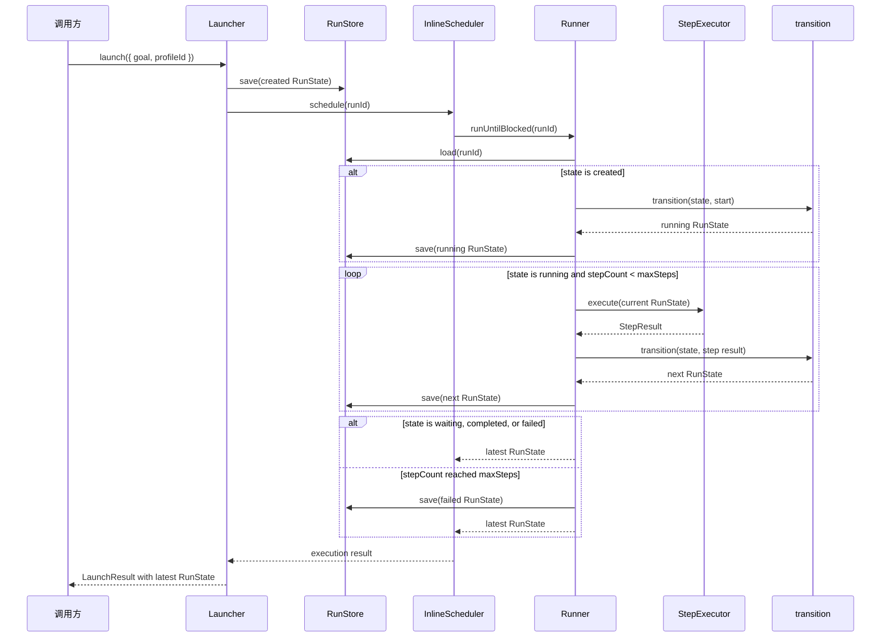

# 最小同步 Run Loop 设计文档

## Overview（概览）

本阶段把已有的“创建并调度 Run”扩展为同步的单进程执行路径：`Launcher` 保存初始 `RunState` 后调用 `InlineScheduler`，后者同步委托 `Runner.runUntilBlocked(runId)`。`Runner` 负责加载、启动或恢复、调用 `StepExecutor`、使用既有 `transition` 推进状态并保存最新快照。

`Run` 仍是一次逻辑执行实例；代码与 Store 中实际流动的数据仍只有它的当前 `RunState`。不新增独立 `Run` 类型、队列、Worker、LLM 或 Tool。

### 设计依据

- 现有 `transition` 已是纯状态转换函数，且 `RunStore` 只保存每个 `runId` 的最新 `RunState`；`Runner` 只编排这两个既有边界和新的 `StepExecutor`。
- `node:test` 对返回 `Promise` 的测试函数有原生支持，项目现有的 `tsx --test` 方式足够覆盖异步顺序与异常路径，因此不新增测试框架。[Node.js Test Runner 文档](https://nodejs.org/api/test.html)
- 为保持最小范围，`maxSteps` 使用已有的持久化 `stepCount` 作为单个 Run 的累计预算；它不会在 `waiting → resume` 后重置。

## Architecture（架构）



运行边界如下：

```text
Launcher：创建并提交一个 Run
InlineScheduler：同步委托一次 Run 执行
Runner：驱动一个 Run，直到 waiting、终态或步数上限
StepExecutor：只产生一个 StepResult
transition：只计算合法的下一份 RunState
RunStore：只保存和读取最新 RunState
```

`Runner` 不保存某个 Run 的实例字段；同一个 `Runner` 可顺序处理多个 `runId`。单次 `runUntilBlocked` 也不承诺一定完成 Goal：`waiting` 是合法返回状态。

## Components and Interfaces（组件与接口）

### 1. StepExecutor

新增 `packages/runtime/src/step-executor.ts`：

```ts
export interface StepExecutor {
    execute(state: RunState): Promise<StepResult>;
}
```

- 接收当前的完整 `RunState`，而非 `Goal`、Profile ID 或 `runId` 的碎片参数。
- 一次调用只产生一个既有 `StepResult`；不调用 `transition`、不写 Store、不自发循环。
- 接口为异步，以兼容未来 LLM 或 Tool 实现；本阶段测试只使用 fake。

### 2. Runner

新增 `packages/runtime/src/runner.ts`：

```ts
export type RunnerResult =
    | { readonly ok: true; readonly state: RunState }
    | {
        readonly ok: false;
        readonly error: {
            readonly code: "RUN_NOT_FOUND" | "RUN_NOT_WAITING";
            readonly message: string;
        };
    };

export interface RunnerDependencies {
    readonly store: RunStore;
    readonly executor: StepExecutor;
    readonly maxSteps: number;
}

export class Runner {
    constructor(dependencies: RunnerDependencies);

    runUntilBlocked(runId: string): Promise<RunnerResult>;
    resume(runId: string): Promise<RunnerResult>;
}
```

`maxSteps` 必须是正整数；构造 `Runner` 时若配置无效，立即抛出配置错误。它表示一个 Run 整个生命周期内允许调用 `StepExecutor` 的最大次数，直接由保存的 `state.stepCount` 判断，因此恢复后不会重置。

`runUntilBlocked` 的算法：

1. 从 Store 加载 `runId`；不存在时返回 `RUN_NOT_FOUND`，不调用 Executor。
2. `created` 状态先经 `transition(state, { kind: "start" })` 得到 `running`，并在首次执行前保存。
3. `waiting` 或任一终态直接返回当前快照，不执行、不保存。
4. `running` 状态进入循环：先检查累计 `stepCount`，再调用一次 Executor；Executor 的 `StepResult` 通过 `transition(state, { kind: "step", result })` 推进，并立即保存。
5. 新状态仍为 `running` 时重复；为 `waiting`、`completed` 或 `failed` 时返回最后保存的快照。

`resume` 的算法：

1. 加载 `runId`；不存在时返回 `RUN_NOT_FOUND`。
2. 若状态不是 `waiting`，返回 `RUN_NOT_WAITING`，不修改 Store。
3. 通过 `transition(state, { kind: "resume" })` 变为 `running` 并先保存。
4. 复用同一内部循环，直至再次阻塞或结束。

### 3. 步数上限处理

步数上限是 Runner 的调度策略，不是 `StepExecutor` 已实际完成的一步。若 `state.status === "running"` 且 `state.stepCount >= maxSteps`：

1. 不再调用 `StepExecutor`。
2. 构造新的 `RunState`：保留现有 `stepCount`，设为 `failed`，并设置 `lastResult` 为 `{ kind: "fail", error: "MAX_STEPS_EXCEEDED: ..." }`。
3. 保存该快照并作为成功的 `RunnerResult` 返回。

该路径不调用 `transition`，因为它不是一次 Executor Step；这保证 `stepCount` 继续准确表示实际尝试执行的次数，而不会因系统保护失败额外加一。所有来自 Executor 的结果（包含其异常转换出的失败）仍必须经过既有 `transition`。

### 4. InlineScheduler 与 RunScheduler

修改 `packages/runtime/src/scheduler.ts`，使调度成功分支携带最新状态：

```ts
export interface RunScheduler {
    schedule(runId: string): Promise<RunnerResult>;
}
```

新增 `packages/runtime/src/inline-scheduler.ts`：

```ts
export class InlineScheduler implements RunScheduler {
    constructor(private readonly runner: Pick<Runner, "runUntilBlocked">);

    schedule(runId: string): Promise<RunnerResult>;
}
```

它的实现只有 `return this.runner.runUntilBlocked(runId)`。这保留注入和测试替身的边界，同时保证没有后台任务、定时器或额外状态。

文档中“`schedule` 返回最新 `RunState`”指其成功分支的 `RunnerResult.state`；业务失败仍通过可区分的 `RunnerResult` 失败分支表达。

### 5. Launcher 返回值

修改 `packages/runtime/src/launcher.ts`：

```ts
export type LaunchResult =
    | {
        readonly ok: true;
        readonly runId: string;
        readonly profileId: string;
        readonly state: RunState;
    }
    | {
        readonly ok: false;
        readonly error: {
            readonly code:
                | "PROFILE_NOT_FOUND"
                | "RUN_NOT_FOUND"
                | "RUN_NOT_WAITING";
            readonly message: string;
        };
    };
```

固定顺序保持不变：解析 Profile → 生成 ID → 创建 `created` 快照 → Store 保存 → `schedule(runId)`。若 Scheduler 返回成功分支，`launch()` 将返回同一份最终 `state`；若它返回 Runner 的业务失败，`launch()` 转发对应失败。Store、Scheduler 或 Runner 的基础设施异常仍原样抛出。

这里的 `LaunchResult.ok` 表示启动与编排调用是否正常完成；`ok: true` 且 `state.status === "failed"` 表示 Run 已被正常执行并持久化为失败终态，而不是 Launcher 调用本身失败。

### 6. 公共导出与文件归属

`packages/runtime/src/index.ts` 新增导出：

- `StepExecutor`
- `Runner`、`RunnerDependencies`、`RunnerResult`
- `InlineScheduler`

既有 `RunScheduler`、`RunState`、`StepResult`、`RunStore` 与 `launch` 继续从同一入口导出。`@kai/llm` 不被 Runtime 导入。

## Data Models（数据模型）

本阶段不新增持久化实体。Store 继续只保存现有 `RunState`：

| 数据 | 用途 | 可变性 |
|---|---|---|
| `Goal` | 一个或多个 Run 共用的任务目标 | 创建 Run 后视为不可变 |
| Run | 一次逻辑执行实例，由 `runId` 标识 | 领域概念，不新增 TypeScript 类型 |
| `RunState` | Run 的当前完整快照 | 每次状态变化创建并覆盖保存 |
| `StepResult` | 一次 Executor 尝试的结果 | 作为 `lastResult` 保存 |
| `RunnerResult` | Runner 的调用结果 | 仅 API 返回值，不持久化 |

状态与行为对应关系：

| 输入状态 | `runUntilBlocked` 行为 | 返回状态 |
|---|---|---|
| `created` | 保存 `running` 后执行 | `waiting`、终态或步数上限 `failed` |
| `running` | 执行并保存每一步 | `waiting`、终态或步数上限 `failed` |
| `waiting` | 不执行、不保存 | 原 `waiting` 快照 |
| `completed` / `failed` / `cancelled` | 不执行、不保存 | 原终态快照 |

## Error Handling（错误处理）

| 场景 | 对外行为 | Store 状态 |
|---|---|---|
| Profile 不存在 | `LaunchResult` 的 `PROFILE_NOT_FOUND` | 不创建 Run |
| Run 不存在 | `RunnerResult` 的 `RUN_NOT_FOUND` | 不修改 |
| `resume` 目标不是 `waiting` | `RunnerResult` 的 `RUN_NOT_WAITING` | 不修改 |
| Executor 抛出异常 | 转成 `step.fail`，正常返回 `failed` RunState | 保存失败终态，`stepCount` 加一 |
| 达到 `maxSteps` | 正常返回带 `MAX_STEPS_EXCEEDED` 的 `failed` RunState | 保存失败终态，`stepCount` 不加一 |
| Store 的 `load` / `save` 抛错 | 原错误向上抛出，停止后续动作 | 保留最后一次成功保存的快照 |
| Runner 的基础设施错误 | `InlineScheduler` 与 `launch()` 原样抛出 | 不伪造成功结果 |

任何理论上不应发生的 `transition` 失败都视为 Runner 内部不变量错误并抛出；Runner 不把它伪装成 Executor 失败，以免掩盖状态机与编排之间的协议错误。

## Testing Strategy（测试策略）

沿用 `node:test`、`node:assert/strict` 和 `tsx --test`，只使用 fake Executor、fake Runner 与 `InMemoryRunStore`。

1. 新增 `packages/runtime/test/runner.test.ts`。
   - `created → running → continue → completed`：验证保存和 Executor 调用的严格顺序，以及最终状态与累计步数。
   - `wait → resume → complete`：验证等待时停止、恢复先保存 `running`、同一 Run 的 `stepCount` 连续累计。
   - 已终止或 `waiting` 的 `runUntilBlocked`：不调用 Executor、不覆盖 Store。
   - Run 不存在、非法 resume：返回业务失败且无副作用。
   - `maxSteps`：恰好允许配置次数的 Executor 调用；不进行下一次调用；保存带 `MAX_STEPS_EXCEEDED` 的失败状态。
   - Executor 异常：转换为 `step.fail` 并持久化为 `failed`。
   - Store 读写异常：验证原错误抛出且不存在后续 Executor 或 Store 操作。
2. 新增 `packages/runtime/test/inline-scheduler.test.ts`。
   - 验证只将一个 `runId` 委托一次给 Runner，返回其结果，并原样抛出 Runner 异常。
3. 更新 `packages/runtime/test/launcher.test.ts`。
   - fake Scheduler 适配新的返回类型。
   - 验证 `launch()` 返回 Scheduler 成功分支中的最终 `RunState`，并继续覆盖 `PROFILE_NOT_FOUND`、保存失败与调度失败。
4. 运行 `npx tsx --test packages/runtime/test/*.test.ts` 与 `npx tsc --noEmit`。

测试不得访问真实 LLM、Tool、网络、文件系统、定时器或后台队列。

## 范围边界

- 不实现真实 LLM、Prompt 生成、结构化输出解析或 Tool 调用。
- 不实现异步调度、并发、重试、轮询、取消信号、租约或多 Run 批处理。
- 不新增 Run 历史、事件流、数据库、checkpoint、outbox 或可观测性基础设施。
- 不把 `StepExecutor` 设计为通用 Agent framework；它仅是最小 Loop 的单步结果边界。
