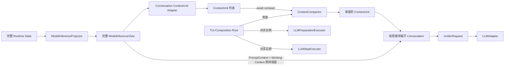

# 模型上下文裁剪设计

## Overview

本功能在 `ModelInferenceProjector` 与 `renderRequest` 之间增加异步上下文裁剪边界。Projector 仍从完整 Runtime State 生成完整 `ModelInferenceView`；Conversation Adapter 将其中的真实消息转换为完整 `ContextUnit`；注入的 `ContextCompactor` 只选择本轮可见单元；Renderer 最后组装 system、已选择 Conversation 与未改动的 Working Context（需求 1、2、5）。

裁剪结果只存在于当前调用栈，不写回 Goal，也不进入 Snapshot。每轮模型调用都从当前完整 Goal 重新投影，因此中断、恢复和跨进程执行得到确定性一致的输入（需求 3）。默认实现按 `196608` 个字符的软预算丢弃最旧单元，Composition Root 可通过 `LLM_CONVERSATION_CHAR_BUDGET` 覆盖预算（需求 4）。

## Architecture



`ContextCompactor` 与 `ContextUnit` 位于 `packages/agent`，不导入 Runtime、Storage 或未来 Trajectory 类型。当前 Adapter 只读取已经投影的 `ModelConversationMessage[]`；未来 Trajectory 需要独立 Adapter 产出同一中立单元协议，不改变裁剪器。

## Key Design Decisions

### 1. 异步裁剪位于 Projector 之后、Renderer 之前

`ModelInferenceProjector` 保持同步、纯投影，不读取预算或环境变量。`renderRequest` 也继续同步且只消费最终 View。`buildPreparationRequest` 与 `buildStepRequest` 改为异步编排函数：投影完整 View、适配 Conversation、`await` 注入的 Compactor、以保留消息创建新的 View，再调用 Renderer。

两个 Executor 的依赖都新增同一个 `contextCompactor`，并把 `ExecutionControl.signal` 作为标准 `AbortSignal` 传入异步裁剪。裁剪前后继续执行现有中止检查；裁剪失败或中止时不调用 Adapter。Compactor 从第一版即为异步协议，使未来摘要实现无需破坏 Executor API（需求 5）。

### 2. ContextUnit 是与来源无关的不可分割容器

`ContextUnit<T>` 只包含有序 `items` 和预先计算的 `characterCount`。它不知道 Goal、phase、Step、Tool、Observation、Snapshot 或 Trajectory。当前 `ConversationContextUnitAdapter` 的分组规则为：

- 每条 `user` 消息开始一个新单元，其后连续 `assistant` 消息属于该单元。
- Conversation 开头连续出现的 `assistant` 消息组成一个独立前缀单元，避免任何真实消息遗漏。
- 连续 `user` 消息分别成为独立单元；空 Conversation 产生空列表。
- 单元字符数是其中所有 `message.content.length` 之和，即 JavaScript UTF-16 code unit 数；角色和 `assistant.profileId` 不占 Conversation 内容预算。

Adapter 和 Compactor 都新建数组，不修改消息、View 或输入单元。展开保留单元时只按原先单元与消息顺序连接，因此未触发裁剪时 Conversation 的角色、内容和顺序字符级不变（需求 1、2、3）。

### 3. 默认策略只选择连续的新消息后缀

`DropOldestContextCompactor` 保存构造时校验过的正安全整数预算。它先计算全部单元字符数；未超预算时返回全部单元。超预算时始终保留最新单元，再从相邻的较旧单元向前累加：能整体容纳则保留，首个不能容纳时立即停止，不跳过它寻找更旧的小单元。

因此输出始终是输入的连续后缀，没有消息或单元内部裁切。最新单元自身超预算时仍完整返回，预算仅为软上限。算法不使用时间、随机数、缓存或进程状态，时间复杂度为 `O(n)`，同一完整输入和预算产生相同输出（需求 1、2、3）。

### 4. 当前执行状态不参与 Conversation 裁剪

执行中的 `pendingAction`、`checkpoint`、`previousStep`（包含已完成 Tool Action 与 Observation）已由 Projector 放入 `ModelWorkingContext.execution`。裁剪流程只替换 `view.conversation`，`prompt` 与 `workingContext` 保持同一投影值并完整交给 Renderer。

Preparation 中尚未获得 assistant 回复的最新 `user` 单元由“最新单元始终保留”保护；Executing 中尚未完成的 Action 则由不可裁剪 Working Context 保护。默认裁剪不发起额外模型请求，也不改变 Action 审批、重放、Step 计数或响应解析（需求 2、5）。

### 5. 预算在 Composition Root 启动期一次性解析

Agent 导出 `DEFAULT_LLM_CONVERSATION_CHAR_BUDGET = 196608`。TUI 的 `readConversationCharBudget(env)` 对 `LLM_CONVERSATION_CHAR_BUDGET` 执行以下解析：缺失或全空白使用默认值；否则只接受十进制正整数，转换后还必须满足 `Number.isSafeInteger`。

非法值抛出 `ConversationBudgetConfigurationError`，稳定错误码为 `INVALID_LLM_CONVERSATION_CHAR_BUDGET`。Composition Root 在解析工作区、加载 Profile、创建 Store 或恢复 Goal 前完成 LLM 配置与预算校验，然后创建一个 `DropOldestContextCompactor` 并共享给两个 Executor。预算不会进入 GoalDefinition 或 Snapshot（需求 3、4）。

### 6. 显式保留后续摘要与 Trajectory 接点

实现需保留两条带稳定说明的注释：默认丢弃策略附近保留 `TODO(model-context-summary)`，说明未来可注入会生成摘要的新 Compactor，但摘要不得由默认实现生成或持久化；Conversation Adapter 附近保留 `TODO(trajectory-context-adapter)`，说明未来 Trajectory 只能通过新 Adapter 映射为 `ContextUnit`，不得让 Compactor 依赖 Trajectory 类型。

摘要 Compactor 可以异步返回新单元，但必须遵守输入不可变、输出单元完整和 `AbortSignal` 契约。Trajectory 是否持久化、如何建模及如何渲染不属于本功能（需求 3、5）。

## Components and Interfaces

```ts
interface ContextUnit<T> {
    readonly items: readonly T[];
    readonly characterCount: number;
}

interface ContextUnitAdapter<TSource, TItem> {
    adapt(source: TSource): readonly ContextUnit<TItem>[];
}

interface ContextCompactor<T> {
    compact(
        units: readonly ContextUnit<T>[],
        signal?: AbortSignal,
    ): Promise<readonly ContextUnit<T>[]>;
}
```

- `conversation-context-unit-adapter.ts`：实现 `ContextUnitAdapter<readonly ModelConversationMessage[], ModelConversationMessage>`，并提供按顺序展开单元的纯函数。
- `context-compactor.ts`：声明中立协议、默认预算、`DropOldestContextCompactor` 与预算不变量。
- `prompt.ts`：异步组合 Projector、Conversation Adapter、Compactor 和 Renderer；不读环境、不保存状态。
- 两个 LLM Executor：依赖新增 `contextCompactor`，继续只调用一次业务 `LLMAdapter` 并沿用现有严格响应协议。
- `packages/agent/src/index.ts`：导出公共裁剪协议、默认实现与预算常量；新增或扩展的公共接口均补充中文契约级 TSDoc、错误、副作用、限制和最小示例。
- `packages/tui/src/cli.tsx`：解析环境预算，在 Composition Root 创建并共享裁剪器；实现完成后同步更新 `docs/architecture/agent.md` 的当前数据流与限制。

## Error Handling

- 非法环境预算在 Composition Root 的任何 Goal I/O 和 LLM 调用前抛出稳定配置错误；错误不回退默认值，也不静默修正小数、指数、符号、零或超出安全整数的值。
- `DropOldestContextCompactor` 被直接以非法预算构造时同样立即失败，防止绕过 Composition Root 产生不确定行为。
- Adapter 若收到不满足当前 Conversation 角色联合的运行时数据则不做容错修复；现有 Projector 类型边界保证正常路径输入合法。
- Compactor 抛出的错误原样传播，Executor 不重试、不转成 LLM 响应协议错误，且不会调用业务 Adapter。
- Prompt 渲染、LLM Adapter、响应解析和 Runtime 状态转换继续保持现有错误所有权与语义。

## Testing Strategy

- Conversation Adapter 单元测试：覆盖空列表、前导 assistant、标准 user/assistant、多 assistant、连续 user、字符计数、顺序和输入不可变（需求 1、2、3）。
- 默认 Compactor 单元测试：覆盖未超预算、精确边界、丢弃多个旧单元、遇到不能容纳单元立即停止、最新单元单独超限、零消息单元防御、确定性和异步返回（需求 1、2、3）。
- Request/Executor 测试：三个 phase 使用同一 Compactor；验证 system 与 Working Context 不变、裁剪只影响中间 Conversation、Compactor 被 await、`AbortSignal` 透传、裁剪错误或中止时业务 Adapter 调用次数为零、正常路径仍只调用一次（需求 3、5）。
- Runtime/Storage 回归：保存恢复后完整 `Goal.state.messages` 不变，Snapshot v5 无字段或版本变化；Action 审批、Observation、wait/resume 与跨进程恢复仍从完整历史重新投影（需求 2、3、5）。
- TUI 配置测试：覆盖缺失、空白、合法覆盖、默认 `196608`，以及零、负数、小数、指数、非数字和超安全整数；非法配置时 `.lazygoal` 不被创建且 LLM 不被调用（需求 4）。
- 完整验证运行 Agent、Runtime、Storage、TUI 测试、`npx tsc --noEmit`、`npm run check:dependencies` 与 `git diff --check`。
