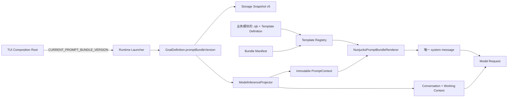

# Nunjucks Prompt Bundle 设计

## Overview

本功能把 Prompt Bundle 定义为“版本化的模板组合 Manifest”，而不是集中存放所有 Prompt 文本的目录。`@lazygoal/agent` 提供共享的 Nunjucks 加载、校验与渲染基础设施；Global Overview、Preparation Protocol 和 AgentDecision Protocol 仍由各自业务模块维护。Bundle Manifest 通过稳定模板 ID 显式声明组成、Phase 映射和顺序，满足需求 1、3 与 6。

Goal 创建时冻结整个 `promptBundleVersion`。Runtime 和 Storage 只保存通用正整数，Agent 的 Bundle Registry 决定版本是否受支持，从而让新增 Bundle 不再推动 Snapshot Schema 升级，满足需求 2。模型请求继续由 Runtime State 单向投影，Nunjucks 只读取独立、深冻结的 PromptContext，满足需求 4 与 5。

## Architecture



- `runtime` 不导入 Agent。Agent 导出的当前 Bundle 版本由 TUI Composition Root 注入 `LauncherDependencies`。
- `storage` 不导入 Agent，也不判断 Bundle 是否受支持；它只往返 `promptBundleVersion`。
- `agent` 的 Projector 是唯一同时读取 Runtime Goal 与模型 DTO 的边界；Renderer 与 PromptContext 不导入 Runtime。
- Nunjucks 只渲染 system prompt。Conversation 和 Working Context 继续按现有消息边界追加，不进入模板环境。

## Key Design Decisions

### 1. Bundle 是 Manifest，模板文本按业务所有权就近放置

集中基础设施放在 `packages/agent/src/prompting/`，包含 Registry、Loader、Environment、Renderer、错误和 DTO。通用的 Profile/Authorized Tools 展示模板也归该目录所有。

业务 Prompt 与描述符放在对应 Agent 业务模块附近：

- `global-system-prompt/`：Global Overview 模板。
- `preparation-prompt/`：`gathering_context` 与 `planning` 协议模板。
- `step-prompt/`：`executing` 的 AgentDecision 协议模板。

`prompting/default-bundles.ts` 只保存 Bundle Manifest 和模板描述符集合，不复制业务 Prompt 文本。每个模板 ID 包含组件版本，例如 `global-overview@1`；修改仍被已支持 Bundle 引用的模板时必须创建新模板 ID 和新 Bundle 版本，旧模板保持不可变。

### 2. Manifest 是顺序与动态选择的唯一来源

`PromptBundleManifest.sections` 是有序只读数组。普通 section 直接引用模板 ID；Phase section 显式提供三个 Phase 到模板 ID 的完整映射。Renderer 只按该数组迭代，不根据模板注册顺序、文件遍历顺序或运行时字符串推导路径。

Registry 构造时拒绝重复模板 ID、重复 Bundle 版本、缺失模板引用、缺失 Phase 映射和非法版本；当前协议还要求四个 slot 各出现一次，并保持 Global Overview → Profile → Phase Protocol → Authorized Tools。模板注册输入先转成按 ID 查找的 Map，因此调用方传入顺序不影响结果。Bundle v2 可以复用 v1 未变化的模板组件。

### 3. 使用显式、封闭的 Nunjucks Environment

基础设施创建独立 `Environment`，配置 `autoescape: false`、`throwOnUndefined: true`、`trimBlocks: true` 与 `lstripBlocks: true`。Prompt 是纯文本而非 HTML，因此关闭 autoescape，避免 Profile 或 JSON 被转换为 HTML entity。

默认模板资产以 `.njk` 文件存在。业务模块导出稳定 ID 和代码内固定的 `URL`；异步默认工厂在 Composition Root 启动期间读取并规范化全部资产，再交给只接受已注册 ID 的内存 Loader。Environment 会在工厂返回前 eager compile 所有被引用模板，运行时渲染不再读取文件系统。

模板不允许使用异步 Filter、Extension、文件系统路径或由 PromptContext 决定的 ``。唯一自定义 Filter 是同步 `stableJson`：对象键按稳定代码单元顺序递归排序，数组保持原顺序，再用两空格缩进序列化。

### 4. PromptContext 是 ModelInferenceView 内的独立深冻结 DTO

现有 `ModelInferenceView` 调整为：

```ts
interface ModelInferenceView {
    readonly prompt: PromptContext;
    readonly conversation: readonly ModelConversationMessage[];
    readonly workingContext: ModelWorkingContext;
}

interface PromptContext {
    readonly promptBundleVersion: number;
    readonly phase: "gathering_context" | "planning" | "executing";
    readonly profile: ModelProfileView;
    readonly authorizedTools: readonly ModelToolDefinition[];
}
```

Projector 逐字段复制 Profile 与 ToolDefinition，并递归冻结 PromptContext 的对象和数组；Renderer 不接收 Goal。Projector 不投影 goalId、runId、当前时间、随机数、进程环境、Snapshot metadata 或瞬时授权。

Authorized Tools 在复制后按 Tool ID 使用显式代码单元比较器升序排列，不使用受 locale 影响的 `localeCompare`。Runtime Registry 已拒绝重复 Tool ID；Projector 对直接调用传入的重复 ID 同样失败，避免同 ID 数据依赖输入顺序。

### 5. system prompt 由确定性 fragment pipeline 组成

Renderer 根据冻结版本取得 Manifest，再把当前 Phase 解析为确切模板 ID。每个 section 使用同一个 PromptContext 单次渲染；Profile、Instructions 与 ToolDefinition 仅作为变量值插入，值中的 `{{ ... }}` 或 `` 不会二次执行。

模板源码和渲染结果统一把 CRLF/CR 转为 LF。每个 fragment 移除末尾换行，最终严格以 `\n\n` 连接且不追加结尾换行。空 Instructions 固定输出 `(No additional instructions.)`，空 Tool 集合由 `stableJson` 固定输出 `[]`。

`renderRequest` 接收 `ModelInferenceView` 与 `PromptBundleRenderer`：先生成唯一 system 消息，再复制 Conversation，最后追加 JSON Working Context。两个 LLM Executor 共享 Composition Root 创建的同一个 Renderer 实例；构造 request 或渲染失败时不会调用 Adapter。

### 6. Bundle 当前版本归 Agent，版本值由 Composition Root 注入 Runtime

Agent 导出 `CURRENT_PROMPT_BUNDLE_VERSION` 和默认 Renderer 工厂。TUI Composition Root 把该版本传入 `LauncherDependencies.promptBundleVersion`；`createGoal` 的 `GoalCreationInput` 必须显式接收正整数版本，Runtime 不再声明当前 Prompt 版本。

`GoalDefinition.globalSystemPromptVersion` 更名为 `promptBundleVersion`。这是 Snapshot 字段结构变化，因此协议一次性升级为 v5，并拒绝 v1–v4，不提供迁移；用户已决定删除旧 Goal。v5 对该字段只校验正整数，后续 Bundle v2、v3 不再改变 Snapshot Schema。

## Components and Interfaces

```ts
interface PromptTemplateAsset {
    readonly id: string;
    readonly sourceUrl: URL;
}

interface PromptTemplateDefinition {
    readonly id: string;
    readonly source: string;
}

type PromptBundleSection =
    | { readonly slot: "global_overview" | "profile" | "authorized_tools";
        readonly templateId: string }
    | { readonly slot: "phase_protocol";
        readonly templates: Readonly<Record<PromptPhase, string>> };

interface PromptBundleManifest {
    readonly version: number;
    readonly sections: readonly PromptBundleSection[];
}

interface PromptBundleRenderer {
    render(context: PromptContext): string;
}
```

- `createPromptBundleRenderer({ templates, bundles })` 接收内存源码，用于纯单元测试和默认工厂的最终构造。
- `createDefaultPromptBundleRenderer()` 读取代码注册的 `.njk` URL、规范化源码并返回 Renderer；TUI 启动时只调用一次。
- `ModelInferenceProjector.project` 返回包含深冻结 `prompt` 的 View；`renderRequest` 只消费该 View 和 Renderer。
- 新增或扩展的公开接口按照仓库规则补充中文契约级 TSDoc、错误、副作用、限制和最小示例。

## Error Handling

- Registry 或默认工厂发现重复 ID/版本、非法 Manifest、缺失资产、无法读取文件或模板语法错误时，抛出 `PromptBundleConfigurationError`；TUI 在创建 Goal 前启动失败。
- Goal 引用未注册 Bundle 版本时，Renderer 抛出 `UnsupportedPromptBundleVersionError`，不回退到当前版本。
- 必需变量缺失或 Nunjucks 渲染失败时，Renderer 抛出带 `cause` 的 `PromptRenderError`；错误信息包含 Bundle 版本、section slot 和模板 ID，但不包含 Profile、Tool Schema 或 Conversation 原文。
- 所有错误都发生在 Adapter 调用前。Executor 不重试、不修复 Prompt，也不把错误写成模型响应；现有 Runtime Tool 授权、状态转换和响应 Schema 行为保持不变。

## Research Findings

- Nunjucks 官方建议显式创建 `Environment`，支持自定义 Loader、eager compile、缓存和 `throwOnUndefined`；本设计不使用具有隐式全局状态的 `configure` 简化 API。[Nunjucks API](https://mozilla.github.io/nunjucks/api.html)
- Nunjucks 官方明确说明模板执行不是 sandbox，因此 Profile、Conversation、Working Context 和 ToolDefinition 永远只能作为变量值，不能进入模板注册或动态 include 路径。[Nunjucks API](https://mozilla.github.io/nunjucks/api.html#user-defined-templates-warning)
- npm 当前发布版本为 3.2.4，包本身未声明 TypeScript 类型入口；`nunjucks` 加入 Agent runtime dependencies，`@types/nunjucks` 加入 Agent devDependencies。[nunjucks npm](https://www.npmjs.com/package/nunjucks)
- 当前仓库直接以源码运行且没有 Agent 构建资产复制流程；默认工厂按 `import.meta.url` 定位 `.njk`。未来若发布编译产物，构建流程必须显式复制这些资产，但本功能不新增尚不存在的发布流程。

## Testing Strategy

- Registry/Loader：覆盖注册顺序置换、重复 ID/版本、缺失引用、Phase 映射不完整、模板语法错误、CRLF 资产和 eager compile；相同 Manifest 必须生成相同 section 序列。
- Projector：覆盖 PromptContext 深复制与递归冻结、禁止字段、Tool ID 代码单元排序、重复 Tool ID、不同 Tool 输入顺序以及不修改 Goal。
- Renderer：对三个 Phase 做字符级 fixture；覆盖 Manifest 顺序、Profile/Tool 中的 Nunjucks 文本不执行、空集合、`stableJson`、LF 与无结尾换行、未知版本、缺失变量和错误脱敏。
- Executor：Preparation 与 Step 分别验证正常请求只调用一次 Adapter；配置、版本或渲染错误验证 Adapter 调用次数为零且原错误语义保留。
- Runtime/Storage/TUI：覆盖 Composition Root 注入当前版本、Goal 创建与恢复冻结版本、Snapshot v5 往返任意正整数、v1–v4 拒绝，以及新增 Bundle 版本不改变 Snapshot Schema。
- 回归验证运行 Agent、Runtime、Storage、TUI 相关测试、`npx tsc --noEmit`、`npm run check:dependencies` 与 `git diff --check`；同步更新当前架构文档，但不修改已完成的 Global System Prompt Fast Plan。
