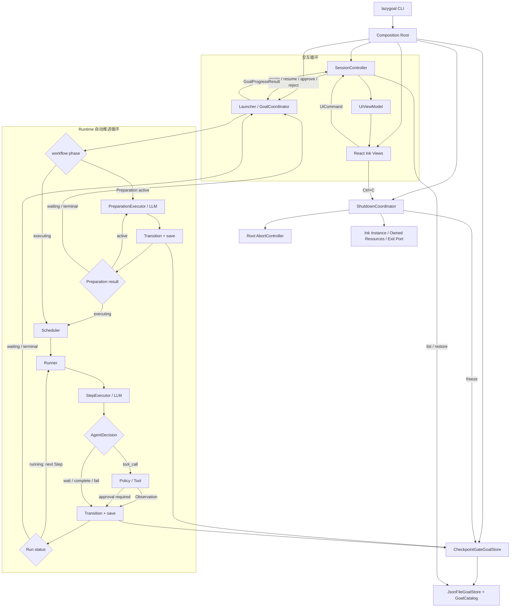

# React Ink TUI 设计

## Overview

本功能新增一个项目级 `lazygoal` 可执行入口和 `packages/tui` 包，以单进程分层 Controller 驱动现有 `launch`、`GoalCoordinator`、`Runner` 与 `JsonFileGoalStore`。CLI 只负责解析三种入口和装配依赖；Controller 串行化用户命令并向 React Ink 暴露不可变 ViewModel；组件只渲染状态和提交语义化命令。该边界覆盖需求 1–5、7，并以统一的执行中止信号和快照写入闸门满足需求 6。

## Research Findings

- 采用 `ink@6.8.x`、React 19 和 Node.js 20+。Ink 6.8 要求 Node.js 20+ 与 React 19+，并提供 `exitOnCtrlC`、`unmount()`、`waitUntilExit()` 和 `ink-testing-library`；稳定版不依赖尚未发布的 alternate-screen API，因此界面保留普通终端 scrollback。[Ink 6.8 README](https://github.com/vadimdemedes/ink/blob/v6.8.0/readme.md) [Ink 6.8 package.json](https://github.com/vadimdemedes/ink/blob/v6.8.0/package.json)
- 使用 `@inkjs/ui` 的 `TextInput`、`Select` 与 `Spinner`，避免自行处理粘贴、光标和列表键盘行为。[Ink UI](https://github.com/vadimdemedes/ink-ui)
- OpenAI Node SDK 的请求选项接受 `AbortSignal`，`OpenAICompatible` 可将根中止信号传给 `chat.completions.create`，避免只靠父进程强制关闭网络句柄。[RequestOptions](https://github.com/openai/openai-node/blob/main/src/internal/request-options.ts)

## Architecture



图中包含两个不同层次的 loop：交互循环只在等待点接收 `UiCommand`，而 Runtime 自动推进循环会在 Preparation 仍为 active 或 Run 仍为 running 时连续执行，不要求使用者逐 Step 触发。只有进入 waiting、terminal 或发生错误时，`GoalProgressResult` 才回到 Controller 并刷新界面。每次循环中的状态转换都先通过 `CheckpointGateGoalStore` 成功保存，再进入下一轮。

Composition Root 为 Launcher、Coordinator、Scheduler、Runner、两个 LLM Executor、默认 Profile、`ReadFileTool` 和 TUI 创建同一个底层 Store、Adapter 与根 `AbortSignal`。程序内只有一个 `SessionController`，所以一个进程只会推进一个 Goal；不引入后台 Worker、队列或跨进程租约。

## Components and Interfaces

### CLI 与依赖装配

- `packages/tui/src/cli.tsx` 使用 `node:util.parseArgs`，只接受空参数、`-c` 和 `resume`。环境变量在创建 Store、Adapter 或 TUI 前完成校验；配置失败直接返回非零退出码。
- 项目根提供 `lazygoal` bin shim，并通过 `tsx` 执行 TSX 源码；`tsconfig.json` 增加 `jsx: react-jsx` 与 `packages/**/*.tsx`。`packages/tui/package.json` 拥有 Ink、React、Ink UI 和测试依赖。
- 每次启动以 `realpath(process.cwd())` 作为 `workspaceRoot`，快照存放在 `<workspaceRoot>/.lazygoal/goals`，并将 `.lazygoal/` 加入 `.gitignore`。这使 Goal 发现和 `ReadFileTool` 权限天然限制在当前项目。
- 新 Goal 的 `goalId`、`runId` 使用 `crypto.randomUUID()`；默认 Profile 使用英文 system prompt/instructions，并只授权已注册的 `read_file`。

### GoalCatalog

新增公开 `GoalCatalog` 与 `GoalCatalogEntry`，由 `JsonFileGoalStore` 同时实现：

```ts
interface GoalCatalogEntry {
    readonly goalId: string;
    readonly runId: string;
    readonly intent: string;
    readonly workflowPhase: Goal["state"]["workflow"]["phase"];
    readonly runStatus: RunStatus;
    readonly updatedAt: string;
}

interface GoalCatalog {
    listResumable(): Promise<readonly GoalCatalogEntry[]>;
}
```

Catalog 只扫描正式 `.json` 快照，复用现有快照 Schema 完整校验内容，以原子替换后文件的 `mtime` 作为最近成功更新时间。它过滤三个终态，按 `mtime` 倒序、`goalId` 升序打破平局。损坏快照使本次查询整体失败并暴露协议错误，不静默跳过。更新时间不写入 Goal，因此不升级 `schemaVersion`。

### SessionController

Controller 暴露 `getSnapshot()`、`subscribe()` 和单一 `dispatch(command)`，React 通过 `useSyncExternalStore` 订阅。`dispatch` 在 busy 或 shutting down 时拒绝新命令，并把以下命令映射到现有 Runtime 操作：

| `UiCommand` | Runtime 调用 |
| --- | --- |
| `create(intent)` | `launch` |
| `continueLatest` / `selectGoal(goalId)` | `store.restore` 后 `coordinator.advance` |
| `submitMessage(content)` | `coordinator.resume(...message)` |
| `approveTask` | `coordinator.resume(...approve)` |
| `approveAction(actionId)` | `coordinator.resume(...approve_action)` |
| `rejectAction(actionId, reason)` | `coordinator.resume(...reject_action)` |

`UiViewModel` 使用 `intent_input | goal_select | session | shutting_down | fatal` 五种顶层 screen。`session` 始终携带最近已知 Goal、busy/error 状态，并从 `GoalProgressResult` 与 Goal 快照派生当前 question、proposal、blocked reason、pending Action、消息、phase、Run 状态、`stepCount`、checkpoint 与终态摘要。Controller 不复制领域状态机，也不自行推断可用操作。

### React Ink Views

- `IntentScreen` 使用 `TextInput`；空白校验留在本屏，合法输入只 dispatch 一次。
- `GoalSelectScreen` 使用 `Select` 展示 Catalog 已排序条目；`-c` 不渲染此屏，直接选择首项。
- `SessionScreen` 用 Ink `Static` 保存已完成消息的 scrollback，并在底部动态渲染状态栏、Spinner 和当前交互控件。
- question/blocked 使用 `TextInput`；proposal 使用批准或反馈选择；Action approval/recovery 先显示完整 Action，再收集批准或拒绝理由。busy 时所有输入控件 inactive。
- `FatalScreen` 与内联 error 都使用集中维护的英文 copy；Agent 的默认 Profile 约束模型使用英文，原始 Tool JSON 不翻译。

### ExecutionControl 与 ShutdownCoordinator

新增可选 `ExecutionControl { signal?: AbortSignal }`，沿 `launch/GoalCoordinator → Scheduler/Runner → PreparationExecutor/StepExecutor → LLMAdapter/Tool` 传递。所有外部调用前以及 await 返回后、状态转换或保存前执行 `throwIfAborted()`。中止使用独立 `ExecutionAbortedError`，各层必须原样传播，不得转换为 fail decision、`execution_error` 或新快照。

`CheckpointGateGoalStore` 包装唯一 Store。`freeze()` 后拒绝尚未进入底层 Store 的 save；已经进入的原子 save 可以完成并成为最新检查点。关闭流程不恢复旧对象、不写 `cancelled`，也不删除 `pendingAction`。

Ink 以 `{exitOnCtrlC: false}` 渲染。组件捕获 raw-mode `Ctrl+C`，进程级 `SIGINT` 处理非 raw-mode/外部信号，两者进入同一个幂等流程：

1. 将 ViewModel 置为 `shutting_down`，冻结 Checkpoint Gate，并 abort 根 signal。
2. 调用 Ink `unmount()`，等待 `waitUntilExit()` 恢复终端输出状态。
3. 在 2 秒 grace period 内等待已进入的 save 和已注册资源关闭；Tool 产生的子进程必须注册 abort handler 并终止其进程树。
4. grace period 到期后强制关闭剩余受管资源，由可注入 `ExitPort` 以代码 130 终止父进程。

生产 `ExitPort` 调用 `process.exit(130)`；测试实现只记录退出请求。由于 `JsonFileGoalStore` 仍采用临时文件加 rename，强制退出最多留下未引用的 `.tmp`；Catalog 忽略它们，后续正常保存可清理同 Goal 的陈旧临时文件。

## Key Design Decisions

1. **Controller 而非 React 组件拥有编排。** 这使需求 1、4、5 的命令合法性、busy 防重和错误保持可在无终端环境下测试，React 只承担显示。
2. **Catalog 使用文件 `mtime`，不修改 Goal 协议。** 需求 3 只需要最近成功更新顺序；原子替换已经提供自然更新时间，新增持久化字段会引入无必要迁移。
3. **Goal 按 workspace 隔离。** 项目本地目录避免从其他工作区恢复 Goal 后把 `ReadFileTool` 指向错误根目录；本 Spec 不提供跨 workspace 浏览。
4. **中止是进程控制，不是领域取消。** `AbortSignal`、Checkpoint Gate 和 `ExecutionAbortedError` 共同保证需求 6；现有 `cancelled` 终态和 `pendingAction` 恢复语义保持不变。
5. **保留普通终端 scrollback。** 不使用不在 Ink 6.8 稳定 API 中的 alternate screen；历史消息用 `Static`，交互区域动态刷新。
6. **不增加跨进程并发控制。** 多个 CLI 同时操作同一 Goal 仍沿用最后写入者覆盖的现有限制；本功能只保证单进程内串行化。

## Error Handling

| 边界 | 处理 |
| --- | --- |
| CLI 参数或 LLM 环境变量无效 | 在启动 TUI/访问 Goal 前输出英文错误并返回非零代码 |
| Catalog 无候选项 | `-c` 返回非零错误；`resume` 显示空列表提示并允许退出 |
| Catalog/快照协议损坏 | 显示原稳定错误码与安全摘要，不创建替代 Goal |
| Runtime 业务失败 | 保留最近 ViewModel/快照，显示错误并停止本次 dispatch |
| Adapter/Tool 基础设施错误 | 沿现有 Runtime 规则保存失败；TUI 展示英文错误 |
| shutdown abort | 作为控制流吞掉，不显示为 Agent/Run 失败，不保存新状态 |
| shutdown 清理超时 | 强制关闭已注册资源并以 130 退出，快照以最后成功原子替换为准 |

## Testing Strategy

- **Catalog 单元测试（需求 1、3、7）：** 使用临时目录验证过滤终态、mtime 排序、`goalId` 平局顺序、损坏快照、`.tmp` 忽略和空目录。
- **Controller 单元测试（需求 1、4、5、7）：** 注入 fake Store/Coordinator，覆盖全部 `GoalProgressResult` 到 ViewModel/命令的映射、busy 防重、无候选 `-c`、恢复选择和错误保持。
- **中止协议单元测试（需求 6）：** 使用 fake clock、阻塞 Executor/Tool 和记录型 Store，分别在模型调用、Tool 调用、save 前后 abort，断言没有 fail Step、`cancelled` 或 abort 后 save，并验证 grace timeout 与退出码 130。
- **Ink 组件测试（需求 3–5、7）：** 使用 `ink-testing-library` 断言 intent、selector、question、proposal、Action approval/recovery、terminal 和 fatal frame，并模拟键盘提交与 `Ctrl+C`。
- **CLI 集成测试（需求 1、2、6）：** 在临时 workspace 启动真实入口与本地 fake OpenAI-compatible server，验证三种命令、环境变量失败、Goal 跨进程恢复、SIGINT 后父/受管子进程退出和快照仍可解码。
- **回归检查：** 运行完整 TypeScript typecheck 与现有 Runtime、Agent、LLM、Tools 测试；新增或扩展的公开 TypeScript interface 及方法必须同时补齐中文契约级 TSDoc 和最小 `@example`。
