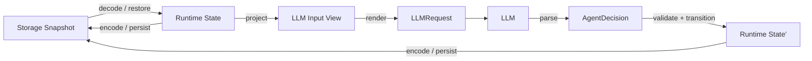

# 三视图分层架构设计

## Overview

本功能采用 Domain-Centered Ports & Adapters：Runtime State 是唯一领域真相，Storage Snapshot 通过 Codec 与其双向转换，LLM Input View 通过 Projector 从其单向派生。三种表示使用独立类型；瞬时执行资源留在编排调用链，不属于任何 View（`req-1-*`、`req-4-*`、`req-5-*`）。

重构保持严格非 Legacy v3 Goal、AgentProfile、Prompt、Action/Observation 与关闭流程的现有语义。v1、v2、包含 `legacy StepRecord` 的 v3，以及旧 StepResult 执行 API 被显式删除；磁盘协议没有新增字段，故继续写 v3，不引入 v4（`req-1-5`、`req-2-*`、`req-7-*`）。

## Architecture



源码依赖固定为：

```text
packages/storage ──► packages/runtime
packages/agent ────► packages/runtime
packages/agent ────► packages/llm
packages/tools ────► packages/runtime
packages/tui ──────► runtime / storage / agent / llm / tools
```

`packages/runtime` 不导入 `storage`、`agent` 或具体 Adapter。`packages/storage` 与 `packages/agent` 分别拥有出站转换；两者互不依赖。`packages/tui` 负责组合具体 Store、Executor、Tool 与 Runtime Port（`req-6-*`）。

## Key Design Decisions

### 1. Goal 是 Runtime State，不是 Snapshot DTO

`Goal` 保留 `id`、`definition` 与 `state`，移除 `metadata.schemaVersion`。`RunState` 只保留当前 Action/Observation 协议需要的 `checkpoint`、`lastStep`、`pendingAction` 与 `stopReason`。`GoalMetadata`、`LegacyRunState`、`LegacyGoalCreationInput`、`StepResult`、`LegacyStepExecutor`、`StepExecutionResult`、旧 `RunInput.step` 和所有 Legacy overload 一并删除（`req-1-*`）。

`GoalStore`、`GoalCatalog`、`AgentProfileStore` 与 `AgentProfileRegistry` 是 Runtime Port，继续以 Runtime 类型作为输入输出。`CheckpointGateGoalStore` 仍位于 Runtime，因为它编排关闭时序且只装饰 Port，不理解 Snapshot 格式。

### 2. Storage package 独占持久化表示

新增私有 package `@lazygoal/storage`。Snapshot DTO、Zod Schema、Codec、协议错误、文件路径与原子写入均归该 package；Runtime 可移除 Zod 与 Node 文件系统依赖。Storage 的公开入口提供 `GoalSnapshotV3Schema`、Codec、`InMemoryGoalStore`、`JsonFileGoalStore`、`JsonFileAgentProfileStore` 及对应配置错误（`req-2-*`、`req-3-*`、`req-6-2`）。

`InMemoryGoalStore` 也保存编码后的 Snapshot，而不是 Runtime Goal 引用：`save` 执行 encode，`restore` 执行 decode。这样内存与文件实现共享同一协议验证，调用方修改原对象或恢复结果都不会污染已保存数据。

Goal Codec 只接受严格 v3：decode 校验 DTO 后构造不含 metadata 的新 Goal；encode 从 Goal 新建 DTO、补入 `{ schemaVersion: 3 }` 并再次执行跨字段校验。v1、v2、Legacy v3 与未知版本统一失败，读取失败绝不触发写回。AgentProfile 文件继续使用现有 `schemaVersion: 1`，本功能只移动其 DTO、Schema 与读取 Adapter，不改变文件协议（`req-2-1`～`req-2-4`、`req-3-*`）。

### 3. LLM Input View 覆盖完整推理输入

Agent 新增独立 `ModelInferenceView`，包含响应协议种类、Profile 指令、真实 Conversation、阶段化 Working Context 与授权 Tool 描述。View DTO 文件不导入 Runtime；独立 Projector 文件同时依赖 Runtime 与 View DTO，逐字段复制并生成新对象（`req-4-1`、`req-5-3`）。

Renderer 只依赖 View DTO 与 `LLMRequest`，按现有顺序生成 system → conversation → working-context user message。现有 `buildPreparationRequest`、`buildStepRequest` 保留为组合 Projector 与 Renderer 的兼容入口，因此受支持 Goal 的最终消息内容和顺序不变（`req-4-2`）。

响应方向不建立第四种持久状态。Agent 使用严格 Schema 解析 LLM 原文，再显式构造 Runtime `PreparationResult` 或 `AgentDecision`；只有这些领域输入能够交给 Coordinator/Runner（`req-4-5`）。

### 4. Legacy 删除后只产生当前 StepRecord

Runner 仅接受返回 `AgentDecision` 的 `StepExecutor`，移除 Legacy 结果探测、旧分支消息转换及旧 response Schema 导出。Action 仍记录为 `StepRecord.action`，非 Tool 决策仍记录为 `StepRecord.decision`（`req-1-5`、`req-7-1`）。

现有非协议 Executor 异常仍需保持“失败、消费一个 Step、追加 assistant 错误”的语义。Runner 将此类异常规范化为当前 `fail` Decision：沿用已有 checkpoint；不存在时使用稳定值 `Executor failed before returning an AgentDecision.`。协议错误仍进入 `INVALID_AGENT_DECISION`，中止仍原样传播。该转换不再生成 Legacy 数据，也不改变失败状态、Step 计数或用户可见错误（`req-1-4`、`req-7-1`）。

### 5. Tool 与持久化时序不跨 View

ToolDefinition、ToolPolicy、瞬时 `authorizedActionId` 和 `ExecutionControl` 仍是 Runtime 编排输入，不进入 Goal Snapshot 或 LLM Input View；只有已授权 Tool 的独立描述 DTO 被 Projector 复制给模型（`req-1-3`、`req-4-3`）。

Runner 继续执行 `stage_action → persist → Tool.execute → observe_action → persist`。Codec 只转换保存边界的数据，不启动 Tool、不重排 Transition，也不吞掉 Store 错误（`req-7-2`、`req-7-3`）。

## Components and Interfaces

```ts
// packages/runtime
interface GoalStore {
    save(goal: Goal): Promise<void>;
    restore(goalId: string): Promise<Goal | undefined>;
}

interface AgentProfileStore {
    load(profileId: string): Promise<AgentProfile | undefined>;
}

// packages/storage
interface GoalSnapshotCodec {
    encode(goal: Goal): GoalSnapshotV3;
    decode(input: unknown): Goal;
}

// packages/agent
interface ModelInferenceProjector {
    project(goal: Goal, tools: readonly ToolDefinition[]): ModelInferenceView;
}
```

具体模块归属：

- Runtime：领域类型、Transition、Port、Runner、Coordinator、Launcher、Checkpoint Gate。
- Storage：Goal Snapshot DTO/Schema/Codec、Goal Store Adapter、Profile 文件 DTO/Schema/Adapter。
- Agent：ModelInferenceView DTO、Runtime Projector、Prompt Renderer、响应 Parser、LLM Executor。
- TUI：从 Storage 导入具体 Store，从 Runtime 导入 Port/编排，从 Agent 导入 Executor。

所有新增或变更的公共接口按仓库规则提供中文契约级 TSDoc 与最小示例。具体 Store 不在 Runtime 保留 re-export，调用方迁移到 `@lazygoal/storage`（`req-6-*`）。

## Data Models

Storage v3 DTO 保持当前 JSON 结构：

```ts
interface GoalSnapshotV3 {
    readonly id: string;
    readonly metadata: { readonly schemaVersion: 3 };
    readonly definition: GoalSnapshotDefinitionV3;
    readonly state: GoalSnapshotStateV3;
}
```

Runtime `Goal` 不再拥有 `metadata`。Storage DTO 的嵌套类型独立声明，不以 `Goal["state"]`、`RunState` 等索引类型复用 Runtime。Codec 对数组和 JSON 值进行深复制，保持 View 间对象隔离（`req-5-*`）。

LLM View 同样独立声明：

```ts
interface ModelInferenceView {
    readonly protocol: "gathering_context" | "planning" | "agent_decision";
    readonly profile: ModelProfileView;
    readonly conversation: readonly ModelConversationMessage[];
    readonly workingContext: ModelWorkingContext;
    readonly authorizedTools: readonly ModelToolDefinition[];
}
```

阶段不变量由 Projector 保持：Preparation 只投影 intent；Executing 额外投影 task、Step 预算、checkpoint、最近 current Step 与 pending Action。View 暂不截断、脱敏或累积轨迹，只复制当前 Prompt 已消费的数据（`req-4-*`）。

## Error Handling

- Goal decode、encode 或 Catalog 扫描遇到非法 DTO 时抛出 `GoalSnapshotProtocolError`；文件系统错误保持原对象传播。
- v1、v2、Legacy v3 使用同一稳定 Snapshot 协议错误，不进行内存迁移或磁盘升级。
- Profile 缺失仍返回 `undefined`；不安全 ID、读取失败、非法 JSON、Schema 或 ID 不匹配仍抛出 `AgentProfileConfigurationError`。
- Projector 对不允许推理的 workflow/run 状态保持现有前置条件错误；Renderer 是纯函数，不产生 I/O。
- Codec/Projector 不捕获 Runtime Transition、LLM Adapter、Tool 或中止错误；各自现有所有者继续决定失败语义（`req-2-4`、`req-3-2`、`req-4-4`、`req-7-*`）。

## Testing Strategy

- Runtime：删除 Legacy API/分支测试，使用只实现 Runtime Port 的本地 Fake Store 验证 Transition、Runner、Coordinator、Launcher 与关闭流程，不从 Storage 导入测试辅助实现（`req-1-*`、`req-6-3`、`req-7-*`）。
- Storage：迁移 Goal/Profile Store 测试；覆盖 Runtime↔v3 round-trip、深复制、严格字段、不变量、v1/v2/Legacy v3 拒绝、原子替换、Catalog 与跨进程恢复（`req-2-*`、`req-3-*`、`req-5-*`）。
- Agent：对每个 phase 比较重构前固定请求 fixture，验证 View 与 Runtime 不共享对象、Storage/瞬时字段不可见、Renderer 顺序稳定、严格响应仍映射为 Runtime 输入（`req-4-*`、`req-5-3`）。
- 依赖边界：验证 Runtime 源码不导入 Storage/Agent，View DTO 与 Renderer 不导入 Runtime，Storage DTO/Schema 不导入 Runtime；只有 Codec/Projector 允许同时看到两侧类型（`req-5-4`、`req-6-*`）。
- 集成回归：通过 TUI Composition Root 覆盖创建、恢复、Action 审批/重放、Ctrl+C Gate 与完整 Prompt，确认用户可见结果和保存顺序不变（`req-6-4`、`req-7-*`）。
