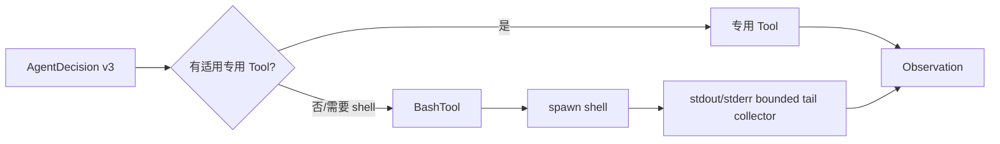

# Tool 输出安全与搜索工具选择优化设计

## Overview

本设计同时收紧 Agent 的 Tool 选择指导和 BashTool 的输出收集边界。Agent 在有适用
专用 Tool 时优先使用专用 Tool；Bash 只作为没有适用专用能力或确实需要 shell 组合
能力时的回退。BashTool 改用流式子进程输出收集，持续消费 stdout/stderr，仅保留
各自尾部，从而消除 `exec` 的固定 `maxBuffer` 溢出路径。

设计不改变 `ToolObservation`、Goal Snapshot、Runner、Action 或 replay 协议。Prompt
Bundle v1/v2 保持不可变；新增 v3 只替换 executing Phase 模板，新 Goal 冻结 v3，旧
Goal 按其原版本恢复（需求 [1](./requirements.md#req-1-1)、[5](./requirements.md#req-5-4)）。

## Key Design Decisions

### 1. 用 v3 隔离 Prompt 行为变化

- 新增 `agent-decision@3.njk` 和 `AGENT_DECISION_TEMPLATE_V3`。
- `PROMPT_BUNDLE_V3_MANIFEST` 复用 v2 的 Global、Profile、gathering_context、
  planning、Authorized Tools 模板，只将 executing 映射到 v3。
- `CURRENT_PROMPT_BUNDLE_VERSION` 与默认 Manifest 切换到 v3；Renderer 同时注册
  v1、v2、v3。v1/v2 资产和渲染字符不修改（需求 1.2、1.4、5.3）。

### 2. 专用 Tool 优先，Bash 仅回退

v3 executing Protocol 增加以下决策顺序，保留现有 AgentDecision JSON 形状：

1. 如果 Authorized Tools 中有能直接完成当前子任务的专用 Tool，优先请求该 Tool。
2. 仓库文本搜索优先请求 `grep`；读取、写入和精确编辑优先使用对应文件 Tool。
3. 仅当没有适用专用 Tool，或需要 shell 组合、系统命令或专用 Tool 无法表达的
   能力时，才请求 `bash`。
4. 用 Bash 搜索时缩小路径，排除 `node_modules`、`.git`、`.lazygoal`、生成文件和
   source map；输出限制不能只依赖按行截取。

这是模型指导，不是命令重写或语义拦截；Runtime 继续只依据 Profile、Registry、
输入校验和 Policy 强制实际权限（需求 2.1–2.6）。

### 3. 用流式 `spawn` 替代 `exec` 的完整字符串缓冲

在 [packages/tools/src/bash.ts](../../packages/tools/src/bash.ts) 中使用
`child_process.spawn` 启动现有 shell 命令，保持 workspaceRoot、shell 选择、超时
上限和 `manual` replay policy 不变。删除 `BASH_MAX_BUFFER_BYTES` 与 `maxBuffer`
选项；保留 `BASH_MAX_OUTPUT_CHARS` 作为每个流的有效负载预算。

每个输出流连接一个包内私有的 bounded tail collector：

- 对 stdout/stderr 设置 UTF-8 解码，按到达顺序接收 chunk；
- 只保存尾部最多 `BASH_MAX_OUTPUT_CHARS` 个 JavaScript 字符；
- 丢弃前缀时累计省略字符数，完成时复用现有
  `[...已省略前 N 字符...]\n尾部` 格式；
- 持续消费并丢弃超出预算的旧数据，不因预算达到而终止进程；
- 使用有限的尾部缓冲，内存不随命令总输出量增长。

输出预算只限制结果保存，不限制命令执行时长或副作用；无限输出仍由既有超时和
中止控制收敛（需求 3.1–3.5）。

### 4. 保持现有生命周期和 Observation 形状

进程关闭后按现有规则映射：退出码 0 返回 `success`，数值非零退出码返回
`COMMAND_FAILED`，超时返回 `COMMAND_TIMEOUT`，中止抛出 `ExecutionAbortedError`。
shell 启动和未分类基础设施异常原样抛出，由 Runner 继续归类为
`TOOL_EXECUTION_ERROR` 并保留 `outcome_unknown` 语义（需求 4）。

不新增 `truncated` 字段，不修改 `Observation`、Snapshot 或 `Run` 类型；截断信息只
存在于 stdout/stderr 字符串中（需求 5.1–5.2）。

## Architecture

Agent 只负责选择；ToolRegistry、Runner 和 ToolPolicy 的所有权不变。BashTool 自己
拥有子进程、输出流、超时和中止生命周期，Runner 仍拥有 Action 持久化与状态转换。

## Components and Interfaces

### BashTool 内部边界

- 新增私有 collector 类型或闭包，不从 `packages/tools/src/index.ts` 导出。
- 保留 `BashTool`、`BASH_TOOL_ID`、`BASH_MAX_TIMEOUT_MS`、`BASH_MAX_OUTPUT_CHARS`
  的现有公共面；不新增公共接口。
- `execute` 先完成既有输入解析、语义校验和 workspaceRoot `realpath`，再创建子进程。
- Promise 同时监听 stdout、stderr、`error`、`close` 和共享 AbortSignal；清理定时器
  与监听器后再解析结果，避免 timeout/abort 与 close 竞态重复结算。
- `spawn` 的 POSIX shell 使用 `/bin/bash`，Windows 保持 Node 默认 shell 行为；cwd
  继续使用 workspaceRoot 的真实路径。

### Prompt Bundle 资产

- `packages/agent/src/step-prompt/agent-decision@3.njk`
- `packages/agent/src/step-prompt/template.ts`
- `packages/agent/src/prompting/default-bundles.ts`
- `packages/agent/test/prompting-default-bundles.test.ts`

v3 只增加专用 Tool 优先、Bash 回退和搜索输出护栏；既有 checkpoint、Observation
证据、终止条件和严格 JSON 协议继续复用 v2 规则。

## Data Models

不新增持久化或公共数据模型。bounded collector 的内部状态至少包含尾部文本和
累计省略字符数，最终投影为现有 `stdout`/`stderr` 字符串。`ToolObservation`、
`AgentDecision`、`PendingAction` 和 Snapshot schema 均保持原定义。

## Error Handling

- 输出超量本身不是错误，不生成新的错误码，也不提前杀掉命令。
- `spawn` 发出的启动错误直接 reject；不得把它伪装成 `COMMAND_FAILED`。
- timeout 先记录超时状态，再发送现有 `SIGTERM`；close 后生成 `COMMAND_TIMEOUT`。
- AbortSignal 优先转换为 `ExecutionAbortedError`，不得写入 failure Observation。
- 进程完成后才组装截断输出，成功和领域失败的消息文案继续使用当前组合逻辑。

## Testing Strategy

### BashTool

- 用单行超过 1 MB 的 stdout 验证命令成功完成，且不出现 `stdout maxBuffer` 异常。
- 同时产生大量 stdout/stderr，验证两个流都只保留尾部并包含省略标记。
- 在超大输出后写入一个完成标记，验证达到输出预算不会提前终止命令。
- 覆盖正常退出、非零退出、timeout、AbortSignal、UTF-8 多字节输出和 shell 启动错误。
- 保留现有输入校验、cwd、`manual` replay 和输出文案断言。

### Prompt 与入口

- 固定 v1/v2 完整渲染字符串，证明新增 v3 资产没有改写旧 Bundle。
- 断言 v3 包含“专用 Tool 优先、Bash 回退、搜索范围与输出限制”的关键命题。
- 断言默认新 Goal 冻结 v3，恢复 v1/v2 Goal 仍按原版本渲染；未知版本仍在 LLM
  调用前失败。

### 回归

运行 tools、agent、runtime、storage、tui 相关测试，随后运行 `npx tsc --noEmit`、
`npm run check:dependencies`、完整测试套件和 `git diff --check`，覆盖需求 6.5。
